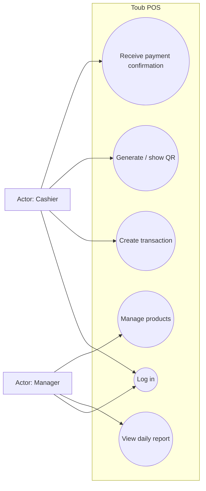
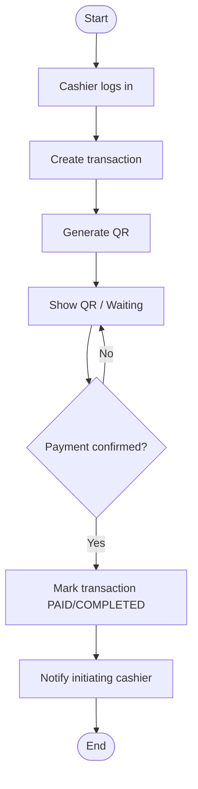
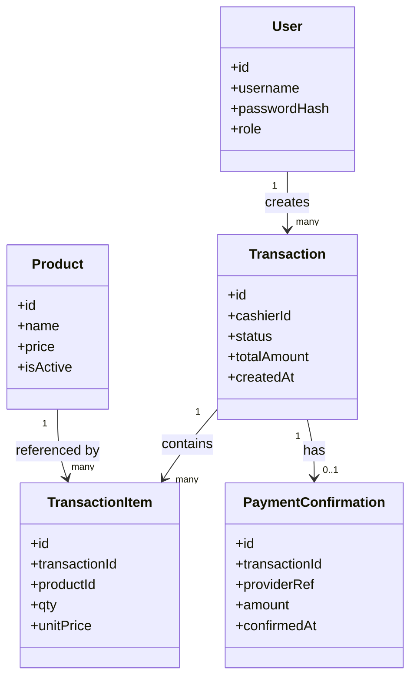
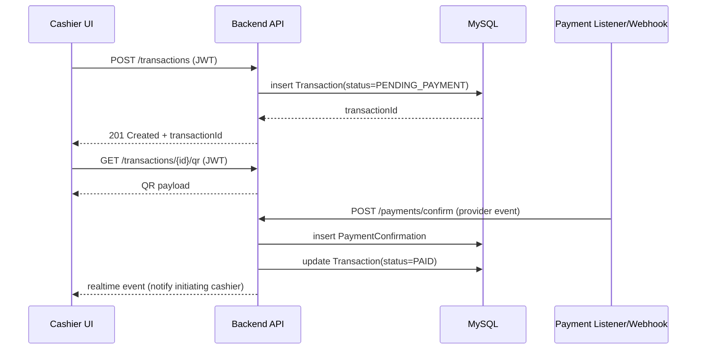

# Software Engineering (SE) Context

This document captures the Software Engineering deliverables required by the Cross-Disciplinary Project handbook.

## 1) Methodology

**Chosen methodology**: Scrum (lightweight).

**Cadence (suggested)**

- Sprint length: 1 week
- Ceremonies: planning (30–45 min), daily standup (10 min), review/demo (30 min), retro (15 min)

**Definition of Done (DoD)**

- Feature works end-to-end in its defined scope
- No invariant in `context/architecture.md` is violated
- Basic happy-path + error-path handling exists
- API endpoint documented (Swagger/OpenAPI) and testable

## 2) Scope (MVP)

The MVP targets the core flow described in `context/project-overview.md`:

- Cashier creates an order/transaction and generates a payment QR
- System receives/derives a payment confirmation event
- System notifies the **specific cashier** who initiated the transaction
- Manager can view a simple daily summary report

**Out of scope (for MVP)**

- Inventory depletion logic
- Hardware integrations (printers/cash drawers)
- Non-QR payment processing

## 3) Actors and Roles

**Actors**

- Cashier
- Manager

**Roles (RBAC)**

- `CASHIER`: create transactions, view own active/session transactions
- `MANAGER`: read access to all transactions + reporting

## 4) Functional Requirements

FR-01 Authentication

- Users can log in and receive a JWT.
- Requests to protected routes require a valid JWT.

FR-02 Authorization

- Cashier can only access and mutate transactions they own (or are assigned to).
- Manager can access reporting and read all transactions.

FR-03 Products (basic)

- Manager can create/update/delete products (or preset items).
- Cashier can list products to build an order.

FR-04 Transaction creation

- Cashier can create a transaction with line items and total.
- Transaction is created in `PENDING_PAYMENT` state.

FR-05 QR generation

- System can generate a payment QR payload for the transaction.

FR-06 Payment confirmation

- System can record a payment confirmation event for a transaction.
- A transaction cannot be marked `PAID/COMPLETED` without a valid confirmation event (see invariants in `context/architecture.md`).

FR-07 Cashier-specific notification

- When payment is confirmed, the system notifies the **specific cashier** who initiated the transaction.

FR-08 Reporting

- Manager can view a daily summary report (e.g., total count, total amount, list of transactions).

FR-09 API documentation + testing

- The API is documented with Swagger/OpenAPI.
- Endpoints are testable (Swagger UI and/or Postman collection).

## 5) Non-Functional Requirements

NFR-01 Security

- JWT auth on all mutation endpoints.
- Role checks enforced on privileged endpoints.
- Unknown input validated at boundaries.

NFR-02 Reliability / Correctness

- Payment status transitions are controlled and auditable.
- No “paid” state without a confirmation event.

NFR-03 Usability

- Cashier-facing UI optimized for tablet/mobile usage and fast tapping (see `context/ui-context.md`).

NFR-04 Performance

- Common endpoints respond quickly under normal booth traffic.

NFR-05 Maintainability

- Backend follows separation: routes/controllers/services/repositories (see `context/architecture.md`).

## 6) User Stories (with Acceptance Criteria)

US-01 Cashier login

- As a cashier, I want to log in so I can start processing sales.
- Acceptance:
  - Given valid credentials, I receive a JWT
  - Given invalid credentials, I receive an error response

US-02 Create transaction

- As a cashier, I want to create a new transaction so I can request a QR payment.
- Acceptance:
  - Creates a transaction in `PENDING_PAYMENT`
  - Transaction is linked to the cashier

US-03 Show QR

- As a cashier, I want to display a QR code so the customer can pay.
- Acceptance:
  - A QR payload is generated for a transaction
  - UI indicates “waiting for payment”

US-04 Receive confirmation

- As a cashier, I want an instant confirmation when the payment is received so I can complete the sale.
- Acceptance:
  - Only the initiating cashier sees the confirmation
  - The transaction status becomes `PAID/COMPLETED` only after confirmation

US-05 Manager report

- As a manager, I want to see a daily report so I can reconcile sales.
- Acceptance:
  - Manager can view totals and transaction list for a day
  - Cashier cannot access manager-only report endpoints

## 7) Team Responsibilities (example mapping)

Adjust names to your group.

- Member A (Backend): Express API, auth, middleware, Swagger
- Member B (Database): ERD/RM, SQL scripts, indexing/roles, connection
- Member C (HCI + Frontend): personas/flows/wireframes, React UI integration

SE responsibility: ensure requirements, diagrams, and planning stay consistent with implemented scope.

## 8) UML Diagrams (Handbook requirement)

### 8.1 Use Case Diagram (Use Case view)

**Description**

- Cashier focuses on creating transactions and receiving payment confirmations.
- Manager focuses on reporting and product management.

### 8.2 Activity Diagram (Main cashier flow)

**Description**

- Loops in “waiting” until a confirmation event is recorded.

### 8.3 Class Diagram (Domain model)

**Description**

- `PaymentConfirmation` is the audit record enabling the invariant “no paid without confirmation”.

### 8.4 Sequence Diagram (Payment confirmation + notification)

**Description**

- Listener/webhook is shown as a separate participant. The exact provider API is an open question in `context/progress-tracker.md`.

## 9) Assumptions and Open Questions

- Payment gateway/provider API is not finalized yet (see `context/progress-tracker.md`).
- “Real-time notification” may be implemented via WebSocket or polling, depending on constraints.
