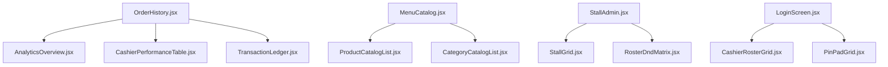

# ToubPOS — Frontend Connection Guide & Completion Roadmap

This guide outlines the sprint plan for the frontend team to connect the React application to the Express backend APIs. It introduces a **hybrid fallback architecture** so that developers can build and run the client dashboard offline (using `localStorage`) while automatically switching to the real backend endpoints when they are online and available.

**Stack:** React, Vite, Tailwind CSS v4, React Router, Custom Hooks.

**Team:** Thang Saoly, Taing Sothyvan, Tiek Chhunhour — "Group 9: The Small Three".

---

## 1. Audit — Current State vs. Target Architecture

### ✅ Frontend Layouts & Components (Completed & Verified)
* **Design & Theme**: High-contrast, dark-blue accent colors (`#003EC7`), rounded touch targets, and pixel-perfect headers/drawers.
* **Component Structures**: Reusable primitives like `<PageShell>`, `<ConfirmDialog>`, `<StatusBadge>`, and `<AdminCrudTable>`.
* **Sub-Path Routing**: Separate routing in `App.jsx` dividing `/login`, `/cashier` (Cashier Dashboard), and `/admin-portal` (Admin/Manager workspace).

### 🔴 Core Hook Integrations (In-Progress / Stubs)
* All hooks (`useProducts`, `useUsers`, `useOrders`) read/write synchronously from `localStorage`.
* Login page verifies Admin username/password and Cashier PINs client-side using seed rosters.
* No API fetch wrapper handles token injections or custom headers (`X-Device-Token`).

---

## 2. Step 1 — Vite API Proxy Setup (Vite configuration)

To avoid CORS issues and simplify resource fetch requests during local development, update your **[vite.config.js](file:///home/saoly/.gemini/antigravity-ide/scratch/TOUB_POS/frontend/vite.config.js)** to proxy `/api` calls directly to your backend running on port `3000`.

```javascript
import { defineConfig } from 'vite';
import react from '@vitejs/plugin-react';
import tailwindcss from '@tailwindcss/vite';

// https://vite.dev/config/
export default defineConfig({
  plugins: [
    react(),
    tailwindcss(),
  ],
  server: {
    proxy: {
      '/api': {
        target: 'http://localhost:3000',
        changeOrigin: true,
        secure: false,
      },
    },
  },
});
```

---

## 3. Step 2 — Hybrid API Client Implementation (`src/services/api.js`)

Overhaul **[api.js](file:///home/saoly/.gemini/antigravity-ide/scratch/TOUB_POS/frontend/src/services/api.js)** to support network fetching. If the backend server is unreachable (i.e. connection refused), it catches the exception and falls back to local storage arrays so the POS remains 100% operational offline.

```javascript
import { DEFAULT_CATEGORIES, DEFAULT_PRODUCTS, DEFAULT_USERS } from '../data/seedData';
import { makeId } from '../utils/ids';
import { getStorageItem, setStorageItem } from '../utils/storage';

export const STORAGE_KEYS = {
  CATEGORIES: 'sabay-pos-categories-v3',
  PRODUCTS: 'sabay-pos-products-v3',
  USERS: 'sabay-pos-users',
  ORDERS: 'sabay-pos-orders',
  TOKEN: 'toub-auth-token',
  USER: 'toub-auth-user',
};

// ── Auth Token Helpers ──────────────────────────────────────────────────────
export const authStorage = {
  getToken: () => localStorage.getItem(STORAGE_KEYS.TOKEN),
  setToken: (token) => localStorage.setItem(STORAGE_KEYS.TOKEN, token),
  getUser: () => JSON.parse(localStorage.getItem(STORAGE_KEYS.USER) || 'null'),
  setUser: (user) => localStorage.setItem(STORAGE_KEYS.USER, JSON.stringify(user)),
  clear: () => {
    localStorage.removeItem(STORAGE_KEYS.TOKEN);
    localStorage.removeItem(STORAGE_KEYS.USER);
  }
};

// ── Shared API Request Helper ───────────────────────────────────────────────
async function request(url, options = {}) {
  const token = authStorage.getToken();
  const headers = {
    'Content-Type': 'application/json',
    ...options.headers,
  };
  
  if (token) {
    headers['Authorization'] = `Bearer ${token}`;
  }
  
  // Attach device token if provisioning is registered
  const deviceToken = localStorage.getItem('toub-device-registered-token');
  if (deviceToken) {
    headers['X-Device-Token'] = deviceToken;
  }

  const response = await fetch(url, { ...options, headers });
  const result = await response.json();
  
  if (!response.ok) {
    throw new Error(result.message || 'API request failed');
  }
  return result;
}

// ── Local Storage Fallback CRUD Factory ─────────────────────────────────────
function createLocalResource(storageKey, defaultData, prefix) {
  return {
    getAll() {
      return getStorageItem(storageKey, defaultData);
    },
    save(item) {
      const items = this.getAll();
      const updated = { ...item };
      if (!item.id) {
        updated.id = makeId(prefix);
        items.push(updated);
      } else {
        const idx = items.findIndex((i) => i.id === item.id);
        if (idx !== -1) items[idx] = updated;
        else items.push(updated);
      }
      setStorageItem(storageKey, items);
      return updated;
    },
    delete(id) {
      const items = this.getAll().filter((i) => i.id !== id);
      setStorageItem(storageKey, items);
    }
  };
}

const localFallback = {
  products: createLocalResource(STORAGE_KEYS.PRODUCTS, DEFAULT_PRODUCTS, 'prod'),
  categories: createLocalResource(STORAGE_KEYS.CATEGORIES, DEFAULT_CATEGORIES, 'cat'),
  users: createLocalResource(STORAGE_KEYS.USERS, DEFAULT_USERS, 'user'),
  orders: {
    getAll: () => getStorageItem(STORAGE_KEYS.ORDERS, []),
    create: (order) => {
      const list = getStorageItem(STORAGE_KEYS.ORDERS, []);
      const newOrder = {
        ...order,
        id: order.id || makeId('order'),
        orderNo: order.orderNo || `ORD-${String(list.length + 1).padStart(4, '0')}`,
        createdAt: new Date().toISOString(),
      };
      list.unshift(newOrder);
      setStorageItem(STORAGE_KEYS.ORDERS, list);
      return newOrder;
    }
  }
};

// ── Integrated Service API Exports ──────────────────────────────────────────
export const api = {
  auth: {
    async login(username, password) {
      try {
        const { data } = await request('/api/auth/login', {
          method: 'POST',
          body: JSON.stringify({ username, password }),
        });
        authStorage.setToken(data.token);
        authStorage.setUser(data.user);
        return data.user;
      } catch (err) {
        // Unreachable/offline fallback check
        if (err.message.includes('Failed to fetch') || err.message.includes('API request failed')) {
          const localUser = localFallback.users.getAll().find(
            (u) => u.name.toLowerCase() === username.trim().toLowerCase() && u.pin === password.trim()
          );
          if (localUser) {
            authStorage.setUser(localUser);
            return localUser;
          }
        }
        throw err;
      }
    }
  },

  products: {
    async getAll() {
      try {
        const res = await request('/api/products');
        return res.data;
      } catch {
        return localFallback.products.getAll();
      }
    },
    async save(product) {
      try {
        const method = product.id ? 'PUT' : 'POST';
        const url = product.id ? `/api/products/${product.id}` : '/api/products';
        const res = await request(url, {
          method,
          body: JSON.stringify(product),
        });
        return res.data;
      } catch {
        return localFallback.products.save(product);
      }
    },
    async delete(id) {
      try {
        await request(`/api/products/${id}`, { method: 'DELETE' });
      } catch {
        localFallback.products.delete(id);
      }
    }
  },

  categories: {
    async getAll() {
      try {
        const res = await request('/api/categories');
        return res.data;
      } catch {
        return localFallback.categories.getAll();
      }
    },
    async save(category) {
      try {
        const method = category.id ? 'PUT' : 'POST';
        const url = category.id ? `/api/categories/${category.id}` : '/api/categories';
        const res = await request(url, {
          method,
          body: JSON.stringify(category),
        });
        return res.data;
      } catch {
        return localFallback.categories.save(category);
      }
    },
    async delete(id) {
      try {
        await request(`/api/categories/${id}`, { method: 'DELETE' });
      } catch {
        localFallback.categories.delete(id);
      }
    }
  },

  users: {
    async getAll() {
      try {
        const res = await request('/api/users');
        return res.data;
      } catch {
        return localFallback.users.getAll();
      }
    },
    async save(user) {
      try {
        const method = user.id ? 'PUT' : 'POST';
        const url = user.id ? `/api/users/${user.id}` : '/api/users';
        const res = await request(url, {
          method,
          body: JSON.stringify(user),
        });
        return res.data;
      } catch {
        return localFallback.users.save(user);
      }
    },
    async delete(id) {
      try {
        await request(`/api/users/${id}`, { method: 'DELETE' });
      } catch {
        localFallback.users.delete(id);
      }
    }
  },

  orders: {
    async getAll() {
      try {
        const res = await request('/api/orders');
        return res.data;
      } catch {
        return localFallback.orders.getAll();
      }
    },
    async getMine() {
      try {
        const res = await request('/api/orders/mine');
        return res.data;
      } catch {
        return localFallback.orders.getAll(); // fallback all in offline mode
      }
    },
    async create(order) {
      try {
        const res = await request('/api/orders', {
          method: 'POST',
          body: JSON.stringify(order),
        });
        return res.data;
      } catch {
        return localFallback.orders.create(order);
      }
    }
  }
};
```

---

## 4. Step 3 — Refactoring Hooks to Asynchronous Contexts

Because network requests are async, you must convert your synchronised component states to fetch values upon component mounting.

### 4.1 Refactoring `useProducts.js`
Modify **[useProducts.js](file:///home/saoly/.gemini/antigravity-ide/scratch/TOUB_POS/frontend/src/hooks/useProducts.js)**:

```javascript
import { useMemo, useState, useEffect } from 'react';
import { suggestedCode } from '../utils/format';
import { api } from '../services/api';

export function useProducts(canManageMenu) {
  const [categories, setCategories] = useState([]);
  const [products, setProducts] = useState([]);
  const [selectedCategory, setSelectedCategory] = useState('All');
  const [searchQuery, setSearchQuery] = useState('');

  // 1. Fetch data on mount
  useEffect(() => {
    async function loadData() {
      const cats = await api.categories.getAll();
      const prods = await api.products.getAll();
      setCategories(cats);
      setProducts(prods);
    }
    loadData();
  }, []);

  const categoryById = useMemo(
    () => new Map(categories.map((cat) => [cat.id, cat])),
    [categories]
  );

  const visibleProducts = products.filter((p) => p.available);

  const filteredProducts = useMemo(() => {
    const q = searchQuery.trim().toLowerCase();
    return visibleProducts.filter((p) => {
      const cat = categoryById.get(p.categoryId);
      const inCategory = selectedCategory === 'All' || p.categoryId === selectedCategory;
      const inSearch =
        p.name.toLowerCase().includes(q) ||
        p.code.toLowerCase().includes(q) ||
        cat?.name.toLowerCase().includes(q);
      return inCategory && inSearch;
    });
  }, [categoryById, searchQuery, selectedCategory, visibleProducts]);

  // Category handler updates
  const saveCategory = async (categoryForm) => {
    const saved = await api.categories.save(categoryForm);
    const updatedCats = await api.categories.getAll();
    setCategories(updatedCats);
    return saved;
  };

  const deleteCategory = async (categoryId) => {
    await api.categories.delete(categoryId);
    setCategories(await api.categories.getAll());
  };

  // Product handler updates
  const saveProduct = async (productForm) => {
    const saved = await api.products.save(productForm);
    setProducts(await api.products.getAll());
    return saved.id;
  };

  const deleteProduct = async (productId) => {
    await api.products.delete(productId);
    setProducts(await api.products.getAll());
    return productId;
  };

  return {
    categories, products, categoryById, filteredProducts,
    selectedCategory, setSelectedCategory,
    searchQuery, setSearchQuery,
    saveCategory, deleteCategory,
    saveProduct, deleteProduct
  };
}
```

---

## 5. Step 4 — Page Integration Updates

Modify your login routines and payment confirmations to await the new asynchronous promises.

### 5.1 Updating `LoginPage.jsx`
Make the login handlers async:

```javascript
  const handleAdminLogin = async (username, password, isRegistering = false) => {
    try {
      setLoginError('');
      const loggedUser = await api.auth.login(username, password);

      if (isRegistering) {
        setDeviceRegistered(true);
        setLoginMode('cashier');
        setFlowStep('select-profile');
      } else {
        navigate('/admin-portal', { state: { currentUser: loggedUser }, replace: true });
      }
      return true;
    } catch (err) {
      setLoginError(err.message || 'Invalid credentials.');
      return false;
    }
  };
```
---

## 6. Frontend Refactoring Roadmap — Extracting Monolithic Components

To align with modern clean-code principles and keep modules small and single-purpose (as defined in `context/code-standards.md`), the team must break down the current monolithic frontend views. 

Aim for components under **150 lines of code** where possible. Keep components clean, focus on prop-driven data flow, and ensure no visual UI styling is changed.

Here is the refactoring architecture and extraction checklist:



### 6.1 Refactoring `OrderHistory.jsx` (27.3 KB)
Split this dashboard page into 3 sub-components placed under `src/components/dashboard/`:

1. **`AnalyticsOverview.jsx`**: Renders the analytical cards, SVG sparklines, and active stall visualizers.
2. **`CashierPerformanceTable.jsx`**: Renders the Employee Efficiency Metrics (orders completed, prep speed, shift statuses).
3. **`TransactionLedger.jsx`**: Renders the searchable transaction ledger audit table.

#### Example: Clean `CashierPerformanceTable.jsx` Implementation
```jsx
import React from 'react';
import StatusBadge from '../ui/StatusBadge';

export default function CashierPerformanceTable({ cashiersData = [], onExport }) {
  return (
    <div className="bg-white rounded-[24px] border border-gray-100 p-6 flex flex-col gap-4 shadow-sm">
      <div className="flex justify-between items-center">
        <h3 className="text-[16px] font-bold text-gray-900">Cashier Efficiency Metrics</h3>
        <button
          onClick={onExport}
          className="text-brand-action hover:underline text-[13px] font-semibold"
        >
          Export CSV
        </button>
      </div>

      <div className="overflow-x-auto">
        <table className="w-full text-left border-collapse">
          <thead>
            <tr className="border-b border-gray-50 text-[11px] font-bold text-gray-400 uppercase tracking-wider">
              <th className="pb-3 font-semibold">Employee</th>
              <th className="pb-3 font-semibold">Orders Done</th>
              <th className="pb-3 font-semibold">Avg Prep Time</th>
              <th className="pb-3 font-semibold">Shift Status</th>
            </tr>
          </thead>
          <tbody className="divide-y divide-gray-50 text-[13px] font-medium text-gray-700">
            {cashiersData.map((row) => (
              <tr key={row.id} className="hover:bg-gray-50/50 transition-colors">
                <td className="py-3.5 font-bold text-gray-900">{row.name}</td>
                <td className="py-3.5">{row.ordersCount} orders</td>
                <td className="py-3.5">{row.avgPrepTime}s</td>
                <td className="py-3.5">
                  <StatusBadge 
                    status={row.onShift ? 'active' : 'disabled'} 
                    labels={{ active: 'On Duty', disabled: 'Off Duty' }} 
                  />
                </td>
              </tr>
            ))}
          </tbody>
        </table>
      </div>
    </div>
  );
}
```

---

### 6.2 Refactoring `MenuCatalog.jsx` (20.5 KB)
Extract the two back-office management tables into separate components under `src/components/admin/`:

1. **`ProductCatalogList.jsx`**: Manages the product grid listing, visibility toggles, and edit modal invocations.
2. **`CategoryCatalogList.jsx`**: Handles the categories list table and category tone swatches.

#### Example: Clean `CategoryCatalogList.jsx` Implementation
```jsx
import React from 'react';
import Icon from '../ui/Icon';
import StatusBadge from '../ui/StatusBadge';
import { toneClasses } from '../../utils/toneClasses';

export default function CategoryCatalogList({ categories, onEdit, onDelete }) {
  return (
    <div className="overflow-x-auto">
      <table className="w-full text-left border-collapse">
        <thead>
          <tr className="border-b border-gray-100 text-[11px] font-bold text-gray-400 uppercase">
            <th className="pb-3">Category Name</th>
            <th className="pb-3">Visual Swatch</th>
            <th className="pb-3 text-right">Actions</th>
          </tr>
        </thead>
        <tbody className="divide-y divide-gray-100 text-[13px]">
          {categories.map((cat) => {
            const swatch = toneClasses[cat.tone] || toneClasses.gold;
            return (
              <tr key={cat.id} className="hover:bg-gray-50/40">
                <td className="py-4 font-bold text-gray-900">{cat.name}</td>
                <td className="py-4">
                  <span className={`px-2.5 py-1.5 rounded-lg text-xs font-semibold uppercase ${swatch.badge}`}>
                    {cat.tone} tone
                  </span>
                </td>
                <td className="py-4 text-right flex justify-end gap-2">
                  <button
                    onClick={() => onEdit(cat)}
                    className="w-9 h-9 rounded-full bg-gray-50 border border-gray-100 grid place-items-center text-gray-600 hover:bg-gray-100 transition-all cursor-pointer"
                    aria-label="Edit Category"
                  >
                    <Icon name="edit" className="w-4 h-4" />
                  </button>
                  <button
                    onClick={() => onDelete(cat.id)}
                    className="w-9 h-9 rounded-full bg-[#fff1f2] border border-[#ffe4e6] grid place-items-center text-red-600 hover:bg-red-50 transition-all cursor-pointer"
                    aria-label="Delete Category"
                  >
                    <Icon name="delete" className="w-4 h-4" />
                  </button>
                </td>
              </tr>
            );
          })}
        </tbody>
      </table>
    </div>
  );
}
```

---

### 6.3 Refactoring `LoginScreen.jsx` (13.5 KB)
Break down the login interface into distinct sub-components located under `src/components/auth/`:

1. **`CashierRosterGrid.jsx`**: Renders the cashier profile quick-tap grid with avatar selection (Step 2 of Cashier shift setup).
2. **`PinPadGrid.jsx`**: Overlays the 4-digit PIN numeric input pad.

#### Example: Clean `PinPadGrid.jsx` Implementation
```jsx
import React from 'react';
import Icon from '../ui/Icon';

const PIN_KEYS = ['1', '2', '3', '4', '5', '6', '7', '8', '9', 'clear', '0', 'erase'];

export default function PinPadGrid({ typedPin = '', onKeyPress, onErase, onClear }) {
  return (
    <div className="flex flex-col items-center gap-6 select-none">
      {/* Visual Dot Indicators */}
      <div className="flex gap-4">
        {[0, 1, 2, 3].map((idx) => (
          <div
            key={idx}
            className={`w-4 h-4 rounded-full transition-all duration-200 ${
              idx < typedPin.length 
                ? 'bg-brand-action scale-110 shadow-sm' 
                : 'bg-gray-200'
            }`}
          />
        ))}
      </div>

      {/* Numeric Pad Layout */}
      <div className="grid grid-cols-3 gap-3 w-full max-w-[280px]">
        {PIN_KEYS.map((key) => {
          const isAction = key === 'erase' || key === 'clear';
          return (
            <button
              key={key}
              type="button"
              onClick={() => {
                if (key === 'erase') onErase();
                else if (key === 'clear') onClear();
                else onKeyPress(key);
              }}
              className={`w-20 h-20 rounded-full text-[20px] font-bold transition-all active:scale-90 cursor-pointer grid place-items-center ${
                isAction 
                  ? 'bg-gray-100 text-gray-500 hover:bg-gray-200' 
                  : 'bg-white text-gray-900 border border-gray-100 shadow-sm hover:bg-gray-50'
              }`}
            >
              {key === 'erase' && <Icon name="delete" className="w-5 h-5" />}
              {key === 'clear' && <span className="text-[12px] uppercase">C</span>}
              {!isAction && key}
            </button>
          );
        })}
      </div>
    </div>
  );
}
```

---

## 7. Development Verification Routine

To verify the integration manually:

1. **Test Offline Fallback**:
   - Shutdown the backend or do not start it.
   - Run the frontend: `npm run dev` in `frontend/`.
   - Log in. Ensure pages load and populate using local storage default categories/products list automatically.

2. **Test Backend Connect**:
   - Start the database server and boot the backend Express API (`npm run dev` in `backend/`).
   - Log in. The frontend should perform requests, storing data directly in MySQL tables via the API layer.

---

## 8. Next-Step Improvements & Technical Debt Reduction
Once the connection and component refactoring are completed, the team should focus on the following core frontend improvements:
### 🔒 8.1 Move PIN Validation Server-Side (Security Debt)
- **Problem**: Verification of cashier PINs is done client-side inside `LoginPage.jsx` against local user objects.
- **Improvement**: Replace client-side comparisons with a secure server-side POST request `/api/auth/pin-login`, ensuring credentials are safe.
### 🎨 8.2 Rich UI/UX Enhancements & Figma Polish
- **Skeleton Loaders**: Replace general blank screens with loading cards or text blocks while waiting for async category/product fetches.
- **WebSocket Confirmation Screen**: Add dynamic payment confirmation overlay listening on WebSocket events for ABA PayWay / Bakong webhooks to transition states automatically.
### 📶 8.3 Offline Resilience & Background Sync
- **Service Worker Caching**: Set up a Service Worker to cache static assets and menu profile resources.
- **Offline Orders Queue**: Cache cashier cash transactions locally in `localStorage` when offline, and automatically trigger background synchronization once the network connects.

---

## Team Responsibility Matrix & Task Allocation

To ensure parallel development and clear ownership, the frontend sprint tasks are divided as follows:

### 👤 Developer 1: Thang Saoly (Core Services & Routing)
* **Vite Proxy Setup**: Add server proxy rules to `vite.config.js` to route `/api` requests to port 3000.
* **Hybrid API Client (`src/services/api.js`)**: Implement the core `fetch` request wrapper, request interceptors (token injections, device headers), and connection-failure fallbacks to local storage.
* **Auth & Session Integration**: Connect `LoginPage.jsx` to `/api/auth/login`, handle local persistent JWT storage, and configure role guards in `CashierPage.jsx` / `AdminPortalPage.jsx`.

### 👤 Developer 2: Taing Sothyvan (Async Hooks & Admin Dashboard Views)
* **Asynchronous Hook Migration**: Overhaul `useProducts.js` and `useUsers.js` to perform async data fetches on mount and await actions.
* **Menu Catalog Extraction**: Split the large `MenuCatalog.jsx` page into `ProductCatalogList.jsx` and `CategoryCatalogList.jsx`.
* **Stall Management Extraction**: Split the complex `StallAdmin.jsx` dashboard into `StallGrid.jsx` and `RosterDndMatrix.jsx`.

### 👤 Developer 3: Tiek Chhunhour (Analytics, Reports & Auth Sub-Views)
* **Sales & Speed Analytics Extraction**: Refactor the monolithic `OrderHistory.jsx` file (27.3 KB) into smaller, single-purpose components:
  * `AnalyticsOverview.jsx` (metric tiles, sparkline SVGs).
  * `CashierPerformanceTable.jsx` (employee speed & efficiency).
  * `TransactionLedger.jsx` (audit trail & receipt table).
* **Login Form & PIN Pad Extraction**: Split the cashier credentials view `LoginScreen.jsx` into standalone sub-components:
  * `CashierRosterGrid.jsx` (avatar grid roster selection).
  * `PinPadGrid.jsx` (numeric layout overlay).

