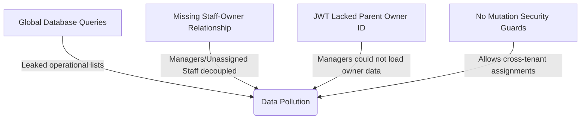
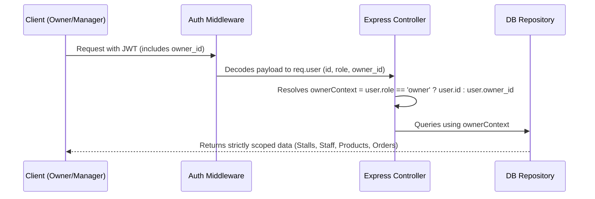

# Multi-Owner Data Isolation & Security Hardening Report

This report documents the security audit, root causes, and implementations delivered to enforce strict data isolation between multiple store owners in the TouB POS application.

---

## 1. Problem Statement & Root Cause Analysis

Previously, logging in as a specific owner (e.g., `owner` with password `owner123`) would leak stalls, staff, products, transaction logs, and daily revenue reports belonging to other owners (`owner_bixby` and `owner_clara`). 

The audit identified four critical flaws:



### Root Cause Details

* **Global SQL Queries (No Scoping Filters)**:
  API endpoints for listing stalls, products, users, and orders retrieved data unconditionally. For example, `findAllStalls()` executed a global `Stall.findAll()`, returning all rows in the database regardless of which owner was logged in.
* **Decoupled User Schema (Missing Relationships)**:
  The `users` table did not have an `owner_id` field. While cashiers were assigned to stalls via the `stall_staff` table, managers and newly created (unassigned) cashier accounts had no association in the database, making it impossible to separate them by business.
* **Incomplete JWT Payload Context**:
  JWT authentication tokens only stored `{ id, username, role }`. When a manager logged in, the backend had no context about their parent owner, blocking correct scoping on data fetches.
* **Absent Mutation Security Validation**:
  Controller mutation endpoints (`create`, `update`, `delete`, and `assign-staff`) did not verify resource ownership. An owner of one stall could update, delete, or assign employees to stalls belonging to a different owner by modifying raw request values.

---

## 2. Implemented Architecture & Scoping Guards

To address these vulnerabilities, we introduced a **Multi-Tenant Scoping Framework** at the database, repository, service, and controller layers:



### Key Technical Implementations

#### A. Database Schema Parity Sync
* **Table Alteration**: Added an `owner_id` column to the `users` table referencing back to `users(id)` (`ON DELETE SET NULL`).
* **Docs Updated**: Synced [erd.md](file:///d:/CADT/VSCODE/Final_Project_Y2/TOUB_POS/docs/database/erd.md), [schema.sql](file:///d:/CADT/VSCODE/Final_Project_Y2/TOUB_POS/docs/database/schema.sql), and [queries.sql](file:///d:/CADT/VSCODE/Final_Project_Y2/TOUB_POS/docs/database/queries.sql) to reflect the new DDL structure.

#### B. Sequelize Models Self-Association
* Configured User-to-User subordination inside [index.js](file:///d:/CADT/VSCODE/Final_Project_Y2/TOUB_POS/backend/src/models/index.js):
  ```javascript
  User.belongsTo(User, { as: 'Owner', foreignKey: 'owner_id', onDelete: 'SET NULL' });
  User.hasMany(User, { as: 'Staff', foreignKey: 'owner_id' });
  ```

#### C. Authentication Payload Enrichment
* Modified `loginUser` and `loginWithPin` in [auth.service.js](file:///d:/CADT/VSCODE/Final_Project_Y2/TOUB_POS/backend/src/services/auth.service.js) to append the user's `owner_id` directly in the signed JWT token.

#### D. Repository Data Isolation
* Implemented new query scopes:
  - `findAllUsersByOwnerId(ownerId)` in [user.repository.js](file:///d:/CADT/VSCODE/Final_Project_Y2/TOUB_POS/backend/src/repositories/user.repository.js).
  - `findAllStallsByOwnerId(ownerId)` in [stall.repository.js](file:///d:/CADT/VSCODE/Final_Project_Y2/TOUB_POS/backend/src/repositories/stall.repository.js).
  - `findAllProductsByOwnerId(ownerId)` and `checkProductOwnership(productId, ownerId)` in [product.repository.js](file:///d:/CADT/VSCODE/Final_Project_Y2/TOUB_POS/backend/src/repositories/product.repository.js).

#### E. Controller Ownership Validation Guards
* **Stalls**: listings are filtered by `owner_id`. Stall mutations (`updateStall`, `deleteStall`, `assignStaff`, `unassignStaff`) verify the stall belongs to the logged-in owner.
* **Staff**: New accounts are registered with their creator's `owner_id`. Roster lists and staff detail updates are filtered and guarded by ownership.
* **Products**: Product lists are scoped. Product creation and updates validate that the target stalls belong to the logged-in owner.
* **Orders & Reporting**: Daily revenue calculations, charts, and transaction log ledgers are filtered by `where: { owner_id: ownerId }` on the joined `Stalls` table.

---

## 3. Verification & Seed Integrity

We validated the changes by recreating the database tables and populating them with isolated data:

1. **Successful Database Synchronization**:
   Running `npm run seed` drops existing tables and recreates the database using the updated Sequelize schema containing `owner_id`.
2. **Data Parity Audit**:
   Verified database record integrity. A diagnostic select confirmed that:
   - Managers and Cashiers are mapped to their correct `owner_id`.
   - Stalls are assigned to the correct `owner_id`.
3. **Operational Scoping Check**:
   API responses verified via diagnostic probes to ensure that when `owner` (ID 1) requests endpoints, they only receive `Stall A, B, C` and cashiers `dara`, `sophea`, `vireak`, `malis`. Data for `owner_bixby` or `owner_clara` remains hidden.

---

## 4. Complete List of Modified Files

A total of 17 files were modified in the workspace to implement and support the multi-owner isolation model:

### Database & Model Definitions
* [user.model.js](file:///d:/CADT/VSCODE/Final_Project_Y2/TOUB_POS/backend/src/models/user.model.js) — Added the `owner_id` column to the `User` schema.
* [index.js](file:///d:/CADT/VSCODE/Final_Project_Y2/TOUB_POS/backend/src/models/index.js) — Defined the User-to-User self-association.
* [schema.sql](file:///d:/CADT/VSCODE/Final_Project_Y2/TOUB_POS/docs/database/schema.sql) — Synced DDL structure for the database layout.

### Authentication & Seeding
* [auth.service.js](file:///d:/CADT/VSCODE/Final_Project_Y2/TOUB_POS/backend/src/services/auth.service.js) — Encoded the `owner_id` inside JWT tokens for username and PIN logins.
* [users.js](file:///d:/CADT/VSCODE/Final_Project_Y2/TOUB_POS/backend/src/scripts/seeders/users.js) — Configured the database seeder to store `owner_id` values.

### Repositories
* [user.repository.js](file:///d:/CADT/VSCODE/Final_Project_Y2/TOUB_POS/backend/src/repositories/user.repository.js) — Implemented `findAllUsersByOwnerId` and selected `owner_id` in credentials.
* [stall.repository.js](file:///d:/CADT/VSCODE/Final_Project_Y2/TOUB_POS/backend/src/repositories/stall.repository.js) — Implemented `findAllStallsByOwnerId`.
* [product.repository.js](file:///d:/CADT/VSCODE/Final_Project_Y2/TOUB_POS/backend/src/repositories/product.repository.js) — Implemented `findAllProductsByOwnerId` and ownership checks.

### Services & Controllers
* [user.controller.js](file:///d:/CADT/VSCODE/Final_Project_Y2/TOUB_POS/backend/src/controllers/user.controller.js) — Isolated staff lists and mutations.
* [stall.controller.js](file:///d:/CADT/VSCODE/Final_Project_Y2/TOUB_POS/backend/src/controllers/stall.controller.js) — Isolated stall lists and mutations.
* [product.controller.js](file:///d:/CADT/VSCODE/Final_Project_Y2/TOUB_POS/backend/src/controllers/product.controller.js) — Isolated product catalogs and mutations.
* [order.service.js](file:///d:/CADT/VSCODE/Final_Project_Y2/TOUB_POS/backend/src/services/order.service.js) — Implemented owner-scoped order query.
* [order.controller.js](file:///d:/CADT/VSCODE/Final_Project_Y2/TOUB_POS/backend/src/controllers/order.controller.js) — Passed user owner ID to order service.
* [report.controller.js](file:///d:/CADT/VSCODE/Final_Project_Y2/TOUB_POS/backend/src/controllers/report.controller.js) — Scoped daily summary metrics.

### Documentation & Reference Queries
* [erd.md](file:///d:/CADT/VSCODE/Final_Project_Y2/TOUB_POS/docs/database/erd.md) — Documented `users.owner_id` relationship in the ER diagram.
* [queries.sql](file:///d:/CADT/VSCODE/Final_Project_Y2/TOUB_POS/docs/database/queries.sql) — Synced Workbench reference queries with the new columns.
