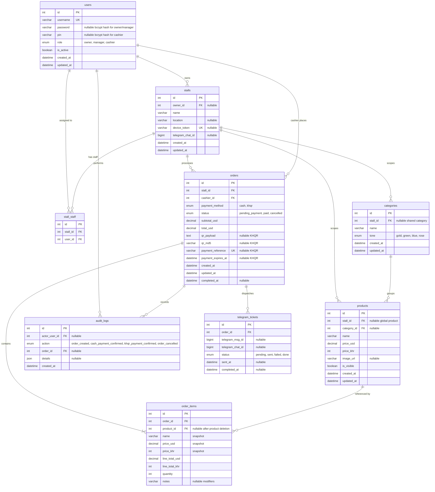

# Entity Relationship Diagram

This ERD is generated from the active Sequelize models in `backend/src/models/`
and the canonical MySQL schema in `docs/database/schema.sql`.

## Notes

- `order_items.name`, `price_usd`, `price_khr`, `line_total_usd`, and `line_total_khr` are snapshots frozen at time of sale. They survive product edits or deletion.
- `orders.qr_payload`, `qr_md5`, `payment_reference`, and `payment_expires_at` are populated for KHQR orders and remain `NULL` for cash orders.
- `orders.payment_reference` is the unique bill number/reference used by the KHQR webhook.
- `users.username` is required and unique for every role.
- `users.password` is used only for Owner/Manager username-password login and is `NULL` for Cashiers.
- `users.pin` is used only for Cashier PIN login and is `NULL` for Owners/Managers.
- `stall_staff` enforces a unique `(stall_id, user_id)` assignment pair.
- `order_items.notes` stores free-text modifiers ("no ice", "extra spicy") per line item.
- `audit_logs` stores sensitive POS actions and links them back to the acting user and related order when available.
- `telegram_tickets.status` tracks the kitchen ticket progress independently from the order payment status.
- `telegram_tickets.telegram_msg_id` stores the Telegram message ID so the bot can edit the existing message when the cook taps "Done".
- `telegram_tickets` enforces a unique `(telegram_chat_id, telegram_msg_id)` pair.
- `stalls.owner_id` identifies the business owner responsible for each stall.
- `stalls.location` stores the physical location of the stall (e.g. AEON Mall, Night Market, University).
- `stalls.device_token` is the permanent terminal registration key stored in browser `localStorage`.
- `products.stall_id = NULL` means a global/shared item visible to all stalls.
- `categories.stall_id = NULL` means a shared category across stalls.
