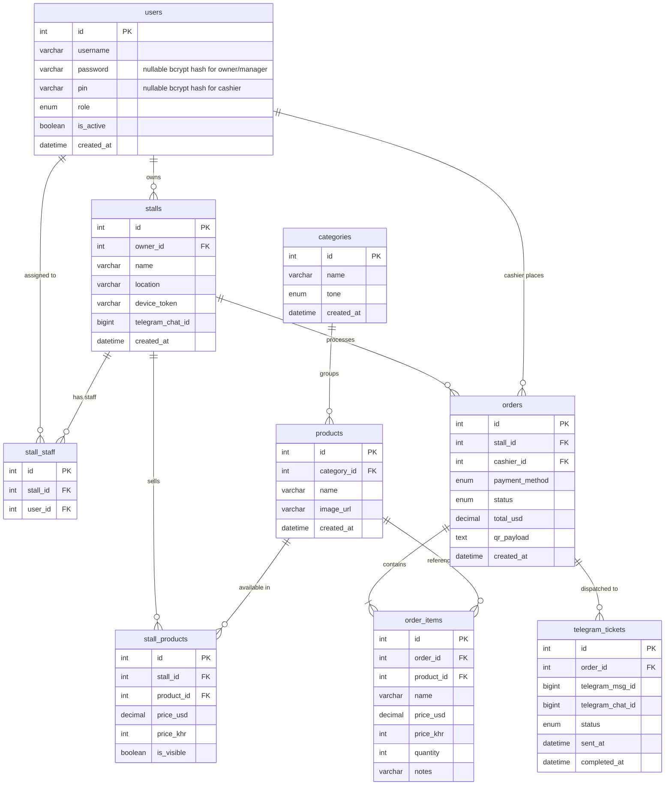

# Entity Relationship Diagram

## Notes

- `order_items.name`, `price_usd`, `price_khr` are **snapshots** — frozen at time of sale. Survives product edits or deletions.
- `users.username` is required and unique for every role.
- `users.password` is used only for Owner/Manager username-password login and is `NULL` for Cashiers.
- `users.pin` is used only for Cashier PIN login and is `NULL` for Owners/Managers.
- `order_items.notes` stores free-text modifiers ("no ice", "extra spicy") per line item.
- `telegram_tickets.status` tracks the kitchen ticket progress independently from the order payment status.
- `telegram_tickets.telegram_msg_id` stores the Telegram message ID so the bot can edit the existing message when the cook taps "Done".
- `stalls.owner_id` identifies the business owner responsible for each stall.
- `stalls.location` stores the physical location of the stall (e.g. AEON Mall, Night Market, University).
- `stalls.device_token` is the permanent terminal registration key stored in browser `localStorage`.
- `categories` are global menu groups shared across stalls.
- `products` stores shared catalog metadata and its global category.
- Per-stall price and visibility live in `stall_products`.
- A product is visible to a stall only when a matching `stall_products` row exists with `is_visible = TRUE`.
