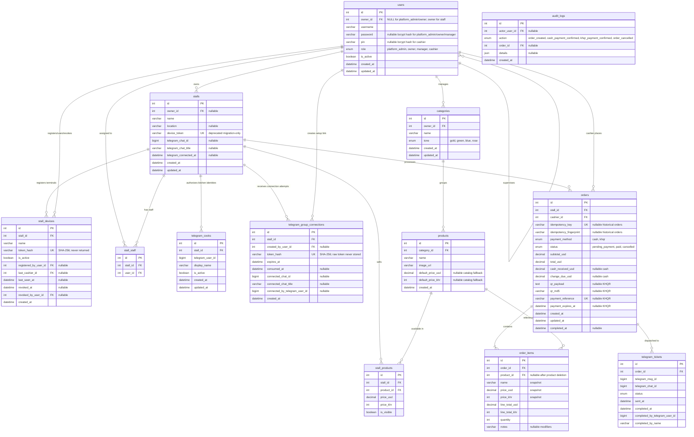

# Entity Relationship Diagram

This ERD is generated from the active Sequelize models in `backend/src/models/`
and the canonical MySQL schema in `docs/database/schema.sql`.

## Notes

- `order_items.name`, `price_usd`, `price_khr`, `line_total_usd`, and `line_total_khr` are snapshots frozen at time of sale. They survive product edits or deletion.
- `orders.cash_received_usd` and `orders.change_due_usd` are stored for cash orders after backend confirmation. The frontend may preview change, but the backend calculates the saved value.
- `orders.idempotency_key` is unique per cashier. Exact checkout retries return the original order; reuse with different request data is rejected by comparing `idempotency_fingerprint`.
- `orders.qr_payload`, `qr_md5`, `payment_reference`, and `payment_expires_at` are populated for KHQR orders and remain `NULL` for cash orders.
- `orders.payment_reference` is the unique bill number/reference used by the KHQR webhook.
- `users.username` is required and unique for every role.
- `users.password` is used only for Platform Admin, Owner, and Manager username-password login and is `NULL` for Cashiers.
- `users.pin` is used only for Cashier PIN login and is `NULL` for Platform Admins, Owners, and Managers.
- `stall_staff` enforces a unique `(stall_id, user_id)` assignment pair.
- `users.owner_id` is `NULL` for `platform_admin` and business `owner` accounts. It links managers and cashiers to the specific business owner who manages them.
- `order_items.notes` stores free-text modifiers ("no ice", "extra spicy") per line item.
- `audit_logs` stores sensitive POS actions and links them back to the acting user and related order when available.
- `telegram_tickets.status` tracks the kitchen ticket progress independently from the order payment status.
- `telegram_tickets.telegram_msg_id` stores the Telegram message ID so the bot can edit the existing message when the cook taps "Done".
- `telegram_tickets` enforces a unique `(telegram_chat_id, telegram_msg_id)` pair.
- `telegram_cooks` is a stall-scoped allowlist of Telegram identities. Cooks are not web users and never receive JWT credentials.
- `telegram_group_connections` stores only SHA-256 hashes of short-lived, one-time Telegram `startgroup` setup tokens. Consuming a valid token binds the selected Telegram group to its stall.
- `telegram_tickets.completed_by_telegram_user_id` and `completed_by_name` preserve who completed a kitchen ticket.
- `stalls.owner_id` identifies the business owner responsible for each stall.
- `stalls.location` stores the physical location of the stall (e.g. AEON Mall, Night Market, University).
- `stall_devices` supports multiple independently revocable terminals per stall. The raw token is stored only in the registered browser; MySQL stores `token_hash`.
- `stall_devices.last_cashier_id` identifies the most recent cashier who successfully unlocked that device. It is display metadata, not ownership of the terminal.
- `stalls.device_token` remains temporarily nullable only as a startup migration source for terminals registered before the multi-device model. Active authentication does not read it.
- `categories.owner_id` links each category to the business owner who manages it. Category names are unique per owner.
- `products` stores shared catalog metadata, its owner-scoped category, and default USD/KHR prices so unassigned products retain their last configured price.
- Per-stall price and visibility live in `stall_products`.
- A product is visible to a stall only when a matching `stall_products` row exists with `is_visible = TRUE`.
