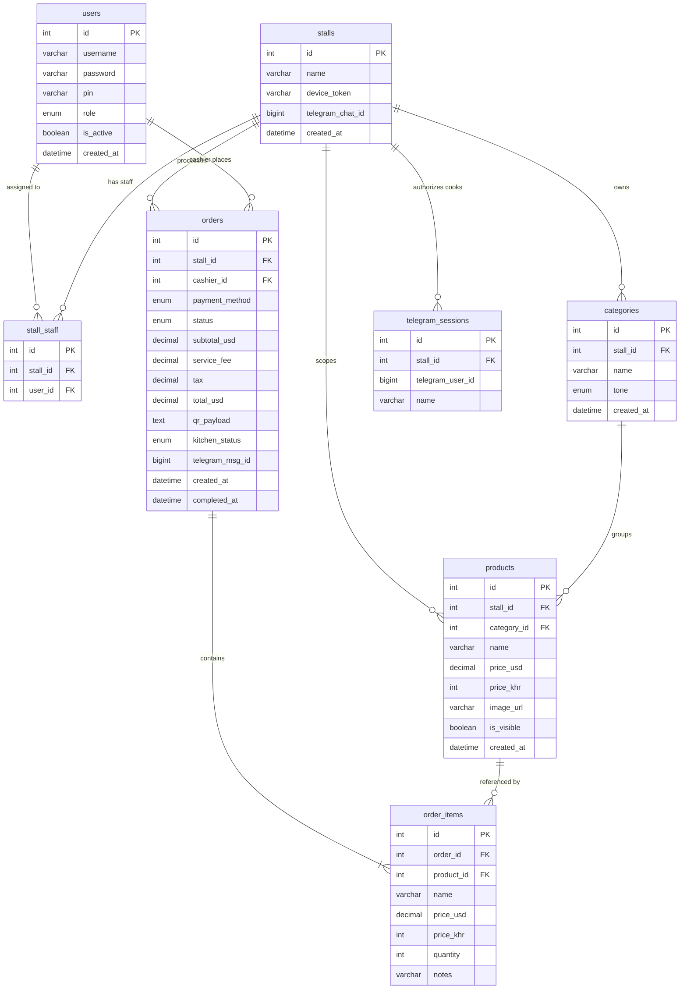

# Entity Relationship Diagram

## Notes

- `order_items.name`, `price_usd`, `price_khr` are **snapshots** — frozen at time of sale. Survives product edits or deletions.
- `order_items.notes` stores free-text modifiers ("no ice", "extra spicy") per line item.
- `orders.kitchen_status` tracks Telegram cook acknowledgement independently from payment `status`.
- `orders.telegram_msg_id` stores the sent message ID so the bot can `editMessage` in-place when cook taps "Done".
- `stalls.device_token` is the permanent terminal registration key stored in browser `localStorage`.
- `products.stall_id = NULL` means a global/shared item visible to all stalls.
- `categories.stall_id = NULL` means a shared category across stalls.
