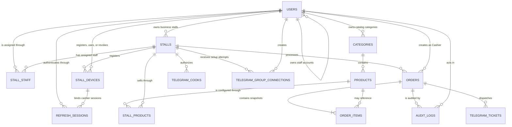
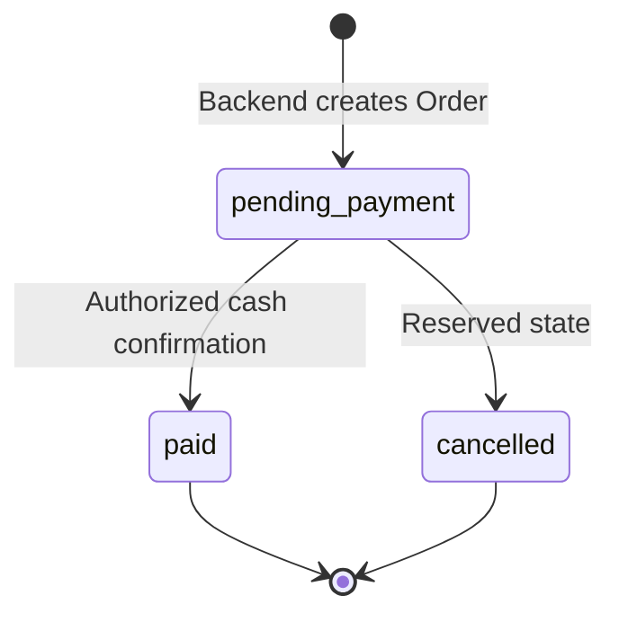

# TouB POS Database Schema Document

## 1. Document Control

| Field | Value |
| --- | --- |
| Product | TouB POS |
| Document type | As-built database schema document |
| Version | 1.0 |
| Status | Baseline with recorded parity follow-ups |
| Baseline date | 30 July 2026 |
| Database | MySQL |
| ORM | Sequelize |
| Executable model source | `backend/src/models/` |
| Canonical SQL source | `docs/database/schema.sql` |
| Query reference | `docs/database/queries.sql` |
| Existing ERD | `docs/database/erd.md` |

### 1.1 Method

This document follows the conceptual, logical, and physical schema distinction
described in MindStudio's
[database schema guide](https://www.mindstudio.ai/blog/what-is-a-database-schema).
It documents tables, columns, data types, constraints, relationships, indexes,
ownership, lifecycle, and migration concerns.

This is an as-built design record, not a replacement for executable Sequelize
models or `schema.sql`. Where those sources currently differ, Section 15 records
the mismatch explicitly.

## 2. Purpose And Scope

TouB POS uses MySQL as the durable source of truth for:

- Web users, roles, credentials, and business ownership.
- Stalls, Cashier assignments, and registered terminals.
- Categories, Products, per-Stall prices, and visibility.
- Orders, immutable Order Item snapshots, cash confirmation, and audit history.
- Telegram kitchen routing, Cook authorization, and ticket state.
- Retained KHQR metadata for historical/inactive payment records.

The following data is intentionally not stored in MySQL:

- JWT access tokens.
- Raw terminal registration tokens.
- Raw Telegram group-connection tokens.
- Product image binary files.
- Browser theme preference and transient UI state.
- Process-local Socket.IO connection maps.

## 3. Schema Levels

### 3.1 Conceptual Schema

The database has five business domains:

| Domain | Main entities | Purpose |
| --- | --- | --- |
| Identity and tenancy | User | Authentication, RBAC, and Owner-based business scope |
| Stall operations | Stall, Stall Staff, Stall Device | Physical locations, staff allocation, and terminal control |
| Catalog | Category, Product, Stall Product | Shared Product definition and per-Stall selling configuration |
| Sales and audit | Order, Order Item, Audit Log | Trusted transactions, snapshots, payment state, and traceability |
| Telegram kitchen | Telegram Cook, Group Connection, Ticket | Group routing, Cook authorization, delivery, and completion |

### 3.2 Logical Schema

The logical schema uses normalized entities and junction tables:

- `stall_staff` resolves the many-to-many User/Stall relationship.
- `stall_products` resolves the many-to-many Product/Stall relationship and
  carries assignment-specific price and visibility.
- `order_items` intentionally duplicates Product name and price as a transaction
  snapshot.
- `telegram_tickets` separates kitchen state from Order payment state.
- `audit_logs.details` uses JSON for action-specific evidence that does not need
  a dedicated column for every event type.

### 3.3 Physical Schema

- Database engine: MySQL.
- Primary keys: auto-incrementing `INT`.
- Naming: snake_case table and column names.
- Money in USD: `DECIMAL(10,2)`.
- Money in KHR: integer Riel values.
- External Telegram identifiers: `BIGINT`.
- Date/time: MySQL `DATETIME`.
- Enumerated states: MySQL `ENUM`.
- Semi-structured audit details: MySQL `JSON`.

## 4. High-Level Entity Relationship Diagram

## 5. Table Inventory

| # | Table | Domain | Row meaning | Main owner/scope |
| --- | --- | --- | --- | --- |
| 1 | `users` | Identity | One web-app identity | Self or `owner_id` |
| 2 | `stalls` | Operations | One physical selling location | `owner_id` |
| 3 | `stall_devices` | Operations | One registered browser/device | `stall_id` |
| 4 | `stall_staff` | Operations | One User-to-Stall assignment | Stall and User |
| 5 | `categories` | Catalog | One Owner-scoped Product group | `owner_id` |
| 6 | `products` | Catalog | One reusable Product definition | Through Category |
| 7 | `stall_products` | Catalog | One Product's configuration at one Stall | Stall and Product |
| 8 | `orders` | Sales | One checkout transaction | Stall and Cashier |
| 9 | `order_items` | Sales | One immutable line snapshot | `order_id` |
| 10 | `audit_logs` | Audit | One sensitive business action | Actor and optional Order |
| 11 | `telegram_cooks` | Kitchen | One authorized Telegram identity at a Stall | `stall_id` |
| 12 | `telegram_group_connections` | Kitchen | One short-lived setup attempt | `stall_id` |
| 13 | `telegram_tickets` | Kitchen | One Telegram dispatch state record | `order_id` |
| 14 | `refresh_sessions` | Identity | One rotating browser login credential | `user_id` and optional `device_id` |

## 6. Identity And Tenancy Tables

### 6.1 `users`

**Purpose:** Stores every web-app account and models customer-business ownership
through a self-referencing `owner_id`.

| Column | Type | Null/default | Key | Meaning |
| --- | --- | --- | --- | --- |
| `id` | `INT` | Auto increment | PK | User identifier |
| `owner_id` | `INT` | Nullable | FK → `users.id` | Owning business Owner for Manager/Cashier |
| `username` | `VARCHAR(50)` | Required | Unique | Login name for every web role |
| `password` | `VARCHAR(255)` | Nullable |  | bcrypt hash for Platform Admin/Owner/Manager |
| `pin` | `VARCHAR(255)` | Nullable |  | bcrypt hash for Cashier PIN login |
| `role` | `ENUM` | Required; `cashier` |  | `platform_admin`, `owner`, `manager`, or `cashier` |
| `is_active` | `BOOLEAN` | Required; `TRUE` |  | Whether authentication is allowed |
| `is_deleted` | `BOOLEAN` | Required; `FALSE` in model |  | Soft-delete marker used by repositories |
| `session_version` | `INT` | Required; `1` |  | Incremented after account changes to invalidate older JWT and Socket.IO sessions |
| `created_at` | `DATETIME` | Required/current time |  | Creation time |
| `updated_at` | `DATETIME` | Required/auto update |  | Last model update |

**Credential invariant**

| Role | `password` | `pin` |
| --- | --- | --- |
| `platform_admin` | bcrypt hash | `NULL` |
| `owner` | bcrypt hash | `NULL` |
| `manager` | bcrypt hash | `NULL` |
| `cashier` | `NULL` | bcrypt hash |

The service layer enforces credential exclusivity. The current SQL does not have
a `CHECK` constraint for this rule.

**Ownership invariant**

- Platform Admin: `owner_id = NULL`.
- Owner: `owner_id = NULL`.
- Manager/Cashier: `owner_id = users.id` of the business Owner.
- One Owner per customer business is a service/product rule. There is no
  separate `businesses` table or database constraint that groups exactly one
  Owner with a tenant record.

**Deletion:** User deletion is a soft delete. The repository sets
`is_deleted = TRUE`, sets `is_active = FALSE`, and changes the username so its
former unique value can be reused.

### 6.2 `refresh_sessions`

**Purpose:** Stores revocable, rotating browser sessions without storing raw
refresh or CSRF tokens.

| Column | Type | Null/default | Key | Meaning |
| --- | --- | --- | --- | --- |
| `id` | `BIGINT` | Auto increment | PK | Session record |
| `user_id` | `INT` | Required | FK → `users.id` | Authenticated user |
| `device_id` | `INT` | Nullable | FK → `stall_devices.id` | Required cashier terminal binding |
| `token_hash` | `VARCHAR(64)` | Required | Unique | SHA-256 refresh-token hash |
| `csrf_token_hash` | `VARCHAR(64)` | Required |  | SHA-256 CSRF-token hash |
| `family_id` | `VARCHAR(36)` | Required | Index | Rotation lineage |
| `session_version` | `INT` | Required |  | User version when issued |
| `expires_at` | `DATETIME` | Required | Index | Absolute session expiry |
| `last_used_at` | `DATETIME` | Nullable |  | Rotation/logout use time |
| `revoked_at` | `DATETIME` | Nullable | Index | Consumption or revocation time |
| `replaced_by_token_hash` | `VARCHAR(64)` | Nullable |  | One-way link to rotation replacement |
| `created_at` | `DATETIME` | Required/current time |  | Issue time |

The raw refresh token exists only in a Secure, HttpOnly cookie. The readable
CSRF cookie is validated against both `X-CSRF-Token` and its stored hash.

## 7. Stall Operations Tables

### 7.1 `stalls`

**Purpose:** Stores a physical selling location and its current Telegram kitchen
destination.

| Column | Type | Null/default | Key | Meaning |
| --- | --- | --- | --- | --- |
| `id` | `INT` | Auto increment | PK | Stall identifier |
| `owner_id` | `INT` | Nullable | FK → `users.id` | Business Owner scope |
| `name` | `VARCHAR(100)` | Required |  | Stall display name |
| `location` | `VARCHAR(150)` | Nullable |  | Physical location label |
| `device_token` | `VARCHAR(255)` | Nullable | Unique | Deprecated migration source |
| `telegram_chat_id` | `BIGINT` | Nullable |  | Full backend-only kitchen group ID |
| `telegram_chat_title` | `VARCHAR(255)` | Nullable |  | Safe group display title |
| `telegram_connected_at` | `DATETIME` | Nullable |  | Last successful guided connection |
| `is_active` | `BOOLEAN` | Required; `TRUE` |  | Operational availability |
| `is_deleted` | `BOOLEAN` | Required; `FALSE` |  | Soft-delete marker |
| `created_at` | `DATETIME` | Required/current time |  | Creation time |
| `updated_at` | `DATETIME` | Required/auto update |  | Last update |

`device_token` is not the active multi-device authentication mechanism.
Active terminal tokens are represented by `stall_devices`.

**Deletion:** Stall deletion is soft deletion in application repositories.

### 7.2 `stall_devices`

**Purpose:** Supports multiple independently revocable physical terminals per
Stall.

| Column | Type | Null/default | Key | Meaning |
| --- | --- | --- | --- | --- |
| `id` | `INT` | Auto increment | PK | Device record identifier |
| `stall_id` | `INT` | Required | FK → `stalls.id` | Registered Stall |
| `name` | `VARCHAR(100)` | Required |  | Human-readable terminal name |
| `token_hash` | `VARCHAR(64)` | Required | Unique | SHA-256 hash of raw browser token |
| `is_active` | `BOOLEAN` | Required; `TRUE` |  | Whether device authentication is allowed |
| `registered_by_user_id` | `INT` | Nullable | FK → `users.id` | Management actor who registered it |
| `last_cashier_id` | `INT` | Nullable | FK → `users.id` | Most recent successful Cashier |
| `last_seen_at` | `DATETIME` | Nullable |  | Latest validated use |
| `revoked_at` | `DATETIME` | Nullable |  | Revocation time |
| `revoked_by_user_id` | `INT` | Nullable | FK → `users.id` | Management actor who revoked it |
| `created_at` | `DATETIME` | Required/current time |  | Registration time |

The raw token is returned only to the registering browser and is not persisted
in MySQL. Device revocation changes state rather than deleting the row.

### 7.3 `stall_staff`

**Purpose:** Junction table between Stalls and Users.

| Column | Type | Null/default | Key | Meaning |
| --- | --- | --- | --- | --- |
| `id` | `INT` | Auto increment | PK | Assignment identifier |
| `stall_id` | `INT` | Required | FK → `stalls.id` | Assigned Stall |
| `user_id` | `INT` | Required | FK → `users.id` | Assigned User |

**Constraints**

- Unique pair: (`stall_id`, `user_id`).
- Deleting either referenced row cascades to the assignment.
- Service logic permits Cashier assignments only.
- The product rule says a Cashier belongs to one Stall, but the database does
  not currently declare `UNIQUE(user_id)`. This rule is application-enforced.

## 8. Catalog Tables

### 8.1 `categories`

**Purpose:** Groups Products within one Owner's catalog.

| Column | Type | Null/default | Key | Meaning |
| --- | --- | --- | --- | --- |
| `id` | `INT` | Auto increment | PK | Category identifier |
| `owner_id` | `INT` | Required | FK → `users.id` | Owner scope |
| `name` | `VARCHAR(100)` | Required | Composite unique | Category name |
| `tone` | `ENUM` | Required; `gold` |  | `gold`, `green`, `blue`, or `rose` |
| `created_at` | `DATETIME` | Required/current time |  | Creation time |
| `updated_at` | `DATETIME` | Required/auto update |  | Last update |

The pair (`owner_id`, `name`) is unique, allowing different businesses to use
the same Category name.

### 8.2 `products`

**Purpose:** Stores Product metadata shared across its Stall assignments.

| Column | Type | Null/default | Key | Meaning |
| --- | --- | --- | --- | --- |
| `id` | `INT` | Auto increment | PK | Product identifier |
| `category_id` | `INT` | Required | FK → `categories.id` | Owner-scoped Category |
| `name` | `VARCHAR(150)` | Required |  | Product display name |
| `image_url` | `VARCHAR(500)` | Nullable |  | ImageKit-delivered image URL |
| `default_price_usd` | `DECIMAL(10,2)` | Nullable |  | Price retained without assignments |
| `default_price_khr` | `INT` | Nullable |  | KHR price retained without assignments |
| `is_active` | `BOOLEAN` | Required; `TRUE` in model |  | Whether Product may be sold |
| `is_deleted` | `BOOLEAN` | Required; `FALSE` in model |  | Soft-delete marker |
| `created_at` | `DATETIME` | Required/current time |  | Creation time |
| `updated_at` | `DATETIME` | Required/auto update |  | Last update |

Deleting a Category is restricted while Products reference it. Product
ownership is derived through `categories.owner_id`, not through a direct
`products.owner_id`.

**Deletion:** Product deletion is a soft delete. Existing Order Item snapshots
remain intact.

### 8.3 `stall_products`

**Purpose:** Junction and configuration table for Product availability at one
Stall.

| Column | Type | Null/default | Key | Meaning |
| --- | --- | --- | --- | --- |
| `id` | `INT` | Auto increment | PK | Assignment identifier |
| `stall_id` | `INT` | Required | FK → `stalls.id` | Selling Stall |
| `product_id` | `INT` | Required | FK → `products.id` | Assigned Product |
| `price_usd` | `DECIMAL(10,2)` | Required |  | Trusted Stall USD price |
| `price_khr` | `INT` | Required |  | Trusted Stall KHR price |
| `is_visible` | `BOOLEAN` | Required; `TRUE` |  | Cashier catalog visibility |

The pair (`stall_id`, `product_id`) is unique. Both foreign keys cascade on
delete. A Product with no row in this table remains manageable but is not
sellable at any Stall.

## 9. Sales And Audit Tables

### 9.1 `orders`

**Purpose:** Stores one backend-owned checkout and payment state.

| Column | Type | Null/default | Key | Meaning |
| --- | --- | --- | --- | --- |
| `id` | `INT` | Auto increment | PK | Order identifier |
| `stall_id` | `INT` | Required | FK → `stalls.id` | Backend-resolved selling Stall |
| `cashier_id` | `INT` | Required | FK → `users.id` | JWT-resolved creating Cashier |
| `payment_method` | `ENUM` | Required |  | `cash` or retained `khqr` |
| `status` | `ENUM` | Required; `pending_payment` |  | `pending_payment`, `paid`, `cancelled` |
| `subtotal_usd` | `DECIMAL(10,2)` | Required; `0.00` |  | Sum before any future adjustments |
| `total_usd` | `DECIMAL(10,2)` | Required |  | Trusted final total |
| `cash_received_usd` | `DECIMAL(10,2)` | Nullable |  | Customer cash accepted by backend |
| `change_due_usd` | `DECIMAL(10,2)` | Nullable |  | Backend-calculated change |
| `qr_payload` | `TEXT` | Nullable |  | Retained KHQR payload |
| `qr_md5` | `VARCHAR(64)` | Nullable |  | Retained KHQR payload digest |
| `payment_reference` | `VARCHAR(100)` | Nullable | Unique | Retained payment reference |
| `payment_expires_at` | `DATETIME` | Nullable |  | Retained QR expiry |
| `created_at` | `DATETIME` | Required/current time |  | Order creation time |
| `updated_at` | `DATETIME` | Required/auto update |  | Last state update |
| `completed_at` | `DATETIME` | Nullable |  | Successful paid transition time |

**Active cash state transition**

`cancelled` exists in the schema but no general user-facing cancellation flow is
currently claimed.

### 9.2 `order_items`

**Purpose:** Stores immutable sale-time line details.

| Column | Type | Null/default | Key | Meaning |
| --- | --- | --- | --- | --- |
| `id` | `INT` | Auto increment | PK | Line identifier |
| `order_id` | `INT` | Required | FK → `orders.id` | Parent Order |
| `product_id` | `INT` | Nullable | FK → `products.id` | Optional live Product reference |
| `name` | `VARCHAR(150)` | Required |  | Product name snapshot |
| `price_usd` | `DECIMAL(10,2)` | Required |  | Unit USD price snapshot |
| `price_khr` | `INT` | Required |  | Unit KHR price snapshot |
| `line_total_usd` | `DECIMAL(10,2)` | Required; `0.00` |  | Trusted USD line total |
| `line_total_khr` | `INT` | Required; `0` |  | Trusted KHR line total |
| `quantity` | `INT` | Required; `1` |  | Purchased quantity |
| `notes` | `VARCHAR(500)` | Nullable |  | Modifier snapshot |

Deleting an Order cascades to its items. Deleting a Product sets `product_id` to
`NULL`, preserving receipt history through snapshot fields.

### 9.3 `audit_logs`

**Purpose:** Records security- and transaction-relevant actions.

| Column | Type | Null/default | Key | Meaning |
| --- | --- | --- | --- | --- |
| `id` | `INT` | Auto increment | PK | Audit record identifier |
| `actor_user_id` | `INT` | Nullable | FK → `users.id` | Acting web user |
| `action` | `ENUM` | Required | Indexed | Audit action |
| `order_id` | `INT` | Nullable | FK → `orders.id` | Related Order |
| `details` | `JSON` | Nullable |  | Action-specific evidence |
| `created_at` | `DATETIME` | Required/current time | Indexed | Event time |

Current action values:

- `order_created`.
- `cash_payment_confirmed`.
- `khqr_payment_confirmed` for retained history.
- `order_cancelled` reserved for a future workflow.

Deleting the referenced User or Order sets its foreign key to `NULL`, preserving
the audit row.

## 10. Telegram Kitchen Tables

### 10.1 `telegram_cooks`

**Purpose:** Stall-scoped allowlist of Telegram-only kitchen identities.

| Column | Type | Null/default | Key | Meaning |
| --- | --- | --- | --- | --- |
| `id` | `INT` | Auto increment | PK | Cook authorization identifier |
| `stall_id` | `INT` | Required | FK → `stalls.id` | Authorized Stall |
| `telegram_user_id` | `BIGINT` | Required | Composite unique | Telegram actor ID |
| `display_name` | `VARCHAR(100)` | Required |  | Human-readable attribution |
| `is_active` | `BOOLEAN` | Required; `TRUE` | Indexed with Stall | Authorization state |
| `created_at` | `DATETIME` | Required/current time |  | Creation time |
| `updated_at` | `DATETIME` | Required/current time |  | Last authorization change |

The pair (`stall_id`, `telegram_user_id`) is unique. Revocation sets
`is_active = FALSE`; it does not create or delete a web user.

### 10.2 `telegram_group_connections`

**Purpose:** Stores one-time, expiring attempts to connect a group to a Stall.

| Column | Type | Null/default | Key | Meaning |
| --- | --- | --- | --- | --- |
| `id` | `INT` | Auto increment | PK | Connection attempt identifier |
| `stall_id` | `INT` | Required | FK → `stalls.id` | Intended Stall |
| `created_by_user_id` | `INT` | Nullable | FK → `users.id` | Owner who created link |
| `token_hash` | `VARCHAR(64)` | Required | Unique | SHA-256 setup-token hash |
| `expires_at` | `DATETIME` | Required | Indexed with Stall | Expiry time |
| `consumed_at` | `DATETIME` | Nullable |  | One-time use time |
| `connected_chat_id` | `BIGINT` | Nullable |  | Group selected in Telegram |
| `connected_chat_title` | `VARCHAR(255)` | Nullable |  | Group display title |
| `connected_by_telegram_user_id` | `BIGINT` | Nullable |  | Telegram actor completing setup |
| `created_at` | `DATETIME` | Required/current time |  | Attempt creation time |

The raw token is never stored. Deleting a Stall cascades to its attempts.
Deleting the creating User sets `created_by_user_id` to `NULL`.

### 10.3 `telegram_tickets`

**Purpose:** Tracks kitchen delivery independently from payment.

| Column | Type | Null/default | Key | Meaning |
| --- | --- | --- | --- | --- |
| `id` | `INT` | Auto increment | PK | Ticket identifier |
| `order_id` | `INT` | Required | FK → `orders.id` | Paid Order |
| `telegram_msg_id` | `BIGINT` | Nullable | Composite unique | Telegram message to edit |
| `telegram_chat_id` | `BIGINT` | Nullable | Composite unique/index | Destination group |
| `status` | `ENUM` | Required; `pending` | Indexed | `pending`, `sent`, `failed`, or `done` |
| `sent_at` | `DATETIME` | Nullable |  | Successful delivery time |
| `completed_at` | `DATETIME` | Nullable |  | Cook completion time |
| `completed_by_telegram_user_id` | `BIGINT` | Nullable |  | Authorized Cook identity |
| `completed_by_name` | `VARCHAR(100)` | Nullable |  | Completion display snapshot |

The pair (`telegram_chat_id`, `telegram_msg_id`) is unique. Deleting an Order
cascades to its tickets.

## 11. Relationship And Delete Matrix

| Parent | Child/relationship | Cardinality | Delete behavior |
| --- | --- | --- | --- |
| `users` Owner | `users` staff | One-to-many | Staff `owner_id` becomes `NULL` |
| `users` | `refresh_sessions` | One-to-many | Cascade |
| `stall_devices` | `refresh_sessions` | One-to-many | Cascade |
| `users` Owner | `stalls` | One-to-many | Stall `owner_id` becomes `NULL` |
| `users` Owner | `categories` | One-to-many | Categories cascade |
| `stalls` | `stall_devices` | One-to-many | Cascade |
| `stalls` | `stall_staff` | One-to-many | Cascade |
| `users` | `stall_staff` | One-to-many | Cascade |
| `categories` | `products` | One-to-many | Restrict |
| `stalls` | `stall_products` | One-to-many | Cascade |
| `products` | `stall_products` | One-to-many | Cascade |
| `stalls` | `orders` | One-to-many | No explicit cascade |
| `users` Cashier | `orders` | One-to-many | No explicit cascade |
| `orders` | `order_items` | One-to-many | Cascade |
| `products` | `order_items` | One-to-many | Set `NULL` |
| `users` | `audit_logs` | One-to-many | Set `NULL` |
| `orders` | `audit_logs` | One-to-many | Set `NULL` |
| `stalls` | `telegram_cooks` | One-to-many | Cascade |
| `stalls` | `telegram_group_connections` | One-to-many | Cascade |
| `users` | `telegram_group_connections` | One-to-many | Set `NULL` |
| `orders` | `telegram_tickets` | One-to-many | Cascade |

Operational entities normally use soft deletion, reducing the need to delete
historical Orders or audit evidence.

## 12. Constraints And Business Rules

### 12.1 Database-Enforced

- Every table has a primary key.
- Usernames are unique.
- Category name is unique per Owner.
- Stall/User assignment pairs are unique.
- Stall/Product assignment pairs are unique.
- Device token hashes are unique.
- Telegram Cook identity is unique per Stall.
- Telegram group-connection token hashes are unique.
- Telegram chat/message ticket pairs are unique.
- Payment references are unique when present.
- Required foreign keys reject missing related rows.
- Enumerations restrict role, state, tone, payment method, and audit action.

### 12.2 Application-Enforced

- Exactly one role-appropriate credential per User.
- Platform Admin creates Owners only.
- Owner manages Managers/Cashiers; Manager manages Cashiers only.
- One Owner per customer business.
- Only Cashiers may be assigned to Stalls.
- A Cashier operates from one assigned Stall.
- Product and Stall belong to the same Owner before assignment.
- USD/KHR prices and quantities are positive.
- Cash received covers the trusted Order total.
- Only allowed actors confirm cash or retry Telegram delivery.
- Only active, visible, non-deleted Products can be sold.
- Telegram callbacks match exact ticket/chat/message context and an active Cook.

The distinction is important: bypassing service logic could violate an
application-enforced rule even when foreign keys remain valid.

## 13. Index Strategy

| Table | Index | Query supported |
| --- | --- | --- |
| `users` | Unique `username` | Username/password login |
| `stalls` | Unique legacy `device_token` | Migration compatibility only |
| `stall_devices` | Unique `token_hash` | Device authentication |
| `stall_devices` | (`stall_id`, `is_active`) | Active device list per Stall |
| `stall_devices` | `last_cashier_id` | Device usage metadata |
| `categories` | Unique (`owner_id`, `name`) | Owner-scoped Category validation |
| `stall_products` | Unique (`stall_id`, `product_id`) | Stall catalog lookup |
| `orders` | Unique `payment_reference` | Retained payment reconciliation |
| `orders` | (`stall_id`, `created_at`) | Management Order history/report scope |
| `orders` | (`cashier_id`, `created_at`) | Cashier's own Order history |
| `orders` | `status` | Paid/pending operational queries |
| `audit_logs` | Actor, Order, action, created time | Audit filtering |
| `telegram_cooks` | Unique (`stall_id`, `telegram_user_id`) | Callback authorization |
| `telegram_cooks` | (`stall_id`, `is_active`) | Active Cook list |
| `telegram_group_connections` | Unique `token_hash` | One-time setup lookup |
| `telegram_group_connections` | (`stall_id`, `expires_at`) | Pending/expired setup lookup |
| `telegram_tickets` | Order, chat, status | Dispatch and completion lookup |
| `telegram_tickets` | Unique (`telegram_chat_id`, `telegram_msg_id`) | Exact callback context |

The three non-unique Order indexes are declared in the Sequelize model but are
currently missing from `schema.sql`; see Section 15.

## 14. Security, Privacy, And Data Classification

| Data | Classification | Storage rule |
| --- | --- | --- |
| Password/PIN hashes | Highly sensitive | bcrypt hash in `users`; never returned |
| Device token | Secret | Raw token browser-only; SHA-256 hash in MySQL |
| Group setup token | Secret | Raw token link-only; SHA-256 hash in MySQL |
| Telegram full IDs | Sensitive operational identifier | Backend/MySQL only; mask in management responses |
| Access JWT | Short-lived session credential | Browser memory; not MySQL |
| Refresh token | Durable rotating session credential | HttpOnly cookie; SHA-256 hash and lineage in `refresh_sessions` |
| Product image | Public business media | Binary in ImageKit; URL in MySQL |
| Order totals/change | Financial record | Backend-calculated and persisted |
| Audit details | Security/financial evidence | JSON in MySQL; access should remain restricted |
| Retained KHQR payload/MD5/reference | Payment metadata | Historical/backend-controlled |

Database credentials and provider secrets belong in backend environment
variables, not tables or committed SQL.

## 15. Sequelize And SQL Parity Findings

The project workflow requires Sequelize models and raw SQL documentation to
remain synchronized. The 30 July 2026 inspection found these differences:

| Priority | Area | Sequelize/current code | `schema.sql` or query docs | Required follow-up |
| --- | --- | --- | --- | --- |
| High | `users.is_deleted` | Defined and required by every active User query | Column absent | Add column/default to canonical SQL and ERD |
| High | Product lifecycle flags | `products.is_active` and `products.is_deleted` are defined and queried | Columns absent | Add both columns/defaults to canonical SQL and ERD |
| Medium | Order performance indexes | Three active indexes declared in `order.model.js` | Missing from canonical SQL | Add named Stall/time, Cashier/time, and status indexes |
| Medium | Product index | Canonical SQL has `idx_stall_products_product_id` | Not explicitly declared by model | Confirm association-generated index or declare it in model |
| Medium | Category query examples | `owner_id` is required | Several sample `SELECT`/`INSERT` statements omit it | Correct `queries.sql` examples |
| Medium | Product query examples | Active code filters lifecycle flags and uses default prices | Several samples omit these fields/filters | Update query reference |
| Low | Existing ERD | Omits current lifecycle/timestamp details | Does not fully represent executable models | Refresh from this document after parity fix |
| High | Seed examples | Placeholder strings are not valid deployable bcrypt hashes | Included in canonical SQL examples | Keep development-only and replace before real deployment |

No schema or source-code changes were made while creating this document. The
parity items should be handled as a separate, reviewed database-maintenance
change because adding fields/indexes can affect existing databases.

## 16. Data Integrity Risks And Recommendations

### 16.1 Must Resolve Before Production

1. Synchronize lifecycle fields and Order indexes between Sequelize and SQL.
2. Replace development placeholder credential hashes.
3. Adopt ordered, versioned migrations instead of production schema mutation.
4. Test backup restoration, not only backup creation.
5. Restrict database accounts by least privilege and network source.

### 16.2 Design Decisions To Revisit

- Add a dedicated `businesses` table if TouB POS becomes multi-customer SaaS.
- Consider database enforcement for one Stall assignment per Cashier.
- Consider `CHECK` constraints for role credentials, positive price, positive
  quantity, and valid cash relationships where supported by the target MySQL.
- Decide retention periods for audit logs, revoked devices, expired Telegram
  group attempts, and financial records.
- Consider replacing mutable username-on-delete behavior with a dedicated
  tombstone/identity-retention policy.

## 17. Schema Creation And Migration

### 17.1 Clean Development Setup

1. Configure database environment variables.
2. Create the database.
3. Apply the corrected canonical schema or allow development Sequelize sync.
4. Run approved development seed scripts.
5. Verify every expected table, foreign key, and index.

### 17.2 Current Runtime Behavior

- Development may run `sequelize.sync({ alter: true })`.
- Production does not run `alter`.
- Startup includes focused compatibility work for legacy terminal data.
- Telegram Cook/group changes have focused idempotent migration scripts.

### 17.3 Recommended Production Migration Rules

1. One logical schema change per migration.
2. Never edit a migration already applied to shared/production data.
3. Back up before structural or destructive changes.
4. Test against a copy of realistic data.
5. Make additive changes before removing old columns.
6. Verify row counts, foreign keys, and indexes after migration.
7. Record rollback steps and application-version compatibility.

## 18. Backup And Recovery

### 18.1 Minimum Final-Project Practice

- Export a timestamped MySQL backup before the final demo.
- Keep one clean-schema export and one demo-data export.
- Store backups outside the running database host.
- Test importing the backup into a separate database.
- Do not include real passwords, tokens, or provider secrets in shared backups.

### 18.2 Suggested Recovery Test

1. Create a disposable database.
2. Restore the latest backup.
3. Start the backend against the restored database.
4. Verify login, Stall catalog, one historical receipt, and report totals.
5. Confirm Telegram identifiers remain protected in API responses.
6. Remove the disposable database after verification.

## 19. Query And Reporting Notes

- Owner scope is derived through `stalls.owner_id` or `categories.owner_id`.
- Product ownership uses Category because Products can have zero Stall
  assignments.
- Cashier catalog queries join `stall_products` and require visibility plus
  active/non-deleted Product state.
- Order creation reads per-Stall prices and writes snapshots in one transaction.
- Paid-report queries filter `orders.status = 'paid'`.
- Business date boundaries are converted to UTC before querying.
- Hour/day trend labels convert stored UTC timestamps to the configured business
  timezone.
- Ledger search is applied before pagination.
- Telegram Ticket state is joined separately from Order payment state.

`docs/database/queries.sql` is an educational/query reference, while repository
and service code remains the executable query behavior.

## 20. Requirement Traceability

| Schema area | Main PRD requirements |
| --- | --- |
| Users and credentials | `IAM-001` to `IAM-012`, `RBAC-001` to `RBAC-010` |
| Stalls, assignments, devices | `DEV-001` to `DEV-009` |
| Categories and Products | `CAT-001` to `CAT-011` |
| Orders and snapshots | `ORD-004` to `ORD-014` |
| Cash confirmation | `PAY-001` to `PAY-010` |
| Retained QR metadata | `QRP-001`, `QRP-002` |
| Telegram kitchen | `KIT-001` to `KIT-013` |
| Reporting | `REP-001` to `REP-010` |
| Security and integrity | `NFR-SEC-*`, `NFR-DATA-*` |

## 21. Verification Checklist

- [ ] All 13 Sequelize models have a corresponding table.
- [ ] Every model field is represented in canonical SQL.
- [ ] Every SQL column has an intended model mapping or documented exception.
- [ ] Associations match foreign keys and delete behavior.
- [ ] Unique constraints match business identity rules.
- [ ] Active query indexes exist in both model and SQL definitions.
- [ ] Soft-delete fields exist before repositories filter them.
- [ ] Credential fields remain nullable but mutually exclusive by role.
- [ ] Sensitive hashes and full Telegram IDs are excluded from normal APIs.
- [ ] Order Item snapshots survive Product edits/deletion.
- [ ] Cash totals and change are backend-calculated.
- [ ] Telegram state remains independent from payment state.
- [ ] KHQR fields are documented as retained/inactive.
- [ ] Migration and backup procedures are tested before deployment.

## 22. Team Review Questions

1. Should a dedicated `businesses` table replace Owner ID as the tenant key
   before any SaaS/platform work?
2. Should the database enforce one Stall per Cashier with `UNIQUE(user_id)`?
3. Which lifecycle data should be soft-deleted, archived, anonymized, or retained
   permanently?
4. How long should Audit Logs and Telegram completion identifiers be retained?
5. Should positive money/quantity and credential-exclusivity rules become MySQL
   `CHECK` constraints?
6. Who owns production migrations and backup restoration during deployment?
