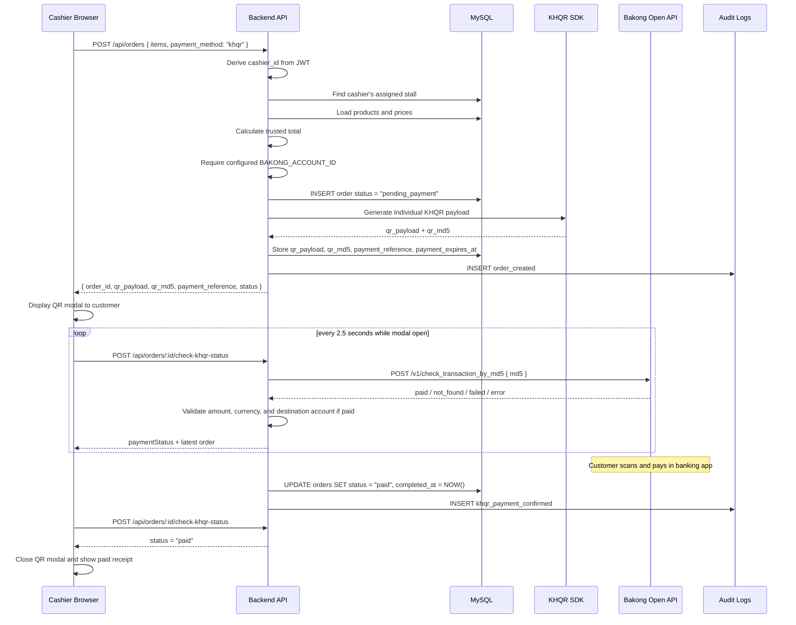

# Payment Flow

This document describes the current cash and KHQR payment behavior.

## Current Cash Payment Flow

Cash payment is backend-owned. The frontend may preview totals while the cashier builds a cart, but the backend calculates the trusted order total from database product prices.


Important rules:

- The frontend must not send trusted totals, item prices, `cashier_id`, `stall_id`, paid flags, or final status.
- Cash orders start as `pending_payment`.
- Only backend confirmation changes a cash order to `paid`.
- Cash confirmation is allowed for the creating cashier, or an owner/manager in the same business owner scope.
- Order creation and cash confirmation write audit log rows.

---

## Order Status Lifecycle

```text
pending_payment ──▶ paid
        └────────▶ cancelled
```

| Status | Trigger |
|--------|---------|
| `pending_payment` | Backend creates an order and waits for payment confirmation |
| `paid` | Cash is confirmed by an allowed user, or the backend verifies KHQR payment by Bakong md5/hash |
| `cancelled` | Order is cancelled before payment completion |

---

## KHQR Individual Payment Flow

Phase 5 uses Generate KHQR (Individual), not Merchant KHQR. This is because the project does not have official MerchantID and AcquiringBank credentials. Individual KHQR requires the configured owner/stall Bakong account ID and is appropriate for final-project/demo scope.

The backend owns QR generation and payment status. The frontend displays the QR and polls the TouB backend status-check endpoint; it never calls Bakong directly and never marks a KHQR order as paid by itself.



Important rules:

- Frontend sends only product IDs, quantities, notes, and payment method.
- Backend calculates trusted totals from MySQL.
- Backend requires `BAKONG_ACCOUNT_ID`; it does not fall back to a demo account.
- Backend generates and stores the QR payload, QR md5, unique payment reference, and expiry timestamp.
- `POST /api/orders/:id/check-khqr-status` is the frontend polling endpoint.
- The backend calls Bakong Open API by md5/hash.
- `BAKONG_OPEN_API_TOKEN` must never reach the frontend.
- `BAKONG_ACCOUNT_ID` is backend-only payment configuration and is required for QR generation and paid-status validation.
- Already-paid checks are idempotent and do not duplicate audit logs.
- WebSocket cashier-specific push is still a later enhancement; current Phase 5 frontend uses polling.
