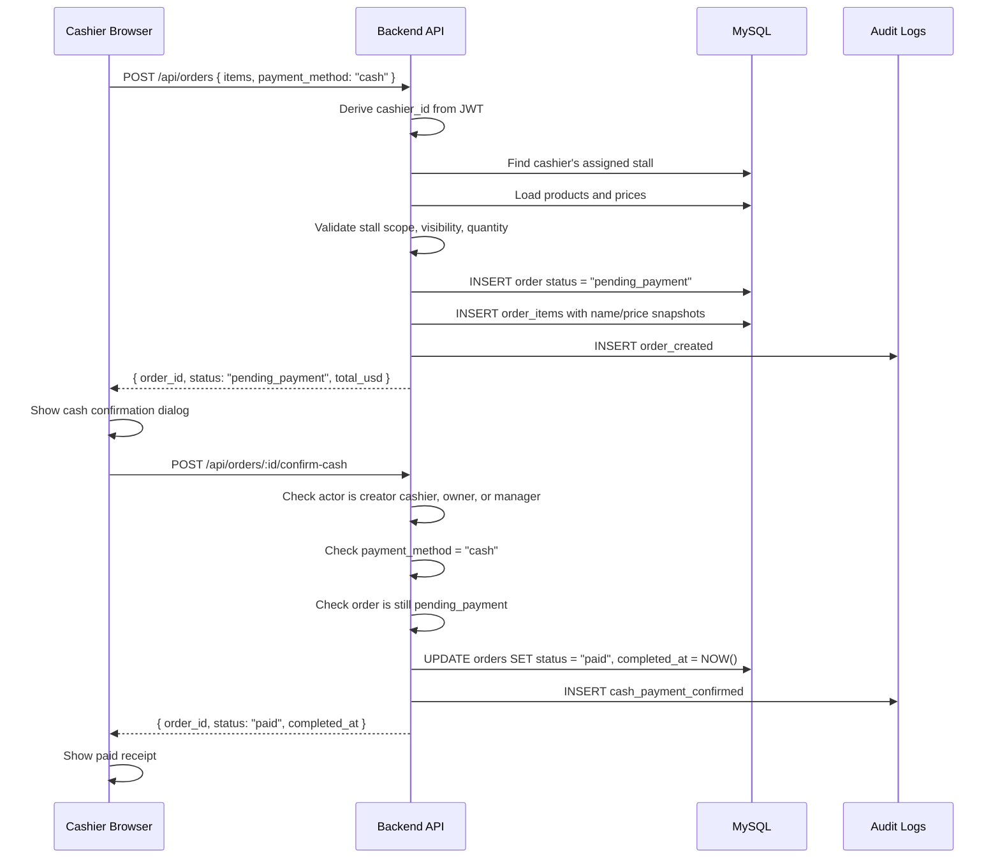
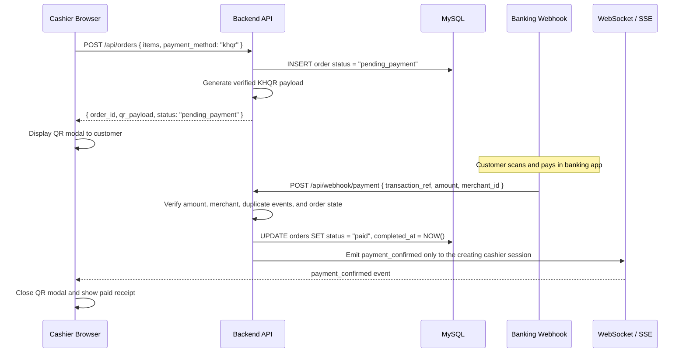

# Payment Flow

This document describes the current Phase 4 payment behavior and the planned Phase 5 KHQR behavior.

## Current Cash Payment Flow

Cash payment is backend-owned. The frontend may preview totals while the cashier builds a cart, but the backend calculates the trusted order total from database product prices.



Important rules:

- The frontend must not send trusted totals, item prices, `cashier_id`, `stall_id`, paid flags, or final status.
- Cash orders start as `pending_payment`.
- Only backend confirmation changes a cash order to `paid`.
- Cash confirmation is allowed for the creating cashier, owner, or manager.
- Order creation and cash confirmation write audit log rows.

---

## Order Status Lifecycle

```text
pending_payment ──▶ paid
        └────────▶ cancelled
```

| Status | Trigger |
|--------|---------|
| `pending_payment` | Backend creates an order and waits for payment confirmation |
| `paid` | Cash is confirmed by an allowed user, or future KHQR webhook verifies payment |
| `cancelled` | Order is cancelled before payment completion |

---

## Planned KHQR Payment Flow

Real KHQR webhook confirmation is planned for Phase 5 and is not implemented yet. The current webhook endpoint is a placeholder and should not be treated as a real payment confirmation path.

Planned target flow:



Phase 5 must add real gateway verification, idempotency, amount matching, and cashier-specific live notifications before KHQR is considered complete.
