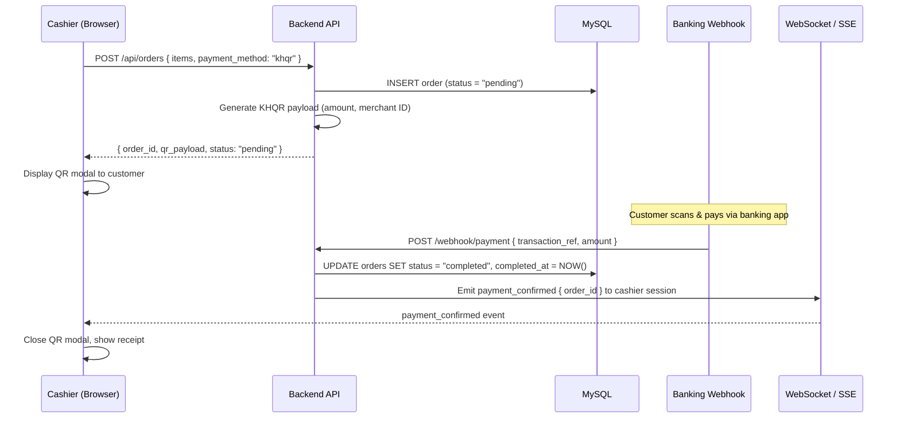
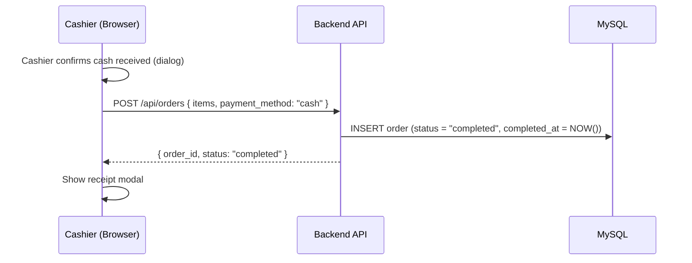

# Payment Flow

## KHQR (QR Code) Payment



---

## Cash Payment



---

## Order Status Lifecycle

```
pending ──▶ completed
        └─▶ cancelled
```

| Status      | Trigger                                          |
|-------------|--------------------------------------------------|
| `pending`   | Order created, awaiting KHQR payment             |
| `completed` | Webhook confirms payment OR cashier marks cash paid |
| `cancelled` | Cashier manually cancels before payment          |
