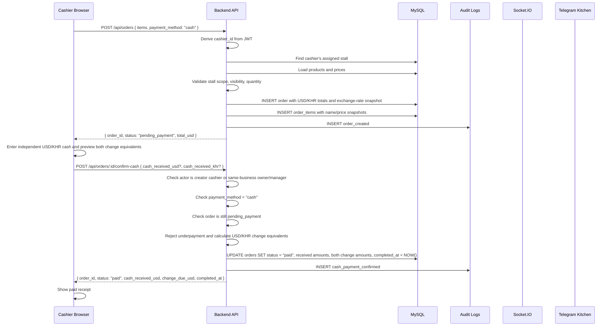
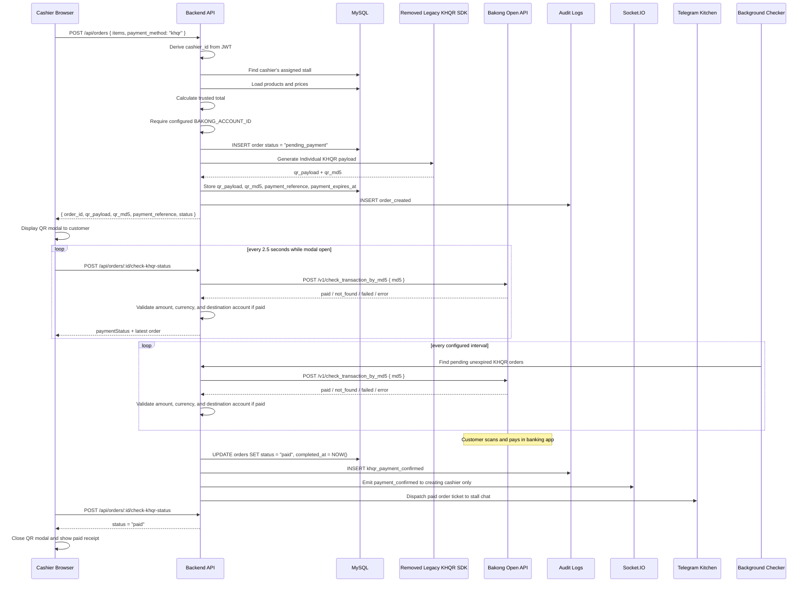

# Payment Flow

This document describes the active cash flow and the historical, currently
suspended KHQR design.

> **Current availability:** Cash checkout is enabled. KHQR checkout, status
> polling, and background reconciliation are disabled while TouB POS evaluates
> an approved merchant payment provider. The legacy generation SDK has been
> removed; environment flags alone cannot re-enable payment. Historical KHQR
> data remains available for reporting and audit.

## Current Cash Payment Flow

Cash payment is backend-owned. The frontend may preview totals while the cashier builds a cart, but the backend calculates the trusted order total from database product prices.

Under the current approved financial policy, the final total equals the item
subtotal. TouB POS does not automatically add a service fee or tax. Any future
charge must be defined and calculated by the backend before it can appear on a
receipt or report.



Important rules:

- The frontend must not send trusted totals, item prices, `cashier_id`, `stall_id`, paid flags, or final status.
- Cash orders start as `pending_payment`.
- Only backend confirmation changes a cash order to `paid`.
- Cash confirmation is allowed for the creating cashier, or an owner/manager in the same business owner scope.
- Cashiers may enter USD, KHR, or both. The frontend previews both change equivalents, while the backend validates the combined amount using the Order's snapshotted rate and saves the actual tender plus both change values.
- Owners may update the business rate in Financial Settings. Only new Orders use the new rate; existing Orders and reports retain their sale-time rate.
- USD is stored in integer cents during settlement calculations and KHR is stored as whole riel. Owner rates must be whole-hundred KHR values, allowing deterministic conversion; USD change is rounded half-up to cents and KHR change down to whole riel.
- Order creation and cash confirmation write audit log rows.

---

## Order Status Lifecycle

```text
pending_payment ──▶ paid
        └────────▶ cancelled
```

| Status | Trigger |
|--------|---------|
| `pending_payment` | Backend creates an order and waits for payment confirmation |
| `paid` | Cash is confirmed by an allowed user, or the backend verifies KHQR payment by Bakong md5/hash |
| `cancelled` | Order is cancelled before payment completion |

---

## KHQR Individual Payment Flow

The following diagram records the former integration for historical design
context only. It is not executable by setting environment flags. A future
merchant rollout requires an approved provider, a new adapter, suitable
transaction-checking limits, and a fresh security review.

The backend owns QR generation and payment status. The frontend displays the QR and polls the TouB backend status-check endpoint as a fallback; it never calls Bakong directly and never marks a KHQR order as paid by itself. The backend also runs a background checker for unexpired pending KHQR orders.



Important rules:

- `KHQR_ENABLED=false` blocks backend creation, explicit status checks, and background reconciliation.
- `VITE_KHQR_ENABLED=false` hides cashier KHQR checkout and resume actions.
- Frontend sends only product IDs, quantities, notes, and payment method.
- Backend calculates trusted totals from MySQL.
- Backend requires `BAKONG_ACCOUNT_ID`; it does not fall back to a demo account.
- Backend generates and stores the QR payload, QR md5, unique payment reference, and expiry timestamp.
- `POST /api/orders/:id/check-khqr-status` is the frontend polling endpoint.
- The background checker uses the same backend validation path so payment detection can continue after the modal closes.
- The backend calls Bakong Open API by md5/hash.
- `BAKONG_OPEN_API_TOKEN` must never reach the frontend.
- `BAKONG_ACCOUNT_ID` is backend-only payment configuration and is required for QR generation and paid-status validation.
- Already-paid checks are idempotent and do not duplicate audit logs or Telegram dispatch.
- Socket.IO cashier-specific push is active, and polling remains as a fallback while the modal is open.
- Newly confirmed KHQR paid orders dispatch to the stall's Telegram kitchen chat using the same ticket flow as confirmed cash orders.
