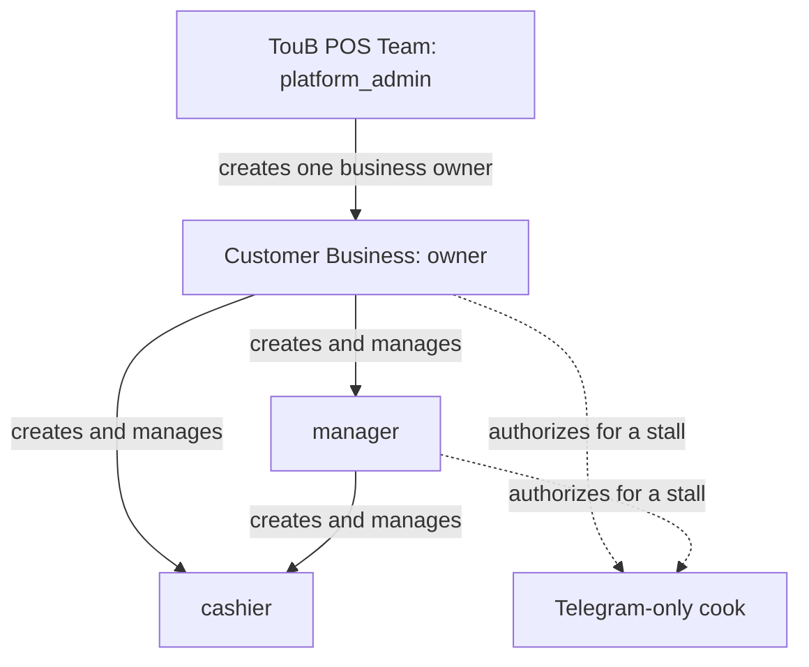
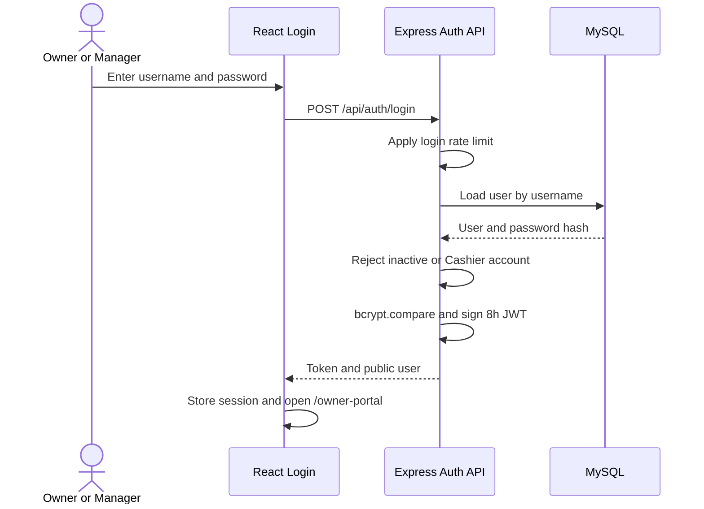
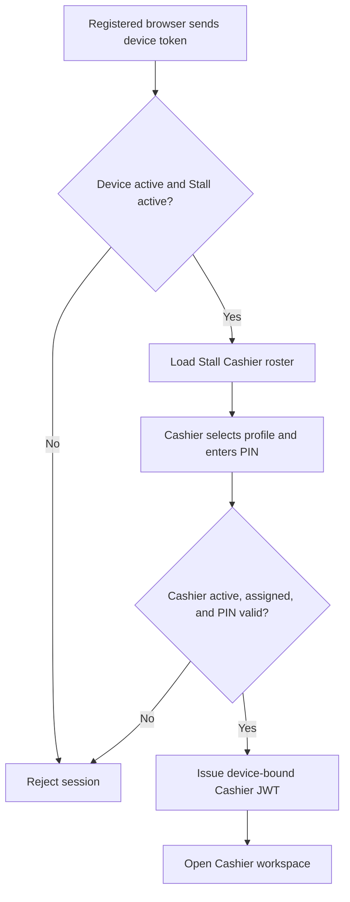
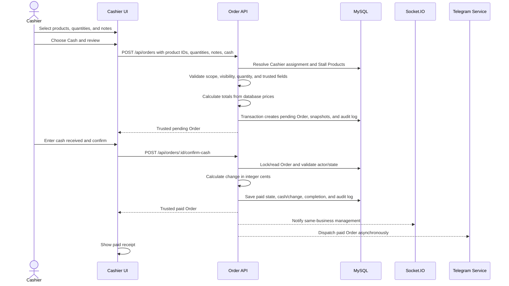
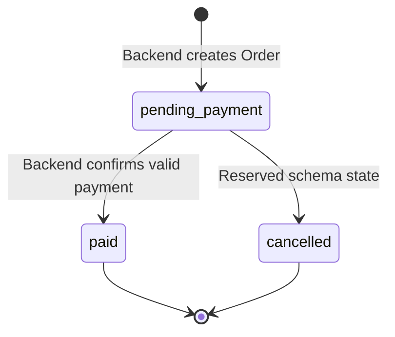
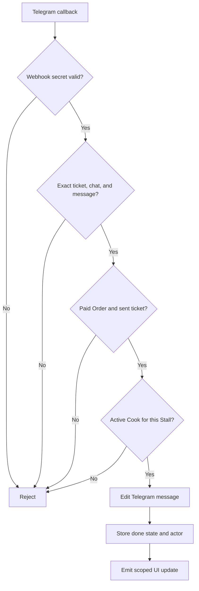
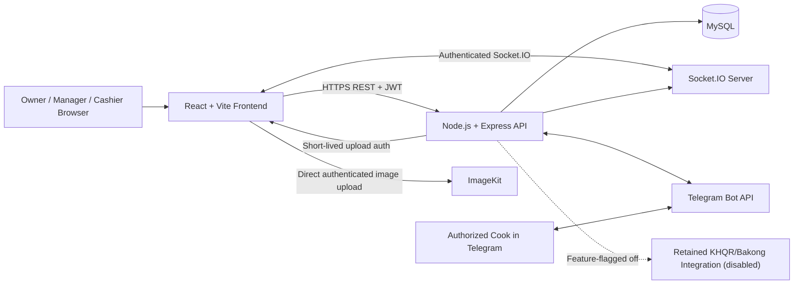
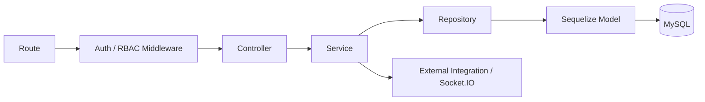
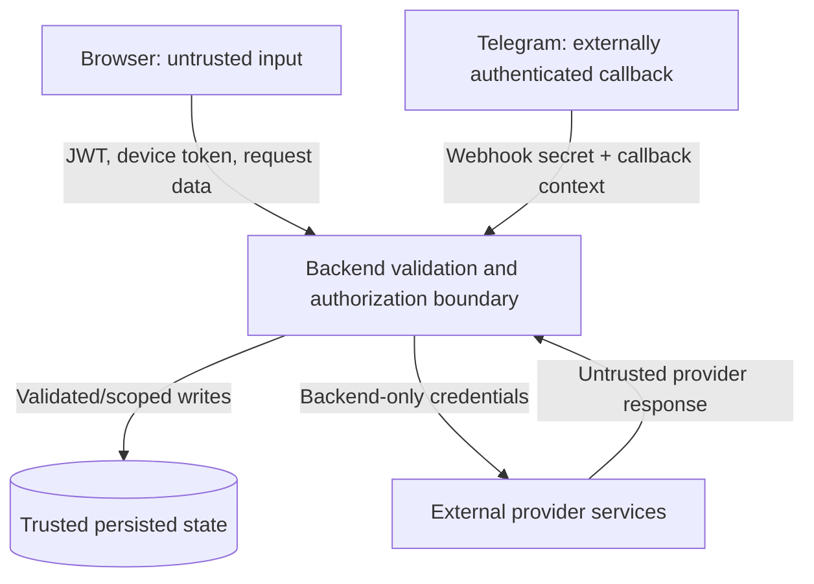

# TouB POS Functional And Technical Design

## 1. Document Control

| Field | Value |
| --- | --- |
| Product | TouB POS |
| Document | Combined Functional Design Document (FDD) and Technical Design Document (TDD) |
| Version | 1.0 |
| Status | As-built baseline for team review |
| Baseline date | 30 July 2026 |
| Functional source | `docs/product/toub-pos-prd.md` |
| Implementation source | `docs/archive/reference/toub-pos-current-system-fact-sheet.md` and executable code |
| Detailed API source | `docs/api/endpoints.md` and backend Swagger |
| Detailed data source | `docs/database/schema.sql` and `docs/database/erd.md` |

### 1.1 Method

This document follows the combined FDD/TDD pattern described by Microsoft in
[Create a functional and technical design document](https://learn.microsoft.com/en-us/dynamics365/guidance/patterns/create-functional-technical-design-document).

- The **functional design** explains how TouB POS behaves from the user's and
  business's perspective.
- The **technical design** explains how the current solution implements that
  behavior.

This is an as-built design. Suspended and future behavior is marked explicitly.

## 2. Introduction

### 2.1 Purpose

This document gives developers, testers, teammates, and course evaluators one
shared explanation of:

- Who uses TouB POS and what each role is responsible for.
- How the main business processes work.
- How React, Express, Sequelize, MySQL, Socket.IO, Telegram, and ImageKit
  collaborate.
- Where authorization, validation, data ownership, and failure handling occur.
- Which requirements are implemented, suspended, or future.

### 2.2 Audience

- TouB POS project team.
- Frontend and backend developers.
- Database and test owners.
- Project supervisor and course evaluators.
- Future maintainers.

### 2.3 Abbreviations

| Term | Meaning |
| --- | --- |
| API | Application Programming Interface |
| CRUD | Create, Read, Update, Delete |
| FDD | Functional Design Document |
| JWT | JSON Web Token |
| KHQR | Cambodia's standardized QR payment format |
| KDS | Kitchen Display System |
| MD5 | Hash used by the retained Bakong transaction-checking contract |
| ORM | Object-Relational Mapping |
| PRD | Product Requirements Document |
| RBAC | Role-Based Access Control |
| REST | Representational State Transfer |
| TDD | Technical Design Document |
| UTC | Coordinated Universal Time |

### 2.4 Diagram Key

| Shape or notation | Meaning |
| --- | --- |
| Rectangle | User, system, component, or processing step |
| Cylinder | Persistent data store |
| Diamond | Decision |
| Solid arrow | Request, command, or synchronous response |
| Dashed arrow | Asynchronous notification or external event |

## 3. Project Overview

TouB POS is a cash-first, multi-stall point-of-sale system for small merchant
teams. The active solution supports:

- A public landing/login entry.
- A Cashier selling workspace.
- An Owner/Manager management portal.
- Backend-owned Orders and cash confirmation.
- Stall-scoped Product visibility and registered terminals.
- Telegram kitchen tickets and Cook completion.
- Real-time operational refresh.
- Database-backed dashboards and reports.

KHQR processing is retained but disabled by default. The current release does
not present it as an active payment option.

### 3.1 Functional Scope

| Workstream | Current scope |
| --- | --- |
| Identity | Password login for Platform Admin/Owner/Manager; PIN login for Cashier |
| Access control | Platform, business, role, Stall, Order, terminal, and Cook scope |
| Catalog | Categories, Products, images, prices, visibility, multiple Stall assignment |
| Workforce | Manager/Cashier management and Cashier-to-Stall assignment |
| Terminals | Multiple named devices per Stall with individual revocation |
| Sales | Cart, notes, backend-owned Order creation, cash received/change, receipt |
| Kitchen | Stall group connection, Cook allowlist, ticket dispatch/completion/retry |
| Reporting | Dashboard, filters, trends, transaction ledger, receipt, CSV/PDF |
| Real-time | Order, kitchen, terminal, and Telegram connection updates |

### 3.2 Out-Of-Scope Boundaries

The current design does not include:

- Multiple Owners for one customer business.
- Cook web-app authentication.
- Platform Admin frontend console.
- Active QR payment.
- Cancellation, refund, return, or split-payment workflows.
- Offline-first checkout.
- Inventory depletion.
- POS hardware integration.
- Automatic Telegram retry queue.

## 4. Organization And Responsibilities

### 4.1 Role Structure



### 4.2 Functional Responsibilities

| Role | Responsibilities | Explicit limits |
| --- | --- | --- |
| Platform Admin | Bootstrap Owner accounts | No customer management portal or daily POS operations |
| Owner | Full customer-business configuration and oversight | Cannot create another Owner |
| Manager | Operational catalog, Stall, Cashier, terminal, kitchen, Order, and report work | Cannot create Owner/Manager or connect kitchen routing |
| Cashier | Sell assigned-Stall Products, confirm own cash payment, view own Orders, retry own eligible kitchen ticket | No management APIs or other Cashiers' Orders |
| Cook | Complete authorized Stall tickets in Telegram | No web account, JWT, POS data, or management access |

### 4.3 System Responsibilities

| System area | Responsibility |
| --- | --- |
| Frontend | Collect user input, show state, call APIs, display backend results |
| Backend | Authenticate, authorize, validate, scope, calculate, persist, and coordinate |
| MySQL | Enforce and store authoritative relational state |
| Socket.IO | Notify only the affected Cashier, terminal, or business |
| Telegram | Display kitchen tickets and deliver Cook callbacks |
| ImageKit | Store and deliver Product image binary assets |

## 5. Functional Design

### 5.1 Process Inventory

| Process ID | Process | Main actor | PRD references |
| --- | --- | --- | --- |
| BP-01 | Bootstrap a customer business | Platform Admin | US-PLT-01, RBAC-002 |
| BP-02 | Management login and portal access | Owner/Manager | IAM-002, IAM-006 to IAM-010 |
| BP-03 | Register a terminal and unlock a Cashier session | Owner/Manager, Cashier | IAM-003, IAM-009, DEV-003 to DEV-009 |
| BP-04 | Manage staff and Stall assignments | Owner/Manager | RBAC-004 to RBAC-007, DEV-001 to DEV-003 |
| BP-05 | Manage the catalog | Owner/Manager | CAT-001 to CAT-011 |
| BP-06 | Create and confirm a cash Order | Cashier | ORD-001 to ORD-013, PAY-001 to PAY-010 |
| BP-07 | Connect a Telegram kitchen group | Owner | KIT-001 to KIT-003 |
| BP-08 | Authorize Cooks and complete tickets | Owner/Manager, Cook | KIT-004 to KIT-013 |
| BP-09 | Retry failed kitchen delivery | Owner/Manager/Cashier | KIT-006 to KIT-010 |
| BP-10 | Review dashboard, reports, and receipts | Owner/Manager | REP-001 to REP-010 |
| BP-11 | Revoke one terminal | Owner/Manager | DEV-006 to DEV-009, RT-004 to RT-007 |

### 5.2 BP-01: Bootstrap A Customer Business

**Preconditions**

- Backend is running outside production or already contains a Platform Admin.
- Platform Admin has valid username/password credentials.

**Normal flow**

1. Platform Admin authenticates through the password login API.
2. Backend verifies the password, role, and active state.
3. Platform Admin submits a unique Owner username and password.
4. Backend confirms Platform Admin may create only `owner`.
5. Backend hashes the Owner password.
6. Backend creates the Owner with `owner_id = NULL` and `pin = NULL`.
7. The Owner can now sign in to the management portal.

**Exceptions**

- Duplicate username: reject with a validation/database conflict response.
- Target role is not Owner: reject with `403`.
- PIN included for Owner: reject with `400`.
- Platform Admin attempts update/delete: reject with `403`.

**Postcondition**

- One independent customer Owner account exists.

### 5.3 BP-02: Management Login



**Alternative flows**

- Invalid credential: show a clean login error.
- Cashier uses password login: instruct use of Cashier PIN flow.
- Rate limit exceeded: show the `429` message and wait period.
- Role is Platform Admin: authentication may succeed for API bootstrap, but the
  frontend must not route it into the management portal.

### 5.4 BP-03: Terminal Registration And Cashier PIN Login

**Terminal registration**

1. Owner/Manager signs in.
2. Management selects a same-business Stall.
3. Management enters a recognizable device name.
4. Backend creates a cryptographically random raw device token.
5. MySQL stores only its SHA-256 hash and terminal metadata.
6. The raw token is returned once and stored in that browser.
7. Management receives a real-time terminal-registry refresh.

**Cashier unlock**

1. Terminal presents active Cashiers assigned to its Stall.
2. Cashier selects their profile and enters a PIN.
3. Backend validates the device token and active Stall.
4. Backend validates Cashier role, active state, Stall assignment, and bcrypt PIN.
5. Backend updates last-seen/last-Cashier metadata.
6. Backend issues an eight-hour JWT containing `device_id` and `stall_id`.
7. Cashier enters `/cashier`.



**Security outcome**

The JWT alone is insufficient for Cashier API/Socket.IO access. The same active
device token must accompany it.

### 5.5 BP-04: Staff And Stall Assignment

**Create user**

- Owner form offers Manager and Cashier.
- Manager form offers Cashier only.
- Manager requires username/password and rejects PIN.
- Cashier requires username/PIN and rejects password.
- Edit forms leave credential fields blank unless a credential is changing.

**Assign Cashier**

1. Owner/Manager selects a Stall and Cashier.
2. Backend validates both IDs and same Owner scope.
3. Backend verifies target role is Cashier.
4. Backend creates or changes the `stall_staff` assignment.
5. UI reloads Stalls/rosters from the backend.

**Exceptions**

- Manager targets Owner/Manager: `403`.
- User or Stall belongs to another Owner: `403`.
- Target is not Cashier: `400`.
- Missing User/Stall: `404`.

### 5.6 BP-05: Catalog Management

**Category behavior**

- Category belongs to one Owner.
- Name is required and unique inside that Owner scope.
- Product belongs to exactly one Category.
- Management can move existing Products between Categories.

**Product behavior**

1. Management enters name, Category, USD/KHR prices, visibility, image, and zero
   or more Stall assignments.
2. Frontend performs helpful form validation.
3. Backend validates required values, positive prices, Category ownership, and
   every Stall ID.
4. Product stores shared metadata and default prices.
5. `stall_products` stores each assigned Stall's price and visibility.
6. Product with no Stall assignment stays in the management catalog.
7. Cashier Product queries return only visible assignments for the authenticated
   Stall.

**Image behavior**

1. Owner/Manager requests short-lived ImageKit upload authentication.
2. Browser uploads the validated JPG, PNG, or WebP directly to ImageKit.
3. Product save sends only the delivered image URL to TouB POS.

**Failure behavior**

- Invalid price, Category, Stall, or image URL: reject without partial Product
  mutation.
- Removing all Stalls: preserve Product and default prices.
- Hidden/unassigned Product: omit from Cashier selling catalog.

### 5.7 BP-06: Backend-Owned Cash Sale



**Preconditions**

- Cashier session and terminal are active.
- Cashier has a Stall assignment.
- Cart contains at least one visible assigned Product.

**Trusted backend behavior**

- Cashier and Stall identity are derived rather than accepted from the browser.
- Prices and totals come from MySQL.
- Client-submitted trusted fields are rejected.
- Order and item snapshots are created in one database transaction.
- Order begins as `pending_payment`.
- Cash confirmation saves `paid` only after valid received cash.

**Alternative/error flows**

| Condition | Result |
| --- | --- |
| Cashier has no Stall | Reject with `403` |
| Product is hidden/unassigned/other-Stall | Reject without creating a paid Order |
| Quantity is invalid | Reject with `400` |
| Cash is below total | Keep Order pending and reject confirmation |
| Order is already paid/cancelled | Reject duplicate confirmation with `409` |
| Telegram fails after payment | Keep Order paid; record failed ticket and allow scoped retry |

### 5.8 Order State Design



The `cancelled` state exists in the data model, but the active product has no
general cancellation endpoint. It is not an available user workflow.

### 5.9 BP-07: Connect A Telegram Kitchen Group

1. Owner opens Stall Management.
2. Owner requests a connection link for a same-business Stall.
3. Backend verifies Bot identity and generates a random one-time token.
4. Backend stores only the token hash and expiry.
5. Owner opens Telegram and selects/creates a group for the Bot.
6. Telegram sends `/start <token>` from the group to the secured callback.
7. Backend validates group type, token, expiry, previous use, and conflicting
   Stall routing.
8. Backend saves the group ID/title to the Stall and consumes the token.
9. Telegram confirms the connection in the group.
10. Owner/Manager Stall UI refreshes through Socket.IO or polling fallback.

Managers cannot generate this routing link.

### 5.10 BP-08: Cook Authorization And Ticket Completion

**Cook authorization**

1. Owner/Manager selects a Stall.
2. They enter Cook display name and Telegram user ID.
3. Backend validates the ID and same-business Stall.
4. Backend creates/reactivates the Stall-scoped Cook.
5. UI receives only the masked Telegram user ID.

**Ticket completion**

1. Telegram displays a sent paid-Order ticket with a Done button.
2. Cook presses Done.
3. Telegram sends callback with chat, message, user, and Order action.
4. Backend validates webhook secret.
5. Backend locates exact ticket by Order/chat/message.
6. Backend verifies the chat equals the Order Stall's configured group.
7. Backend requires paid Order, sent ticket, and active matching Cook.
8. Backend edits the existing Telegram message.
9. Backend saves `done`, completion time, and Cook metadata.
10. Backend emits `kitchen_ticket_updated`.
11. Cashier and management refetch Order state.



### 5.11 BP-09: Retry Kitchen Delivery

Eligible actors:

- Owner/Manager for a paid Order in their business.
- Creating Cashier for their own paid Order.

Eligible state:

- No Telegram ticket exists, or latest ticket is `failed`.

Rejected state:

- Order is not paid.
- Latest ticket is `pending`, `sent`, or `done`.
- Stall has no connected group.
- Telegram Bot is not configured.

Retry resets or recreates the unique durable dispatch job. The background
worker, not the HTTP request, performs the Telegram network call. Retry does not
change payment status.

**Automatic delivery**

1. Payment confirmation and one `telegram_dispatch_jobs` row commit in the same
   MySQL transaction.
2. A worker claims a due job using a row lock and `SKIP LOCKED`.
3. The worker creates or retries the user-visible `telegram_tickets` record.
4. Temporary failures use exponential backoff up to the configured attempt
   limit.
5. Successful delivery marks both the ticket and outbox job sent.
6. A backend restart resumes pending/retry jobs.
7. A crash during `sendMessage` is an unknown external result; the worker marks
   it failed for manual review rather than automatically risking a duplicate.

### 5.12 BP-10: Dashboard And Reporting

1. Owner/Manager opens Dashboard or Sales Reports.
2. Frontend sends current range, optional Stall/Cashier filters, search, and
   pagination.
3. Backend resolves Owner scope.
4. Backend converts local report boundaries to UTC query timestamps.
5. Database aggregates paid Orders and returns ledger rows.
6. Frontend displays summary, trends, breakdowns, ledger, and receipts.
7. CSV/PDF export uses the current report result.
8. Relevant real-time events trigger a debounced refetch.
9. Periodic polling remains fallback.

**Date behavior**

- Today uses business-local calendar boundaries.
- Week starts Monday and presents Monday through Sunday.
- Month uses current calendar month.
- Custom uses validated start/end dates.
- Stored Order timestamps remain UTC.

### 5.13 BP-11: Revoke One Terminal

1. Owner/Manager selects one named device under a same-business Stall.
2. UI requires explicit destructive confirmation.
3. Backend verifies Stall and device ownership.
4. Backend marks only that device inactive and records revocation metadata.
5. Backend emits `device:revoked` to sockets mapped to that device.
6. Affected browser clears Cashier session and returns to login.
7. Backend emits `device_registry_updated` to same-business management.
8. Other devices remain active.

## 6. Technical Architecture

### 6.1 System Context



### 6.2 Runtime Topology

- Express and Socket.IO share one Node HTTP server.
- React is a separate Vite application and calls the configured API URL.
- MySQL is the authoritative persistent store.
- Product images are stored externally in ImageKit.
- Telegram calls the public backend callback endpoint.
- In local Telegram development, an Ngrok helper may expose the backend and
  register the callback URL.

### 6.3 Technology Stack

| Layer | Technology | Design role |
| --- | --- | --- |
| Browser UI | React 19 | Component and state composition |
| Build | Vite 8 | Development and production frontend build |
| Styling | Tailwind CSS 4 | Semantic theme tokens and responsive UI |
| HTTP client | Axios | Central auth/device headers and error normalization |
| Charts | Recharts | Dashboard and report visualization |
| API | Express 4 | REST routes and middleware |
| ORM | Sequelize 6 | Models, associations, transactions, and queries |
| Database | MySQL | Authoritative relational data |
| Authentication | JWT + bcrypt | Stateless identity and credential verification |
| Real-time | Socket.IO | Scoped operational notifications |
| Kitchen integration | Telegram Bot API | Kitchen ticket delivery and callbacks |
| Product media | ImageKit | Product image storage/delivery |
| QR integration | No active provider adapter | Historical fields/status code retained; legacy SDK removed |

## 7. Frontend Design

### 7.1 Module Boundaries

| Folder | Responsibility |
| --- | --- |
| `frontend/src/app/` | Router, providers, and protected route composition |
| `frontend/src/features/auth/` | Auth context, storage, login, terminal registration |
| `frontend/src/features/cashier/` | Cashier catalog/cart/order presentation |
| `frontend/src/features/catalog/` | Management Product/Category UI |
| `frontend/src/features/management/` | Portal shell, navigation, dashboard |
| `frontend/src/features/payments/` | Cash, retained KHQR, and receipt dialogs |
| `frontend/src/features/reports/` | Sales reports, ledger, date-range dialog |
| `frontend/src/features/staff/` | Staff CRUD and allocation |
| `frontend/src/features/stalls/` | Stall, device, Telegram group/Cook management |
| `frontend/src/components/ui/` | Reusable domain-neutral primitives |
| `frontend/src/hooks/` | Server data and workflow state hooks |
| `frontend/src/services/` | Axios API mapping and Socket.IO client |
| `frontend/src/shared/` | Cross-feature layout and theme |

### 7.2 Routing Design

| Route | Component | Protection |
| --- | --- | --- |
| `/` | Landing page | Public |
| `/login` | Login page | Public |
| `/cashier` | Cashier page | `cashier` |
| `/owner-portal` | Owner portal page | `owner`, `manager` |

Frontend guards redirect users for usability. They do not replace backend
authorization.

### 7.3 State Design

- Access JWT/user state stays in memory and restores through the rotating
  HttpOnly refresh session. Registered-terminal metadata persists in localStorage.
- Theme preference persists in `localStorage`.
- Persisted business data comes from backend APIs, not browser storage.
- Cart and dialog state are owned by Cashier components/hooks.
- Custom hooks load and refresh Products, users, Orders, and reports.
- Socket events cause backend refetch rather than directly becoming trusted
  business state.

### 7.4 API Client Design

`frontend/src/services/apiClient.js`:

- Uses `VITE_API_BASE_URL`, defaulting to `http://localhost:3000/api`.
- Reads the JWT and attaches `Authorization: Bearer`.
- Reads device registration and attaches `X-Device-Token`.
- Normalizes successful and failed responses.
- Handles invalid/revoked Cashier session codes.

`frontend/src/services/api.js`:

- Groups domain operations.
- Maps backend snake_case/association shapes into frontend models.
- Keeps credential edit fields blank unless the user enters a replacement.
- Excludes backend-only Telegram identifiers.

### 7.5 Presentation Design

- Dark mode is default; light mode is available.
- Semantic theme tokens provide surface, text, border, action, success, and
  danger colors.
- Cashier layout prioritizes Products, cart, and payment actions.
- Mobile views avoid required horizontal scrolling.
- Loading, empty, error, pending, paid, failed, and done states are explicit.
- Toasts appear bottom-right for three seconds; blocking/destructive decisions
  remain centered and require action.

## 8. Backend Design

### 8.1 Layered Request Flow



### 8.2 Layer Responsibilities

| Layer | Responsibility | Must not do |
| --- | --- | --- |
| Route | Define HTTP method/path and compose middleware | Business rules or raw SQL |
| Middleware | Verify JWT, role, device, origin, rate, and request safety | Domain persistence |
| Controller | Parse HTTP input and format HTTP output | Import models/repositories directly |
| Service | Validation, authorization detail, ownership, workflow, transactions | Depend on frontend state |
| Repository | Sequelize/raw SQL persistence and scoped queries | HTTP response handling |
| Model | Table fields, indexes, and associations | Route/service behavior |

### 8.3 Domain Services

| Domain | Public/focused modules | Responsibility |
| --- | --- | --- |
| Auth | `auth.service.js` | Password/PIN verification and JWT creation |
| Users | `user.service.js` | Role hierarchy, credentials, Owner scope |
| Stalls/devices | `stall.service.js` | Stall CRUD, staff assignment, registration/revocation |
| Catalog | `product.service.js`, `category.service.js` | Validation, ownership, assignments, visibility |
| Orders | `order.service.js`, `services/orders/` | Creation, query/access, cash, retained KHQR, Telegram retry |
| Reports | `report.service.js`, `report.repository.js` | Date validation, aggregates, trends, ledger |
| Telegram | `telegram*.service.js` | Outbound tickets, callbacks, Cooks, group connection |
| Real-time | `websocket.service.js` | Authenticated socket maps and scoped events |
| Images | `imagekit.service.js` | Short-lived upload authentication |

### 8.4 Transaction Boundaries

**Order creation transaction**

- Resolve assignment and Products.
- Validate all items.
- Create Order.
- Create Order Item snapshots.
- Create `order_created` Audit Log.
- Commit before management notification.

**Cash confirmation transaction**

- Lock/read Order.
- Validate actor, method, and state.
- Validate cash and calculate change.
- Update Order.
- Create `cash_payment_confirmed` Audit Log.
- Commit before Telegram dispatch.

External Telegram calls occur after the payment transaction so external failure
cannot roll back a valid paid sale.

## 9. API Design

### 9.1 API Conventions

- Base path: `/api`.
- JSON request/response.
- Protected routes use Bearer JWT.
- Cashier protected routes also use `X-Device-Token`.
- Success shape: `{ "success": true, "data": ... }`.
- Error shape: `{ "success": false, "code": "...", "message": "..." }` when a
  domain code exists; otherwise `code` may be absent.
- Pagination metadata accompanies paginated list results.

### 9.2 Route Summary

| Domain | Paths | Main roles |
| --- | --- | --- |
| Health/docs | `/health`, `/docs` | Public |
| Auth | `/auth/login`, `/auth/pin`, `/auth/cashiers`, `/auth/device-status` | Public/device/Cashier as appropriate |
| Users | `/users`, `/users/:id`, `/users/me/stall` | Platform Admin/Owner/Manager; assigned Stall route also Cashier |
| Products | `/products`, `/products/:id`, `/products/imagekit-auth` | Authenticated list; Owner/Manager mutation |
| Categories | `/categories`, `/categories/:id` | Authenticated list; Owner/Manager mutation |
| Stalls | `/stalls` and nested staff/device/Telegram routes | Owner/Manager; group connection Owner-only |
| Orders | `/orders`, `/orders/mine`, `/orders/:id`, payment/retry routes | Role and Order scope dependent |
| Reports | `/reports/daily`, `/reports/sales` | Owner/Manager |
| Telegram | `/telegram/callback` | Telegram secret, not JWT |

Full request bodies, status codes, examples, and query parameters remain in
`docs/api/endpoints.md` and Swagger.

### 9.3 Authorization Sequence

1. Route determines whether JWT is required.
2. `authenticate` verifies signature and expiry.
3. Cashier JWT triggers active device-token validation.
4. `authorize` checks coarse role permission.
5. Service resolves Owner/Stall/Order ownership.
6. Repository query includes matching scope.
7. Response sanitizer removes sensitive/internal identifiers.

## 10. Data Architecture

### 10.1 Ownership Model

The current customer isolation key is the Owner User ID:

- Owner: `users.owner_id = NULL`.
- Manager/Cashier: `users.owner_id = owner.id`.
- Stall and Category carry `owner_id`.
- Product ownership is derived through Category.
- Order business ownership is derived through Stall.

There is no separate Business/Tenant table.

### 10.2 Main Entity Groups

| Group | Entities | Purpose |
| --- | --- | --- |
| Identity | `users` | Role, Owner scope, and role-appropriate credential |
| Operations | `stalls`, `stall_staff`, `stall_devices` | Locations, Cashier assignment, registered terminals |
| Catalog | `categories`, `products`, `stall_products` | Shared catalog and per-Stall selling configuration |
| Sales | `orders`, `order_items`, `audit_logs` | Transaction, immutable item snapshot, sensitive action history |
| Kitchen | `telegram_dispatch_jobs`, `telegram_tickets`, `telegram_cooks`, `telegram_group_connections` | Durable dispatch, delivery state, authorization, and secure group setup |

### 10.3 Key Data Rules

- Username is unique.
- Role is restricted to four active web roles.
- Management credential and Cashier credential are mutually exclusive.
- Category name is unique per Owner.
- Product must reference a Category.
- Stall Product pair is unique.
- Stall Staff pair is unique.
- Device token hash is unique.
- Telegram Cook is unique by Stall and Telegram user.
- Telegram group setup token hash is unique.
- Payment reference is unique when present.
- Order Item snapshot survives later Product mutation/deletion.
- Telegram payment/ticket state is separate from Order payment state.
- One unique Telegram dispatch job is transactionally created per paid Order.

### 10.4 Persistence And Schema Change

- Sequelize models are executable application definitions.
- `docs/database/schema.sql` is the canonical course SQL artifact.
- Models, managed migrations, and the canonical SQL artifact must remain synchronized.
- Ordered migrations live under `backend/src/database/migrations/`.
- Development startup applies pending migrations.
- Production startup never mutates schema and refuses to start when migrations are pending.
- Successful versions are recorded in the MySQL `schema_migrations` ledger.

The later database schema document will define every table, column, type,
constraint, index, relationship, and retention concern.

## 11. Security Design

### 11.1 Trust Boundaries



### 11.2 Authentication Controls

- JWT signature verification uses required `JWT_SECRET`.
- Passwords and PINs use bcrypt.
- Password and PIN login methods reject the wrong role.
- Cashier JWTs bind identity to a registered terminal and Stall.
- Login endpoints have separate rate limits.
- Inactive users are rejected.

### 11.3 Authorization Controls

- Routes enforce coarse role permission.
- Services enforce role hierarchy and Owner scope.
- Cashier Product access resolves server-side Stall assignment.
- Order access checks creator or same-business management.
- Terminal mutation checks same-business Stall/device.
- Telegram routing setup is Owner-only.
- Telegram completion checks secret, exact ticket context, and Stall Cook.

### 11.4 Sensitive Data Controls

Never return or log:

- Raw passwords or password hashes.
- Raw PINs or PIN hashes.
- JWTs or authorization headers.
- Raw device tokens after initial registration, or token hashes.
- Telegram Bot token or webhook secret.
- ImageKit private key.
- Bakong token.
- Complete Telegram IDs in frontend-facing operational responses.

Request logging masks nested sensitive keys. Telegram IDs remain complete only
where required for backend routing/authorization and MySQL persistence.

### 11.5 Browser Token Architecture

Access JWTs remain only in JavaScript memory and expire after about 15 minutes.
An opaque refresh token rotates after every use inside a Secure, HttpOnly cookie;
MySQL stores only SHA-256 hashes and token-family lineage. Refresh/logout require
a readable CSRF cookie copied into `X-CSRF-Token`. The absolute session lifetime
is eight hours, including Cashier device-bound sessions.

### 11.6 HTTP And Origin Security

- Helmet is enabled.
- Content Security Policy is currently disabled to preserve local Swagger.
- Production CORS requires `FRONTEND_ORIGIN`.
- Development allows local frontend ports.
- Socket.IO applies equivalent origin rules.
- Production database connections request TLS.

## 12. Integration Design

### 12.1 Telegram Bot API

**Outbound**

- Sends structured paid-Order tickets.
- Stores returned chat/message ID in a Telegram Ticket.
- Edits the same message when done.

**Inbound**

- `POST /api/telegram/callback`.
- Validates `X-Telegram-Bot-Api-Secret-Token`.
- Processes group connection messages and ticket button callbacks.

**Failure policy**

- Failure is logged and represented as ticket state.
- Paid Order remains paid.
- Manual retry is scoped and deduplicated.

### 12.2 ImageKit

- Backend generates short-lived signed upload authentication for Owner/Manager.
- Browser validates type/size and uploads directly.
- Backend stores only the final image URL.
- Private key remains backend-only.

### 12.3 Socket.IO

Backend maintains process-local maps:

- Cashier ID to socket IDs.
- Device ID to socket IDs.
- Owner scope to management socket IDs.

| Event | Intended recipient |
| --- | --- |
| `payment_confirmed` | Creating Cashier |
| `device:revoked` | Selected terminal |
| `device_registry_updated` | Same-business management |
| `order_updated` | Same-business management |
| `kitchen_ticket_updated` | Creating Cashier and same-business management |
| `telegram_group_updated` | Same-business management |

Event payloads prompt refetch; they are not a replacement data store.

### 12.4 Retained KHQR/Bakong Integration

Status: **suspended**.

- Backend and frontend require explicit opt-in feature flags.
- Disabled requests return `KHQR_DISABLED`.
- Background checker exits without provider/database polling.
- Historical fields and Orders remain readable.
- Any future reactivation must validate provider status, amount, currency, and
  destination and preserve row-locked idempotency.

TouB POS does not assume Bakong sends a payment webhook.

## 13. Reporting Design

### 13.1 Functional Outputs

- Total Orders and paid Orders.
- Revenue and average Order value.
- Cash/historical KHQR payment mix.
- Stall breakdown.
- Cashier breakdown.
- Hourly, daily, or seven-day trends.
- Previous-period comparisons.
- Paginated transaction ledger.
- Order receipt.
- CSV and PDF export.

### 13.2 Query Design

- Owner scope is mandatory.
- Only paid Orders contribute to revenue.
- Optional Stall and Cashier filters are validated.
- Search is applied before ledger pagination.
- Aggregate queries execute in MySQL.
- Ledger detail uses Sequelize with scoped associations.

### 13.3 Timezone Design

- Order timestamps are stored in UTC.
- `REPORT_TIMEZONE_OFFSET` defines business-local boundaries.
- Raw SQL receives explicit UTC timestamps.
- Hourly buckets shift timestamps to business-local time.
- Week begins Monday.

## 14. Error Handling, Logging, And Audit

### 14.1 API Error Handling

- Controllers forward errors to the global handler.
- Services create status-aware domain errors.
- Global handler returns a clean JSON message and optional code.
- Development logs include error detail; production responses do not include raw
  stack traces.

Common statuses:

| Status | Meaning |
| --- | --- |
| `400` | Invalid body, state, relationship, amount, or identifier |
| `401` | Missing/invalid/expired JWT or invalid/revoked terminal |
| `403` | Authenticated actor lacks role, Owner, Stall, or Order permission |
| `404` | Scoped entity does not exist |
| `409` | Duplicate/incompatible state transition |
| `429` | Authentication rate limit reached |
| `503` | Disabled feature or unavailable required integration |

### 14.2 Request Logging

Request logging records:

- UTC timestamp.
- HTTP method and path.
- Status.
- Duration.
- Sanitized body when present.

It masks sensitive keys recursively.

### 14.3 Audit Logging

Implemented Order actions:

- `order_created`.
- `cash_payment_confirmed`.
- Historical/retained `khqr_payment_confirmed`.
- Reserved `order_cancelled`.

Audit records contain actor, action, optional Order, JSON details, and timestamp.
The existence of `order_cancelled` in the enum does not mean cancellation is an
active workflow.

## 15. Performance And Scalability

### 15.1 Current Controls

- Sequelize pool: maximum 10 connections.
- Server-side pagination for large list/report workflows.
- Database aggregation for reports.
- Lazy-loaded frontend routes and Product images.
- Focused indexes for Order Stall/time, Cashier/time, status, references, and
  unique junction pairs.
- Socket events are scoped rather than globally broadcast.

### 15.2 Current Limits

- Socket maps are process-local and do not synchronize across multiple Node
  instances.
- KHQR background checker is process-local and disabled.
- Telegram delivery uses a durable outbox with automatic bounded retries and manual recovery for ambiguous failures.
- Owner ID acts as tenant key rather than a dedicated Business entity.

### 15.3 Production Evolution

A scaled deployment would likely add:

- Redis Socket.IO adapter.
- Background job queue for external delivery and reconciliation.
- Migration verification in CI against a disposable MySQL database.
- Dedicated Business/Tenant entity.
- Central observability and alerting.
- Structured audit/event retention.

## 16. Environment And Operations

### 16.1 Required Startup Configuration

- `JWT_SECRET`
- `DB_HOST`
- `DB_PORT`
- `DB_USER`
- `DB_NAME`
- `DB_PASSWORD` when explicitly required
- `FRONTEND_ORIGIN` in production

### 16.2 Feature Configuration

| Area | Variables |
| --- | --- |
| Auth | `JWT_ACCESS_EXPIRES_IN`, `REFRESH_SESSION_EXPIRES_HOURS`, `AUTH_COOKIE_SAME_SITE` |
| Reporting | `REPORT_TIMEZONE_OFFSET` |
| Telegram | Bot token, webhook secret, connection-link expiry |
| ImageKit | Public key, private key, URL endpoint |
| KHQR | Feature flag, account, merchant, API, expiry, checker settings |

No real values belong in documentation or source control.

### 16.3 Startup Sequence

1. Validate environment.
2. Import database configuration and create the local development database if needed.
3. Authenticate MySQL.
4. In production, assert there are no pending migrations; in development, apply them.
5. Import the Express app and Sequelize models.
6. Remove expired refresh sessions.
7. Seed the development Platform Admin when absent.
8. Start the shared HTTP and Socket.IO server.
9. Start the KHQR checker only when explicitly enabled.
10. Start the Telegram dispatch worker.

### 16.4 Data Migration

Umzug applies ordered files from `backend/src/database/migrations/` and records
successful names in `schema_migrations`. The immutable baseline creates a clean
schema or validates a current existing schema before enrollment. Deployment runs
`npm run db:migrate` before production startup. A one-step rollback command is
gated by `ALLOW_MIGRATION_ROLLBACK=true`; verified backup restore remains the
preferred recovery path for data-changing or uncertain failures.

## 17. Testing And Verification Design

### 17.1 Automated Commands

```text
backend: npm run lint
backend: npm test
backend: npm run test:live       (requires running API and test MySQL)
frontend: npm run lint
frontend: npm run build
```

### 17.2 Automated Coverage Areas

- Report range and timezone utilities.
- KHQR suspension.
- Telegram callback authorization.
- Telegram group connection.
- Telegram identifier response safety.
- Live credential model.
- Live backend-owned Order and cash flow.

### 17.3 Manual End-To-End Scenarios

1. Platform Admin creates an Owner through API.
2. Owner creates Manager and Cashier; Manager cannot create Manager/Owner.
3. Management creates Stall, assigns Cashier, and registers two devices.
4. Cashier unlocks one terminal with PIN.
5. Cashier sees only assigned visible Products.
6. Tampered total/price fields are rejected.
7. Underpayment is rejected; valid cash stores correct change.
8. Paid Order reaches only the correct Telegram Stall group.
9. Unauthorized Cook cannot mark done; authorized Cook can.
10. Cashier/management UI updates without manual page refresh.
11. Revoking one terminal logs it out while the second remains active.
12. Today/custom reports include expected Cambodia-local Orders.
13. CSV/PDF and receipt display match backend report/Order data.
14. KHQR is hidden and backend rejects KHQR creation while disabled.

### 17.4 Requirement Traceability

Test evidence should reference PRD IDs. Example:

| Test | Requirement IDs |
| --- | --- |
| Cashier credential live test | IAM-003 to IAM-006, IAM-009, DEV-003 |
| Backend Order flow live test | ORD-004 to ORD-013, PAY-001 to PAY-009 |
| Telegram callback unit test | KIT-005 to KIT-013 |
| Report range unit test | REP-002, REP-006, REP-007 |
| KHQR suspension unit test | QRP-001 |

## 18. Key Design Decisions

| ID | Decision | Reason |
| --- | --- | --- |
| DD-01 | One Owner per customer business | Keeps customer authority unambiguous; additional leaders are Managers |
| DD-02 | Separate Platform Admin from customer roles | Prevents developer/support access from being confused with store authority |
| DD-03 | Backend owns totals and paid state | Browser requests are untrusted and can be modified |
| DD-04 | Device-bound Cashier JWT | A PIN session must remain tied to an approved physical terminal |
| DD-05 | Product-to-Stall junction | Supports shared catalog metadata with per-Stall price/visibility |
| DD-06 | Order Item snapshots | Historical receipts must survive catalog changes |
| DD-07 | Telegram ticket state separate from payment | Kitchen delivery failure must not invalidate payment |
| DD-08 | Cook is Telegram-only | Avoids unnecessary web role and kitchen UI scope |
| DD-09 | Real-time event followed by backend refetch | Backend remains source of truth and missed events are recoverable |
| DD-10 | In-memory access JWT + rotating HttpOnly refresh token | Limits XSS credential exposure while supporting reload persistence and revocation |
| DD-11 | KHQR retained but disabled | Preserves history/work while preventing unsupported live payment behavior |

## 19. Known Limitations And Future Design

| Area | Current limitation | Future direction |
| --- | --- | --- |
| Platform | No Platform Admin UI or subscription model | Audited multi-customer platform console |
| Tenancy | Owner ID is tenant key | Dedicated Business/Tenant entity |
| Authentication | Short access token + rotating HttpOnly refresh cookie | Add multi-session management and administrator-visible revocation history if required |
| Payments | Cash only; KHQR suspended | Approved merchant QR provider |
| Orders | No active cancel/refund/return | Controlled state machine with permissions and audit |
| Reliability | Manual Telegram retry | Queue with bounded retry and dead-letter monitoring |
| Real-time scale | Process-local socket maps | Redis adapter/shared presence |
| Database changes | Development sync and focused scripts | Versioned migrations |
| Offline | Online operation required | Offline-safe cart/order synchronization |
| Hardware | Browser-only | Optional receipt printer and cash drawer |

## 20. Requirement-To-Component Traceability

| PRD group | Frontend | Backend | Data |
| --- | --- | --- | --- |
| `IAM`, `RBAC` | `features/auth`, `ProtectedRoute`, permissions | auth/user services and middleware | `users`, `stall_devices` |
| `DEV` | Stall Management and Login | stall service/repositories | `stalls`, `stall_staff`, `stall_devices` |
| `CAT` | catalog features and Product hooks | product/category services | `categories`, `products`, `stall_products` |
| `ORD`, `PAY` | Cashier, Order hook, cash/receipt modals | order facade and focused Order services | `orders`, `order_items`, `audit_logs` |
| `KIT` | Stall Telegram manager, Order status/retry UI | Telegram services and callback | Telegram Cook/group/ticket tables |
| `REP` | Dashboard, reports, receipt/export | report service/repository/range utility | Orders and related scoped joins |
| `RT` | Socket client and refresh hooks | WebSocket service | No separate event store |
| `NFR-SEC` | Safe UI/session behavior | Helmet, CORS, rate limit, logger, auth | Hashes, constraints, minimized responses |

## 21. Design Review Checklist

- [ ] Functional flows match the PRD and current demonstration behavior.
- [ ] Platform Admin remains outside the customer portal.
- [ ] Owner/Manager permission differences are accepted.
- [ ] Cashier identity and Stall are never trusted from Order request fields.
- [ ] Cash remains the only active checkout method.
- [ ] KHQR is clearly suspended.
- [ ] Telegram dispatch cannot roll back payment.
- [ ] Cook completion remains Stall-scoped and Telegram-only.
- [ ] Real-time events remain recipient-scoped.
- [ ] Sequelize and SQL schema remain synchronized.
- [ ] Open PRD questions are resolved before related feature changes.
- [ ] Later user-flow and database documents reuse PRD IDs and this design.
