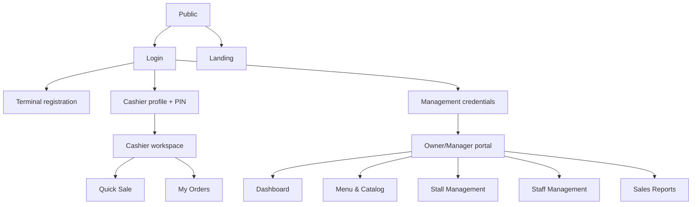

# TouB POS UI/UX Design Brief

## 1. Document Control

| Field | Value |
| --- | --- |
| Product | TouB POS |
| Document type | As-built UI/UX design brief |
| Version | 1.0 |
| Status | Baseline for team review |
| Baseline date | 30 July 2026 |
| Frontend | React 19, Vite, Tailwind CSS v4 |
| Design implementation | Custom TouB POS components and semantic theme tokens |
| Product requirements | `docs/product/toub-pos-prd.md` |
| User flows | `docs/design/toub-pos-user-flow-diagrams.md` |
| UI context | `context/ui-context.md` |

### 1.1 Method

This brief follows the structure recommended by Wavespace's
[UI/UX design brief guide](https://www.wavespace.agency/blog/design-brief-example):
project goals, target users, scope, brand guidance, deliverables, technical
constraints, success criteria, and review expectations.

It documents the current implemented direction and sets guardrails for future
design work. It does not propose new business features or change approved user
flows.

## 2. Project Overview

TouB POS is a responsive point-of-sale and business-management web application
for small merchant teams operating one or more physical Stalls. It supports:

- Fast Cashier PIN login on registered terminals.
- Stall-scoped Product browsing and cash checkout.
- Backend-owned totals, cash received, and change.
- Owner/Manager catalog, staff, Stall, device, kitchen, and report tools.
- Telegram-only kitchen operations.
- Light and dark themes.

The interface must work in busy, noisy, touch-heavy environments while also
remaining presentable as a professional Software Engineering final project.

## 3. Design Challenge

The design must balance two different working environments:

1. **Cashier selling:** frequent, time-sensitive, touch-oriented actions with
   minimal navigation and strong payment feedback.
2. **Owner/Manager operations:** denser information, forms, filtering, tables,
   reporting, and occasional destructive actions.

The UI must also make security boundaries understandable without pretending that
frontend visibility is authorization. A hidden action improves clarity, while
the backend remains responsible for enforcing permission.

## 4. Design Goals

| ID | Goal | User outcome | Evidence |
| --- | --- | --- | --- |
| DG-01 | Speed | Cashier finds Products and reaches cash confirmation quickly | Few primary actions, persistent cart access |
| DG-02 | Clarity | Users understand current role, Stall, Order, and payment state | Labels, badges, totals, explicit feedback |
| DG-03 | Touch usability | Controls work comfortably on phone/tablet | 40–48px minimum interactive height |
| DG-04 | Responsive integrity | No required action is clipped or requires horizontal page scrolling | Adaptive grids, drawers, mobile cards |
| DG-05 | Visual consistency | Shared controls look and behave alike | Semantic tokens and UI primitives |
| DG-06 | Error recovery | Users know what failed and what to do next | Inline alerts, retained form/cart state, retry actions |
| DG-07 | Accessible contrast | Text and controls remain readable in both themes | Semantic foreground/background pairs |
| DG-08 | Role clarity | Users see only relevant navigation and actions | Role-filtered portal and protected routes |
| DG-09 | Trustworthy payment | UI never implies payment succeeded before backend confirmation | Busy, pending, paid, and error states |
| DG-10 | Demo readiness | Core flows can be explained and demonstrated without confusion | Stable hierarchy, visible status, consistent terminology |

## 5. Success Measures

These are design evaluation targets, not analytics already implemented:

- A Cashier can identify the active Stall, add an item, and find Cash checkout
  without instruction.
- A Cashier can complete common Product/cart actions using touch alone.
- A first-time Owner can locate Menu, Stall, Staff, and Sales Report sections.
- No supported screen width hides the primary action.
- Every data screen has loading, error, and empty behavior.
- Destructive actions require explicit confirmation.
- Color is never the only indication of payment, Order, or kitchen status.
- Keyboard focus remains visible for primary controls and dialogs.
- Refreshing after a mutation shows the same backend-owned result.

Formal usability timing and WCAG testing remain future validation activities.

## 6. Target Users

### 6.1 Owner

**Context:** Business decision-maker using laptop, tablet, or phone.  
**Goals:** Configure the business, supervise staff/devices/kitchen, and understand
sales.  
**Pain points:** Dense operational data, accidental destructive changes, and
unclear ownership boundaries.  
**Design response:** Stable management navigation, summarized dashboard,
searchable management views, strong confirmations, and clear report filters.

### 6.2 Manager

**Context:** Operational supervisor who may work on-site.  
**Goals:** Manage Cashiers, catalog, Stalls, devices, kitchen access, Orders, and
reports.  
**Pain points:** Needing daily operational control without Owner-only authority.  
**Design response:** Same management shell with role-filtered actions and no
misleading Owner-only controls.

### 6.3 Cashier

**Context:** Frontline worker on a registered phone, tablet, or counter laptop,
often under time pressure.  
**Goals:** Unlock quickly, find Products, adjust a cart, accept cash, calculate
change, view a receipt, and follow kitchen state.  
**Pain points:** Small targets, hidden cart actions, payment uncertainty,
cross-Stall confusion, and slow recovery from errors.  
**Design response:** Stall label, touch targets, sticky search/categories,
responsive cart drawer, explicit cash confirmation, and own-Order cards.

### 6.4 Cook

The Cook does not use the web UI. Their interface is a Telegram ticket with a
single authorized Done action. Web design work must not invent a Cook portal or
web role.

### 6.5 Platform Admin

The temporary Platform Admin is API-only. This brief does not define a Platform
Admin console. A future platform product requires a separate design brief.

## 7. Scope And Non-Goals

### 7.1 In Scope

- Public landing and login screens.
- Cashier Quick Sale, cart, cash confirmation, My Orders, and receipt.
- Owner/Manager navigation, dashboard, catalog, Stalls, staff, and reports.
- Telegram kitchen connection/Cook management controls.
- Shared buttons, forms, dialogs, badges, alerts, states, and pagination.
- Desktop, laptop, tablet, and phone layouts.
- Persistent light/dark theme behavior.

### 7.2 Out Of Scope

- New navigation, feature placement, or business workflows.
- Cook web application.
- Platform Admin portal.
- Active KHQR payment UX while the provider path is suspended.
- Inventory, refunds, split payment, parked Orders, or offline checkout UI.
- Marketing rebrand, new logo, or copied third-party branding.
- Backend, database, authorization, or payment-state changes.

## 8. Brand And Product Personality

TouB POS should feel:

- **Operational:** Designed for real tasks, not decorative presentation.
- **Precise:** Totals, states, and identifiers are easy to inspect.
- **Fast:** Primary actions are prominent and interaction feedback is immediate.
- **Calm under pressure:** Errors are direct without being visually chaotic.
- **Modern:** Clean dark-tech appearance with restrained motion and color.
- **Local-business friendly:** Professional without feeling enterprise-heavy.

It should not feel:

- Like a marketing landing page inside the working application.
- Overly rounded, glossy, playful, or decorative.
- Dependent on one color to communicate meaning.
- Like a copy of another company's brand, logo, content, or proprietary assets.

## 9. Visual Direction

The approved direction is a premium, restrained dark operational interface
inspired by modern developer and control tools:

- Near-black layered surfaces.
- Warm off-white text instead of pure white.
- Fine warm-gray borders.
- One orange action accent.
- Small tonal elevation shifts instead of large card shadows.
- Compact radii and crisp geometry.
- Monospace used only for identifiers and compact technical labels.
- Spacious composition where it improves scanning, but dense enough for POS work.

Light mode uses the same hierarchy with warm off-white surfaces and darker
semantic colors. The two themes are equal product modes, not separate designs.

## 10. Color System

### 10.1 Core Semantic Colors

| Token/use | Dark | Light | Purpose |
| --- | --- | --- | --- |
| Page background | `#080807` | `#F3F2EE` | Main application canvas |
| Surface | `#111110` | `#FBFAF7` | Cards, sidebars, tables |
| Elevated | `#171715` | `#FFFFFF` | Dialogs, drawers, raised controls |
| Muted surface | `#1C1B19` | `#EAE7E1` | Hover and secondary containers |
| Border | `#302E2B` | `#D7D3CC` | Structure and separation |
| Strong text | `#F1EFEA` | `#1B1917` | Main headings and values |
| Soft text | `#A29D96` | `#625E58` | Supporting text |
| Muted text | `#706C67` | `#827C74` | Metadata and disabled context |
| Action | `#E76F2E` | `#C9571D` | Primary action and active navigation |
| Success | `#55A982` | `#267452` | Paid state and monetary totals |
| Warning | `#D89A43` | `#93601D` | Attention and pending state |
| Danger | `#E35D5D` | `#B53F3F` | Destructive/error state |

### 10.2 Color Rules

- Orange indicates a primary action, active navigation, or selected filter.
- Green indicates successful payment and total monetary values.
- Red is reserved for errors, cancellation, deletion, and revocation.
- Amber indicates pending, warning, or needs-attention states.
- Neutral surfaces carry most structure; semantic color should remain sparse.
- Text must use a semantic foreground suitable for its current surface.
- Hover styling must never make foreground and background converge.
- Status controls combine color with text, icon, dot, or border.

### 10.3 Category Tones

`gold`, `green`, `blue`, and `rose` are Category metadata colors. They organize
catalog content and must not override payment/error semantics.

## 11. Typography

### 11.1 Font Families

- Interface: **Geist Variable**.
- Technical labels, IDs, compact metadata: Geist Mono or system monospace stack.
- System fallback: `ui-sans-serif`, system UI, Segoe UI.

### 11.2 Type Roles

| Role | Recommended treatment |
| --- | --- |
| Page title | 24–32px, bold/black, tight but non-negative tracking |
| Section title | 18–24px, bold |
| Card/row title | 14–16px, semibold/bold |
| Body | 14–16px, regular/medium |
| Supporting text | 12–14px, medium |
| Metadata/label | 10–12px, bold monospace where appropriate |
| Key total | 24–36px, black, success color |

Use sentence case for ordinary UI. Uppercase and wider tracking are limited to
short labels, badges, and technical metadata.

## 12. Spacing, Shape, And Elevation

### 12.1 Spacing

Use an 8px base rhythm:

- `8px`: tightly related controls or metadata.
- `16px`: standard component padding and gaps.
- `24px`: section/card spacing.
- `32px`: major content grouping.
- `48px`: large page separation where space permits.

Four- and twelve-pixel values may be used inside compact controls, but layout
structure should preserve the 8px rhythm.

### 12.2 Radius

- Buttons, inputs, tabs, badges: 6–8px.
- Cards, panels, drawers, dialogs: generally 8px.
- Avatars: circular.
- Avoid large pill/rounded-card styling unless the control meaning requires it.

### 12.3 Elevation

- Prefer borders and surface changes over shadows.
- Use pronounced shadow only for modal/dialog/drawer separation.
- Do not nest multiple decorative cards.
- The scan-critical retained KHQR surface remains white regardless of theme, but
  is inactive in the current payment journey.

## 13. Responsive Layout Strategy

| Range | Primary behavior |
| --- | --- |
| Phone, below ~640px | Compact Product list or two-column grid, bottom-sheet cart, stacked forms/cards |
| Tablet/small laptop, 640–1180px | Fluid content, cart side drawer, adaptive grids |
| Desktop, above ~1180px | Product area plus persistent 400px cart, management sidebar |
| Management below ~768px | Desktop sidebar becomes ordered collapsible menu |

### 13.1 Responsive Rules

- No page-level horizontal scrolling for required workflows.
- Dense tables become readable cards or two-column label/value layouts.
- Primary action stays visible and reachable.
- Modal height uses small viewport units and internal scrolling.
- Sticky mobile search/category controls use an opaque surface and correct
  stacking so Products disappear behind them.
- Product grids use responsive tracks without leaving an oversized empty column.
- Touch targets should normally be at least 44px high; compact 40px controls are
  acceptable when surrounding spacing prevents mis-taps.
- Long names wrap or truncate with an accessible title/context.

## 14. Information Architecture

Desktop and mobile management navigation must use this same order:

1. Dashboard.
2. Menu & Catalog.
3. Stall Management.
4. Staff Management.
5. Sales Reports.

Role filtering may remove unavailable destinations but must not reorder the
remaining ones.

## 15. Shared Component Standards

### 15.1 Button

Implemented variants:

- `primary`: direct action.
- `secondary`: neutral alternative.
- `outline`: lower-emphasis action with brand relation.
- `ghost`: compact utility action.
- `danger`: destructive action.
- `success`: payment/success confirmation.
- `warning`: warning action.

Buttons support sizes, icons, loading, disabled state, full width, and
button/link rendering. Loading must preserve the action label context and prevent
duplicate submission.

### 15.2 Form Controls

`FormInput`, `FormSelect`, checkbox, and switch controls must provide:

- Visible label.
- Required marker when applicable.
- Error or helper text.
- `aria-invalid` and description linking.
- Disabled state.
- Visible focus border/ring.
- Minimum touch-friendly height.

Edit forms leave password/PIN blank unless the user intentionally changes the
credential.

### 15.3 Modal And Confirmation

- Use `ModalShell` as the focus-managed overlay foundation.
- Dialogs trap keyboard focus, close appropriately with Escape, and restore
  previous focus.
- Destructive actions use a clear object/action description.
- Loading confirmation cannot be accidentally repeated.
- Native `alert()` and `confirm()` are not used.
- Blocking confirmations remain centered.

### 15.4 Feedback

- `Alert`: persistent inline information, success, warning, or error.
- SweetAlert toast: transient success/error at bottom-right, three seconds.
- `LoadingState`: skeleton/spinner with task label.
- `EmptyState`: explicit absence plus next action where possible.
- `Badge`/`StatusBadge`: concise state with text and optional dot.

### 15.5 Data Display

- Tables/cards use clear headers or label/value pairs.
- Rows have a readable hover state in both themes.
- Selected grid/list items use a visible border/outline, not color alone.
- Pagination remains near the dataset it controls.
- IDs and report metadata use monospace selectively.
- Total amounts use the shared success green.

### 15.6 Icons And Charts

- Icons: Lucide through the shared `Icon` component.
- Unknown icon-only actions require an accessible label/title.
- Charts: Recharts.
- Charts require text labels, readable axes/tooltips, loading, error, and empty
  behavior.
- Chart color must not be the only way to understand series or status.

## 16. Page-Level Design Requirements

### 16.1 Landing Page

**Purpose:** Explain the product briefly and route staff to the correct login.  
**Primary actions:** Cashier Terminal and Management Portal.  
**Requirements:** Compact public content, no sign-up promise, responsive header,
theme toggle, and no exposure of operational data.

### 16.2 Login And Terminal Registration

**Purpose:** Separate management password login from registered-terminal Cashier
PIN login.  
**Primary actions:** Login, register terminal, select profile, enter PIN.  
**Requirements:**

- One focused card per current step.
- Visible back/switch path.
- Large PIN keypad and four-digit progress.
- Terminal name explains that it identifies the physical device.
- Errors remain near the relevant form.
- Development credentials appear only in enabled development/demo mode.
- Theme toggle remains reachable.

### 16.3 Cashier Quick Sale

**Purpose:** Build a Stall-scoped Order quickly.  
**Primary action:** Add Products, open cart, choose Cash.  
**Requirements:**

- Active Stall is visible.
- Search and Category controls remain reachable while browsing.
- Product image, name, Category, price, and add/quantity control are scannable.
- Phone defaults support compact list and optional two-column grid.
- Hidden/unavailable Products are not selectable.
- Cart item includes a small Product image.
- Mobile cart opens as a bottom sheet; tablet uses side drawer; desktop keeps a
  persistent panel.
- Payment stays disabled for an empty or busy cart.
- Clear cart requires confirmation.

### 16.4 Cash Confirmation

**Purpose:** Accept physical cash and show correct change before confirmation.  
**Primary action:** Confirm paid.  
**Requirements:**

- Trusted Order total is prominent and green.
- USD and KHR received inputs are clearly labeled.
- Change updates as input changes.
- Underpayment uses text plus warning color.
- Busy state prevents duplicate confirmation.
- Paid state is shown only after backend success.
- Cancel returns safely without falsely marking paid.

### 16.5 Receipt

**Purpose:** Let Cashier/management inspect the trusted Order result.  
**Requirements:**

- Strong contrast in both themes.
- Order, Stall, Cashier, items, notes, payment, cash received, and change are
  readable.
- Total is green and visually dominant.
- Long receipts scroll within the modal.
- Historical KHQR receipt data may display, but the receipt does not imply that
  KHQR is currently available.

### 16.6 Cashier My Orders

**Purpose:** Show the current Cashier's backend-owned history and kitchen state.  
**Requirements:**

- Responsive card grid with no horizontal page scroll.
- Status and payment method use text badges.
- Receipt and eligible Telegram retry actions are explicit.
- Loading, empty, backend error, and retry error are separate states.
- New Order and kitchen updates refresh without manual page reload.

### 16.7 Management Dashboard

**Purpose:** Summarize revenue, paid Orders, selling Stalls, and trends.  
**Requirements:**

- KPI cards lead with the value.
- Revenue range includes Today, full Monday–Sunday Week, Month, and Custom.
- Revenue chart uses Recharts and backend-owned data.
- Future dates may appear as zero points for a stable full-week axis.
- Chart loading/error/empty states occupy the chart region without layout shift.
- Avoid low-value widgets, quick-task clutter, or recent-system-event noise.

### 16.8 Menu And Catalog

**Purpose:** Manage Categories, Products, prices, visibility, and Stall
assignments.  
**Requirements:**

- Product and Category subtabs are clear.
- List/grid selection has a visible selected border.
- Grid tracks fill the available width neatly.
- Row/card hover maintains readable contrast in both themes.
- Product form communicates required prices before assigning a Stall.
- Removing all Stall assignments preserves the Product/default prices.
- Category view supports moving Products without duplicating the Product editor.
- Destructive changes require confirmation.

### 16.9 Stall Management

**Purpose:** Manage Stalls, Cashier assignments, terminals, kitchen group, and
Cook access.  
**Requirements:**

- Mobile uses explicit Manage Staff actions rather than drag-and-drop.
- Desktop drag-and-drop may remain an optional shortcut.
- Devices show a human-readable name and last-use context.
- Revocation identifies one device and confirms the consequence.
- Kitchen group and Telegram IDs are masked where displayed.
- Connect Kitchen Group is Owner-only.
- Cook authorization clearly separates display name from numeric Telegram ID.
- Assignment/connection changes update without manual refresh.

### 16.10 Staff Management

**Purpose:** Create/edit role-appropriate users and manage status.  
**Requirements:**

- Owner role selector: Manager or Cashier.
- Manager role selector: Cashier only.
- Management form asks for password, not PIN.
- Cashier form asks for PIN, not password.
- Edit credentials stay blank unless changing them.
- Staff rows remain readable on hover in light and dark mode.
- Phone layout converts wide columns into compact cards/label groups.

### 16.11 Sales Reports

**Purpose:** Analyze scoped sales and inspect the transaction ledger.  
**Requirements:**

- Analytics and Transaction Ledger are distinct views.
- Phone period filter uses a compact dropdown/custom calendar path.
- Stall, Cashier, payment, status, and search controls remain usable on mobile.
- Operational filters use a compact scrollable/snap layout when needed.
- Selling Stalls content expands/wraps to contain all values.
- Transaction search and filters are visibly reflected in results.
- Each ledger Order can open its receipt.
- CSV and PDF exports are both available.
- New Orders trigger a scoped refetch; polling remains fallback.

## 17. Interaction And Motion

- Standard transition: approximately 150–200ms.
- Use motion for state change, drawer/modal arrival, and press feedback.
- Buttons may scale slightly on active press.
- Do not animate critical totals in a way that delays reading.
- Avoid continuous decorative animation.
- Loading spinners indicate active work and disable duplicate action.
- Respect future `prefers-reduced-motion` support; current implementation should
  be audited for this before production.

## 18. Accessibility Requirements

### 18.1 Required Baseline

- Semantic button, input, select, label, heading, and navigation elements.
- Accessible name for every icon-only button.
- Visible keyboard focus.
- Modal focus trap, Escape behavior, and focus restoration.
- Error text linked to invalid inputs.
- State communicated with text, not color alone.
- Contrast target: WCAG 2.1 AA for normal UI text and controls.
- Touch targets sized for POS use.
- No required workflow dependent only on hover or drag.
- Logical tab and reading order after responsive layout changes.

### 18.2 Known Validation Need

The global focus-visible compatibility selector in `index.css` is currently
commented out. Many shared controls provide component-level focus styling, but a
full keyboard audit is still required to ensure every legacy control has a
visible focus indicator.

## 19. Content And Terminology

### 19.1 Voice

- Direct, concise, calm, and action-oriented.
- Explain the recovery action, not only the failure.
- Avoid developer jargon in routine operational UI.
- Use technical identifiers only where they help support/debugging.

### 19.2 Approved Terms

- Owner.
- Manager.
- Cashier.
- Platform Admin only in API/developer documentation.
- Stall.
- Terminal or device, used consistently within one screen.
- Current Order.
- Pending payment.
- Paid.
- Kitchen ticket.
- Cash received.
- Change due.
- Sales Reports.

Do not use the removed `admin` role. Do not call Cook a web user. Prefer “paid
Order” over ambiguous “completed Order” when referring to payment state.

## 20. Technical Constraints

- Preserve React/Vite routing and existing component hierarchy where practical.
- Use Tailwind CSS v4 and semantic tokens from `frontend/src/index.css`.
- Use shared UI components before creating feature-local duplicates.
- Use Lucide through `Icon`; do not add large inline SVG decoration.
- Use Recharts for established chart behavior.
- Use Axios-backed centralized API services.
- Preserve backend-owned data and authorization.
- Do not calculate or commit trusted paid state in presentation components.
- Theme preference may remain in browser storage.
- Product images come from ImageKit URLs with fallbacks and lazy loading.
- Socket.IO events prompt backend refetch; UI event payloads are not a data store.

## 21. Current Deliverables

| Deliverable | Status | Evidence |
| --- | --- | --- |
| Semantic dark/light theme tokens | Implemented | `frontend/src/index.css` |
| Shared UI primitives | Implemented | `frontend/src/components/ui/` |
| Theme context/toggle | Implemented | `frontend/src/shared/theme/` |
| Responsive Cashier flow | Implemented | `features/cashier`, `features/payments` |
| Responsive management shell | Implemented | `features/management` |
| Catalog/staff/Stall/report screens | Implemented | Corresponding feature folders |
| Revenue charts | Implemented | Recharts dashboard/report components |
| User flow document | Implemented | `docs/design/toub-pos-user-flow-diagrams.md` |
| Formal usability session results | Not yet recorded | Future validation |
| Automated visual regression suite | Not implemented | Future |

## 22. Existing Design Debt

| Priority | Issue | Impact | Direction |
| --- | --- | --- | --- |
| High | Compatibility CSS maps many old utility colors globally | New legacy-style classes can hide contrast problems | Migrate remaining components to semantic tokens |
| High | Some components still use hardcoded light colors/inline Inter styles | Theme behavior depends on compatibility overrides | Replace incrementally with shared primitives/tokens |
| Medium | Global focus-visible rule is commented | Legacy controls may lack keyboard focus indication | Audit and restore a safe global/component strategy |
| Medium | SweetAlert confirmation styling is partly local | Feedback patterns can drift | Centralize notification/confirmation theme |
| Medium | Some radii/classes still use old `rounded-2xl/3xl` values | Compatibility CSS masks inconsistent intent | Use approved 6–8px component radii directly |
| Medium | KHQR components remain in the codebase | Designers may accidentally expose suspended payment | Keep feature-gated and visually out of active flow |
| Low | No screenshot regression baseline | Visual changes rely on manual review | Add Playwright desktop/mobile snapshots |
| Low | Reduced-motion behavior is not formalized | Motion-sensitive users may receive unnecessary animation | Add and test reduced-motion variants |

Design debt should be corrected in small, visually verified changes without
rewriting business logic.

## 23. Acceptance Criteria For Future UI Changes

Every UI change should satisfy:

1. Existing role and business behavior is unchanged unless separately approved.
2. Dark and light themes both remain readable.
3. Phone, tablet, and desktop layouts preserve required actions.
4. No new page-level horizontal scrolling.
5. Shared semantic tokens/components are used where available.
6. Loading, empty, error, disabled, busy, and success states are considered.
7. Keyboard focus and accessible names remain present.
8. Destructive actions are confirmed.
9. Paid state appears only after backend confirmation.
10. KHQR remains hidden/disabled while suspended.
11. Frontend lint and production build pass.
12. Core Login, Cashier, and Owner/Manager journeys are manually checked.

## 24. Review Process And Responsibilities

### 24.1 Suggested Three-Person Review

| Role | Responsibility |
| --- | --- |
| UX reviewer | Runs user flows, checks clarity, touch behavior, and recovery |
| UI reviewer | Checks tokens, contrast, spacing, typography, and both themes |
| Engineering reviewer | Checks responsive layout, accessibility, state integrity, and diff scope |

Reviewers should exchange roles for at least one critical flow to reduce blind
spots.

### 24.2 Visual Check Matrix

| Screen | Phone | Tablet | Desktop | Dark | Light |
| --- | --- | --- | --- | --- | --- |
| Login/PIN | Required | Required | Required | Required | Required |
| Quick Sale/cart | Required | Required | Required | Required | Required |
| Cash confirmation/receipt | Required | Required | Required | Required | Required |
| Dashboard | Required | Required | Required | Required | Required |
| Catalog | Required | Required | Required | Required | Required |
| Stall/Staff | Required | Required | Required | Required | Required |
| Sales Reports | Required | Required | Required | Required | Required |

## 25. Requirement Traceability

| Design area | Main PRD requirements |
| --- | --- |
| Authentication and role UI | `IAM-001` to `IAM-012`, `RBAC-001` to `RBAC-009` |
| Terminal/Cashier context | `DEV-003` to `DEV-009` |
| Catalog management | `CAT-001` to `CAT-011` |
| Cart and checkout | `ORD-001` to `ORD-013`, `PAY-001` to `PAY-010` |
| Suspended payment presentation | `QRP-001`, `QRP-002` |
| Kitchen management/status | `KIT-001` to `KIT-013` |
| Dashboard and reports | `REP-001` to `REP-010` |
| Real-time refresh | `RT-001` to `RT-006` |

## 26. Approval Checklist

- [ ] The design serves Owner, Manager, and Cashier without inventing new roles.
- [ ] The Platform Admin and Cook remain outside the operational web UI.
- [ ] Cash remains the only active checkout presentation.
- [ ] Role navigation and action differences are accepted.
- [ ] Dark and light palettes are accepted.
- [ ] Geist typography and semantic token use are accepted.
- [ ] Responsive breakpoints and cart behavior are accepted.
- [ ] Payment, status, and destructive feedback patterns are accepted.
- [ ] Accessibility targets are accepted.
- [ ] Existing design debt is acknowledged and prioritized.
- [ ] Future UI changes will use this brief and the user-flow document together.

