# TouB POS User Flow Diagrams

## 1. Document Control

| Field | Value |
| --- | --- |
| Product | TouB POS |
| Document type | As-built user flow document |
| Version | 1.0 |
| Status | Baseline for team review |
| Baseline date | 30 July 2026 |
| Source PRD | `docs/product/toub-pos-prd.md` |
| Source design | `docs/design/toub-pos-functional-technical-design.md` |
| Source fact sheet | `docs/archive/reference/toub-pos-current-system-fact-sheet.md` |

### 1.1 Method

This document follows the user-centered approach described in Adobe's
[user flow diagram guide](https://business.adobe.com/blog/basics/how-to-make-a-user-flow-diagram).
Each flow starts with a user goal and entry point, maps the screens, actions,
and decisions needed to reach that goal, and includes important failure and
recovery paths.

These diagrams describe the current application. They are not proposals for new
features. KHQR is shown only where necessary to explain that it is suspended.

## 2. How To Read The Diagrams

| Shape or notation | Meaning |
| --- | --- |
| Rounded node | Start or successful/unsuccessful endpoint |
| Rectangle | Screen, system response, or user action |
| Diamond | Decision |
| Database cylinder | Persistent backend data |
| Solid arrow | Normal progression |
| Arrow label | Decision result or condition |
| Dashed boundary/subgraph | Actor, channel, or system area |

Color is supplementary. The text and arrow labels remain the authoritative
meaning so the flows can still be understood without color.

## 3. Actors, Goals, And Entry Points

| Actor | Primary goal | Main entry point | Successful endpoint |
| --- | --- | --- | --- |
| Platform Admin | Bootstrap one Owner for a customer business | Auth API/Swagger | Owner account created |
| Owner | Configure and control one business | `/login?mode=management` | Management task completed |
| Manager | Supervise daily business operations | `/login?mode=management` | Authorized operational task completed |
| Cashier | Sell products from an assigned Stall | `/login?mode=cashier` | Paid Order and receipt |
| Cook | Prepare and complete paid Orders | Stall Telegram group | Ticket marked done |
| Customer | Purchase items and receive correct change | Cashier interaction | Payment and Order accepted |

### 3.1 User Objectives And Business Objectives

| Flow area | User objective | Business objective |
| --- | --- | --- |
| Bootstrap | Give a customer control of their business | Maintain one accountable Owner per business |
| Management login | Reach authorized tools | Prevent unauthorized management access |
| Terminal setup | Prepare a specific device for a Stall | Bind Cashier access to an approved terminal |
| Cashier login | Start a shift quickly with a PIN | Preserve Stall and device isolation |
| Catalog | Maintain accurate sellable products | Keep MySQL as the source of truth |
| Checkout | Complete a sale accurately | Keep prices, totals, and payment state backend-owned |
| Kitchen | Deliver a paid Order to the correct Cook | Avoid cross-Stall routing and paper-ticket loss |
| Reports | Understand sales and inspect receipts | Provide auditable, scoped operational evidence |

## 4. Product Navigation Overview

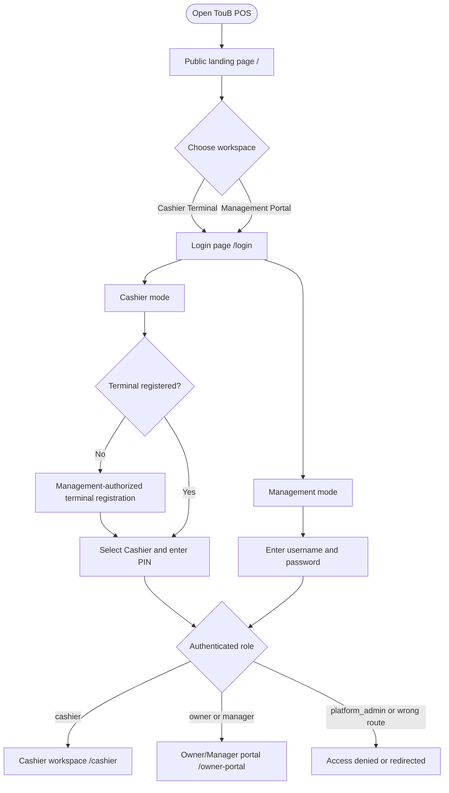

The Platform Admin is intentionally absent from normal web navigation because
the current bootstrap role has no frontend console.

## 5. Flow UF-01: Platform Admin Creates The Business Owner

**Actor:** Platform Admin  
**Goal:** Create the single Owner who becomes the customer-business authority.  
**Entry point:** Swagger/API client with valid Platform Admin credentials.  
**Requirements:** `US-PLT-01`, `RBAC-002`, `RBAC-003`, `IAM-002`.

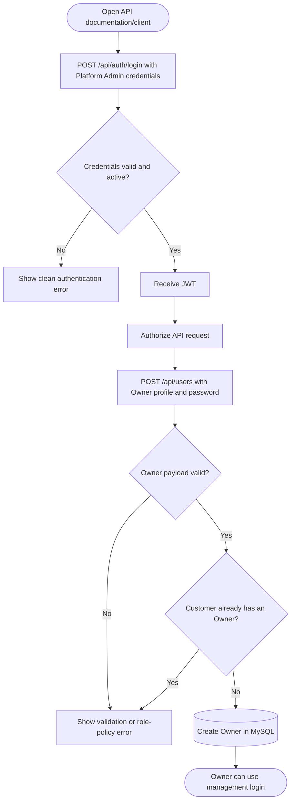

**Important boundary:** Platform Admin creates Owners only. They do not become
part of the customer's management portal or operational business hierarchy.

## 6. Flow UF-02: Owner Or Manager Login

**Actors:** Owner, Manager  
**Goal:** Enter the management portal with role-appropriate controls.  
**Entry point:** `/login?mode=management`.  
**Requirements:** `IAM-001`, `IAM-002`, `IAM-006` to `IAM-012`, `RBAC-004` to
`RBAC-009`.

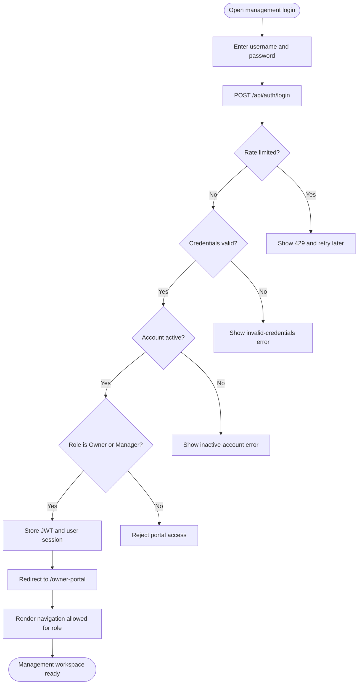

**Recovery:** A rejected login leaves the user on the login screen. A protected
route with no valid session redirects to `/login`.

## 7. Flow UF-03: Register A Cashier Terminal

**Actors:** Owner or Manager performing registration; Cashier later using it.  
**Goal:** Bind one named browser/device to one Stall without affecting other
terminals.  
**Entry point:** Cashier login mode on an unregistered device.  
**Requirements:** `DEV-003` to `DEV-009`, `IAM-009`.

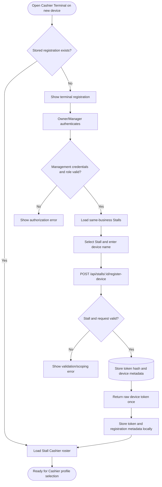

**Important boundary:** The browser stores the raw registration token; MySQL
stores only its SHA-256 hash. A Stall may have multiple independent devices.

## 8. Flow UF-04: Cashier PIN Login And Session Recovery

**Actor:** Cashier  
**Goal:** Unlock the registered terminal for an eight-hour shift.  
**Entry point:** Registered Cashier terminal.  
**Requirements:** `IAM-003`, `IAM-005` to `IAM-012`, `DEV-003`, `DEV-007`.

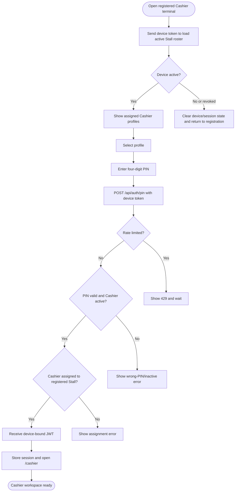

**Live revocation path:** If management revokes this terminal during a session,
the backend emits `device:revoked`; the frontend clears authentication and
registration state and returns the user to login. API and focus checks provide
fallback detection.

## 9. Flow UF-05: Manage Users And Stall Assignments

**Actors:** Owner, Manager  
**Goal:** Maintain valid staff roles and assign Cashiers to a Stall.  
**Entry point:** Staff Management in `/owner-portal`.  
**Requirements:** `US-OWN-01`, `US-MGR-01`, `RBAC-004`, `RBAC-005`, `DEV-002`.

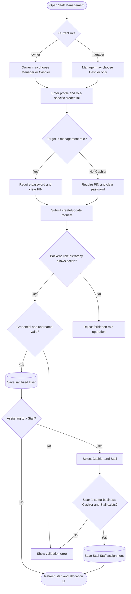

**Role distinction:** Owner can manage Managers and Cashiers. Manager can manage
Cashiers only. Neither creates another Owner.

## 10. Flow UF-06: Manage Catalog And Stall Availability

**Actors:** Owner, Manager  
**Goal:** Maintain categories and products, then choose where each product is
sellable.  
**Entry point:** Menu & Catalog in `/owner-portal`.  
**Requirements:** `CAT-001` to `CAT-011`.

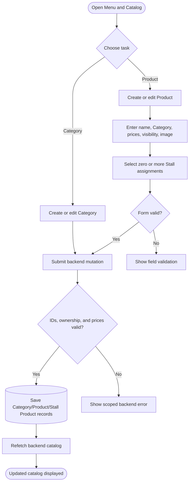

**Zero-Stall path:** Saving a Product with no Stall assignment keeps it in the
management catalog and preserves its default prices. It is not visible to a
Cashier until assigned and marked visible.

## 11. Flow UF-07: Cashier Creates And Confirms A Cash Sale

**Actors:** Cashier, Customer  
**Goal:** Build a Stall-scoped Order, accept cash, and return correct change.  
**Entry point:** Quick Sale in `/cashier`.  
**Requirements:** `ORD-001` to `ORD-013`, `PAY-001` to `PAY-010`.

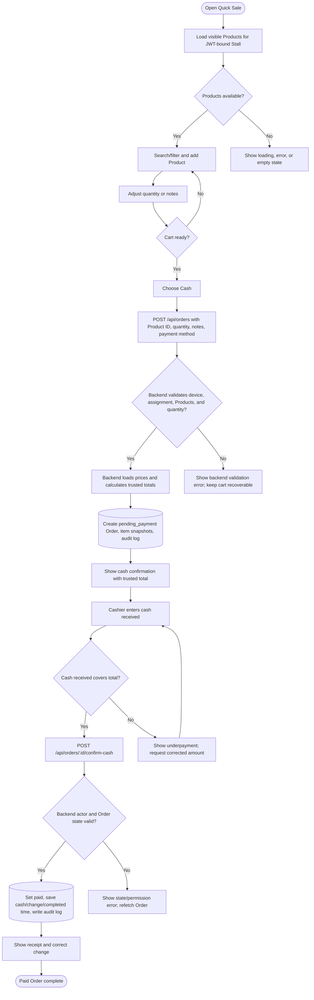

**Trust boundary:** The frontend does not send trusted price, total, Cashier ID,
Stall ID, status, or paid fields. The frontend may preview change, but the saved
change is calculated by the backend.

## 12. Flow UF-08: Paid Order Reaches The Kitchen

**Actors:** Cashier, Telegram Bot, Cook  
**Goal:** Route a paid Order to the correct Stall group and record completion.  
**Entry point:** Successful backend cash confirmation.  
**Requirements:** `KIT-005` to `KIT-013`, `RT-001` to `RT-006`.

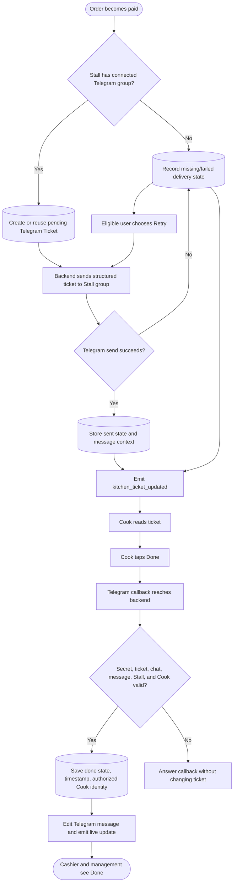

**Retry permission:** Owner/Manager may retry a paid business Order. A Cashier
may retry only their own paid Order. Pending, sent, and done tickets cannot be
duplicated through retry.

## 13. Flow UF-09: Connect A Stall Kitchen Group

**Actors:** Owner, Telegram  
**Goal:** Connect exactly one intended Telegram group to a same-business Stall.  
**Entry point:** Stall Management.  
**Requirements:** `RBAC-008`, `KIT-001` to `KIT-003`.

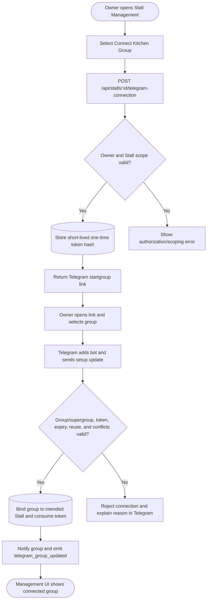

**Privacy:** The management UI displays the group title and masked chat ID. Full
Telegram routing identifiers remain backend/database data.

## 14. Flow UF-10: Authorize Or Revoke A Telegram Cook

**Actors:** Owner, Manager  
**Goal:** Control which Telegram identities may complete tickets for one Stall.  
**Entry point:** Kitchen/Cook controls in Stall Management.  
**Requirements:** `KIT-005` to `KIT-009`, `KIT-013`.

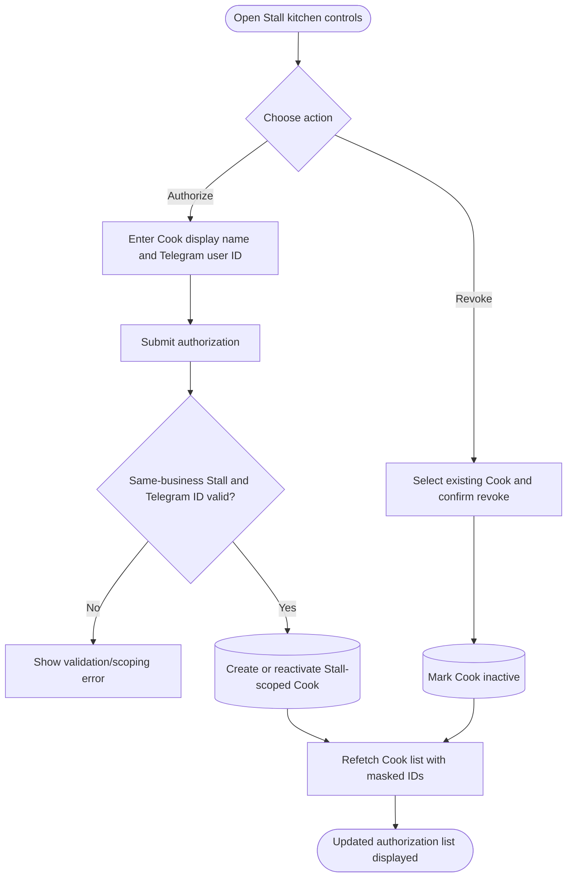

Revocation affects future completion attempts. It does not create a web account
or remove historical completion attribution.

## 15. Flow UF-11: Review Reports And Receipts

**Actors:** Owner, Manager  
**Goal:** Inspect scoped business performance and verify individual Orders.  
**Entry point:** Dashboard or Sales Reports in `/owner-portal`.  
**Requirements:** `REP-001` to `REP-010`, `RT-004`, `RT-006`.

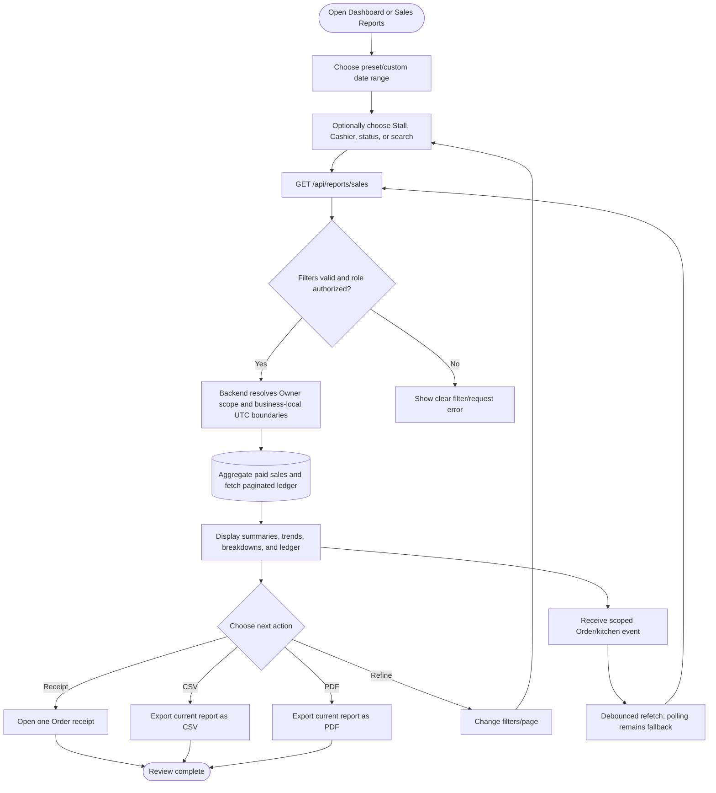

Only paid Orders contribute to revenue. Report dates use the configured
business timezone, while persisted timestamps remain UTC.

## 16. Flow UF-12: Revoke One Registered Terminal

**Actors:** Owner, Manager; affected Cashier  
**Goal:** Disable one selected device without logging out other devices at the
same Stall.  
**Entry point:** Stall Management device list.  
**Requirements:** `DEV-004`, `DEV-006` to `DEV-009`, `RT-002`, `RT-003`.

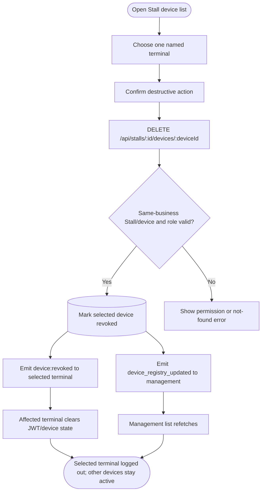

## 17. Suspended KHQR User Path

KHQR is not an active user journey. The Cashier interface hides the option by
default, and the backend rejects KHQR creation/status requests with
`KHQR_DISABLED` unless both feature decisions and configuration explicitly
reactivate it.

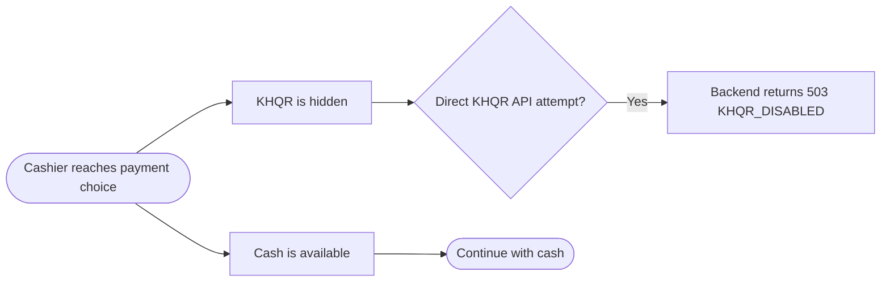

Historical KHQR Orders remain readable in reports and receipts. They do not make
new KHQR checkout an implemented flow.

## 18. Cross-Flow Recovery Rules

| Situation | User-visible response | Recovery |
| --- | --- | --- |
| Missing/expired JWT | Redirect to login | Authenticate again |
| Wrong role | Redirect to role home or show forbidden response | Use an authorized account |
| Login rate limit | Clear `429` message | Wait for the limiter window |
| Revoked terminal | Immediate logout when live event arrives | Management registers the device again if appropriate |
| Network request failure | Inline/shared error state | Retry after connectivity returns |
| Invalid Order item | Backend validation message | Correct cart and submit again |
| Cash underpayment | Underpayment message | Enter a sufficient amount |
| Duplicate payment confirmation | State/conflict response | Refetch and display current Order |
| Telegram send failure | Failed/missing ticket state | Authorized user manually retries |
| Unauthorized Cook | Telegram callback rejected | Owner/Manager authorizes the correct Telegram user |
| Invalid report range | Filter validation message | Correct start/end dates |
| Empty catalog/report | Explicit empty state | Change filters or configure data |

## 19. Friction And Usability Review

| Flow | Existing strength | Remaining friction or risk | Priority |
| --- | --- | --- | --- |
| Management login | Familiar username/password flow | No password-reset or recovery workflow | Future |
| Terminal registration | Clear one-time device binding | Requires Owner/Manager presence on a new terminal | Accepted |
| Cashier login | Fast profile and PIN interaction | Eight-hour expiry can interrupt a shift | Medium |
| Catalog | Products can serve multiple Stalls | Large catalogs require careful search/filter use | Low |
| Cash checkout | Backend validates amount and change | No cancellation/refund after accidental Order creation | Future |
| Kitchen delivery | Stall-specific Telegram routing | External Telegram outage needs manual retry | Medium |
| Cook completion | One-tap action with authorization | Owner must collect the Cook's numeric Telegram ID | Medium |
| Reports | Presets, custom dates, search, receipt, export | Very large exports may need server-generated files later | Low |
| Platform bootstrap | Strong separation from customer roles | API-only setup is unsuitable for nontechnical operators | Future |

## 20. Flow-to-Requirement Traceability

| Flow | Main PRD requirement groups | Primary implementation areas |
| --- | --- | --- |
| UF-01 Platform bootstrap | `IAM`, `RBAC`, `US-PLT-01` | Auth/User routes and services |
| UF-02 Management login | `IAM`, `RBAC` | Auth feature, Auth service, Protected Route |
| UF-03 Terminal registration | `DEV`, `IAM-009` | Login flow, Stall device service |
| UF-04 Cashier PIN login | `IAM`, `DEV-003`, `DEV-007` | Login page, Auth service, device middleware |
| UF-05 Users/assignments | `RBAC`, `DEV-002` | Staff features, User/Stall services |
| UF-06 Catalog | `CAT` | Catalog features and Product/Category services |
| UF-07 Cash sale | `ORD`, `PAY` | Cashier/payment features and Order services |
| UF-08 Kitchen delivery | `KIT`, `RT` | Telegram and Order Telegram services |
| UF-09 Group connection | `KIT-001` to `KIT-003` | Telegram Cook Manager/group connection service |
| UF-10 Cook authorization | `KIT-005` to `KIT-009` | Telegram Cook Manager/Cook service |
| UF-11 Reports | `REP`, `RT-004`, `RT-006` | Reports UI/service/repository |
| UF-12 Terminal revocation | `DEV`, `RT-002`, `RT-003` | Stall Management/device and Socket.IO services |

## 21. Team Review And User Testing

For each flow, ask one teammate to act as the user and another to observe:

1. Can the user identify the correct entry point without coaching?
2. Is the next action obvious at every screen?
3. Does every decision have a clear success and failure response?
4. Can the user recover without refreshing the whole application?
5. Does the UI reveal only actions allowed for that role?
6. Does the backend reject the same forbidden action if the UI is bypassed?
7. Does the final state match MySQL and remain correct after refresh?
8. Do real-time updates reach only the intended user/business/Stall?

Record any mismatch as either:

- **Flow defect:** implementation does not match an approved requirement.
- **Documentation defect:** diagram does not match current implementation.
- **Product decision:** desired behavior is not yet an approved requirement.

## 22. Approval Checklist

- [ ] Platform Admin remains API-only and creates Owners only.
- [ ] Owner and Manager journeys show their different role limits.
- [ ] Cashier login requires both Stall assignment and active terminal.
- [ ] Catalog and Order paths remain backend/database-owned.
- [ ] Cash checkout is the only active payment journey.
- [ ] Trusted totals and paid state never originate in the frontend.
- [ ] Paid Orders route to the connected Stall Telegram group.
- [ ] Cook completion validates exact context and active Stall authorization.
- [ ] Terminal revocation affects only the selected device.
- [ ] Reports are Owner-scoped and use business-local date boundaries.
- [ ] KHQR is clearly marked suspended.
- [ ] Failure and recovery paths match the application.
- [ ] Flow IDs are used in future UX tests and presentation scripts.
