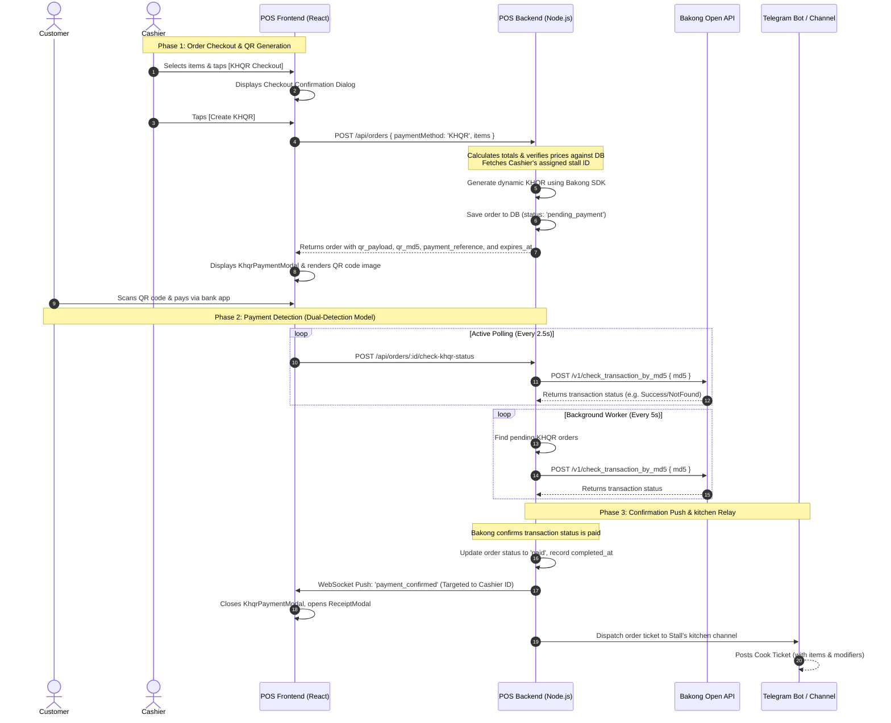

# KHQR Payment Flow & Function Mapping Guide

> **Current status:** This guide documents the retained Phase 5 implementation. KHQR creation, polling, and background checking are disabled by default while TouB POS evaluates an approved merchant payment provider. Cash is the active checkout method.

This document explains the complete end-to-end payment flow when a customer scans a generated KHQR code in the TOUB POS system, along with the precise mapping of functions from the React frontend to the Node.js Express backend.

---

## 1. End-to-End Payment Flow Overview

The KHQR payment validation process runs across three sequential phases:

---

## 2. Phase-by-Phase Detailed Walkthrough

### Phase 1: Order Creation & KHQR Generation
1. **Initiate Checkout**: The Cashier selects items on the terminal interface and selects the blue checkout option **KHQR**.
2. **Checkout Confirmed**: The cashier clicks **Create KHQR** on the confirmation dialog, triggering the API request.
3. **Backend Order Validation**: The backend receives the request. Instead of trusting client-side pricing:
   - It fetches products from the database.
   - Calculates the totals in USD/KHR.
   - Resolves the Cashier's active stall registration.
4. **QR Generation**: The backend uses the official `bakong-khqr` SDK to compile the payload with the merchant's identifier (`BAKONG_ACCOUNT_ID`), reference code, amount, and store label.
5. **Database Entry**: The order is recorded in the database with status `pending_payment` along with its generated `qr_payload`, `qr_md5` (MD5 hash of the payload), `payment_reference`, and `payment_expires_at`.
6. **QR Code Rendering**: The backend returns the `qr_payload` string. The frontend displays the `KhqrPaymentModal` which calls an external QR code API (`api.qrserver.com`) to render the payload string into a scannable QR image.

### Phase 2: Payment Detection (Dual-Detection Mechanism)
To guarantee real-time verification and prevent orders from dropping off, the system uses two simultaneous checks:
* **Frontend Polling**: While the `KhqrPaymentModal` is open, React runs a `setInterval` loop every **2.5 seconds** requesting status updates for that specific order ID.
* **Backend Background Checker**: An asynchronous system task runs every **5 seconds** searching for any `pending_payment` KHQR orders in the database that have not yet expired, checking their transaction status against Bakong API.

Both tracks query NBC's Bakong API endpoints using the transaction's unique `qr_md5`.

### Phase 3: Confirmation & Kitchen Relay
1. **Mark as Paid**: Once the Bakong API returns a successful transaction, the backend performs a currency and amount mismatch check, marks the order status as `paid`, sets the `completed_at` timestamp, and creates an audit log.
2. **Targeted WebSocket Notification**: The backend retrieves the Cashier's WebSocket connection and broadcasts a `payment_confirmed` socket event containing the payment payload **only to that Cashier's terminal**.
3. **Modal Transition**: Upon receiving the socket event, the cashier's screen automatically dismisses the KHQR modal and displays the invoice receipt (`ReceiptModal`).
4. **Kitchen Ticket Dispatch**: Concurrently, the backend sends the structured order ticket payload (including item notes and modifiers) to the Telegram bot, which posts a cook slip directly into the respective stall's Telegram kitchen channel.

---

## 3. Function & File Mapping Reference

Here are the specific functions and files involved in executing the payment flow, sequenced from frontend invocation to backend verification and notifications.

### 3.1. Frontend React Layer

| File Path | Component / Hook | Function / Block | Purpose |
| :--- | :--- | :--- | :--- |
| [CashierPage.jsx](file:///d:/CADT/VSCODE/Final_Project_Y2/TOUB_POS/frontend/src/pages/CashierPage.jsx) | `CashierPage` | `handleCheckoutWithReceipt(method)` | Triggers when checkout option is clicked. For KHQR, it opens the confirmation dialog. |
| [CashierPage.jsx](file:///d:/CADT/VSCODE/Final_Project_Y2/TOUB_POS/frontend/src/pages/CashierPage.jsx) | `CashierPage` | `handleCreateKhqrPayment()` | Invokes checkout hooks to submit the order request to the backend. |
| [CashierPage.jsx](file:///d:/CADT/VSCODE/Final_Project_Y2/TOUB_POS/frontend/src/pages/CashierPage.jsx) | `CashierPage` | `pollOrderStatus() useEffect` | Initiates the 2.5s polling loop to check payment status via HTTP POST request while QR modal is open. |
| [CashierPage.jsx](file:///d:/CADT/VSCODE/Final_Project_Y2/TOUB_POS/frontend/src/pages/CashierPage.jsx) | `CashierPage` | `connectCashierSocket() useEffect` | Establishes the WebSocket connection. Registers listener for `payment_confirmed` events to close the QR modal and open the receipt modal. |
| [CashierPage.jsx](file:///d:/CADT/VSCODE/Final_Project_Y2/TOUB_POS/frontend/src/pages/CashierPage.jsx) | `CashierPage` | `handleResumeKhqrPayment()` | Resumes payment polling/modal for a pending order from the "My Orders" tab. |
| [api.js](file:///d:/CADT/VSCODE/Final_Project_Y2/TOUB_POS/frontend/src/services/api.js) | `api.orders` | `create(order)` | Makes `POST /orders` API call with checkout payload containing items. |
| [api.js](file:///d:/CADT/VSCODE/Final_Project_Y2/TOUB_POS/frontend/src/services/api.js) | `api.orders` | `checkKhqrStatus(orderId)` | Makes `POST /orders/:id/check-khqr-status` API call. |
| [socketClient.js](file:///d:/CADT/VSCODE/Final_Project_Y2/TOUB_POS/frontend/src/services/socketClient.js) | — | `connectCashierSocket(callbacks)` | Connects Socket.IO to the backend and subscribes to the `payment_confirmed` and `kitchen_ticket_updated` events. |

### 3.2. Backend Controllers & Routers

| File Path | Controller | Function | Purpose |
| :--- | :--- | :--- | :--- |
| [order.controller.js](file:///d:/CADT/VSCODE/Final_Project_Y2/TOUB_POS/backend/src/controllers/order.controller.js) | Order Controller | `createOrder(req, res, next)` | Extracts cashier info from authentication JWT, validates JSON parameters, and forwards to Order Service. |
| [order.controller.js](file:///d:/CADT/VSCODE/Final_Project_Y2/TOUB_POS/backend/src/controllers/order.controller.js) | Order Controller | `checkKhqrPaymentStatus(req, res, next)` | Handles status check requests from cashier/manager/owner endpoints. |

### 3.3. Backend Core Services

| File Path | Service | Function | Purpose |
| :--- | :--- | :--- | :--- |
| [`order-creation.service.js`](../backend/src/services/orders/order-creation.service.js) | Order Creation | `createOrder(cashierId, items, paymentMethod)` | Handles MySQL transactions: calculates totals based on DB catalog records, constructs the order items, invokes KHQR generation when needed, logs creation audit trail, and commits. |
| [`order.service.js`](../backend/src/services/order.service.js) | Order Facade | `checkKhqrPaymentStatus(orderId, actor)` | Stable public service API used by the controller to evaluate Bakong status with actor access checks. |
| [`khqr-payment.service.js`](../backend/src/services/orders/khqr-payment.service.js) | KHQR Payment | `checkKhqrPaymentStatusAsSystem(orderId)` | System-context entry point used by the background checker without user-level access restrictions. |
| [`khqr-payment.service.js`](../backend/src/services/orders/khqr-payment.service.js) | KHQR Payment | Internal status workflow | Compares stored state with Bakong, validates the payment, updates MySQL idempotently, emits WebSocket events, and dispatches Telegram tickets. |
| [khqr-provider.service.js](file:///d:/CADT/VSCODE/Final_Project_Y2/TOUB_POS/backend/src/services/khqr-provider.service.js) | KHQR Service | `generateKhqrIndividualPayment(...)` | Sets up payment specifications, configurations, and calls the `BakongKHQR().generateIndividual()` SDK. |
| [bakong-provider.service.js](file:///d:/CADT/VSCODE/Final_Project_Y2/TOUB_POS/backend/src/services/bakong-provider.service.js) | Bakong Service | `checkBakongTransactionByMd5(md5)` | Executes HTTP POST call to NBC's API with authorization headers and parses responses via `normalizeBakongResponse()`. |
| [`khqr-background-checker.js`](../backend/src/startup/khqr-background-checker.js) | Background Worker | `startKhqrBackgroundChecker()` | Starts the process-local interval that checks pending KHQR transactions. |
| [`khqr-background-checker.js`](../backend/src/startup/khqr-background-checker.js) | Background Worker | `runKhqrBackgroundCheckOnce()` | Queries pending, unexpired KHQR orders and checks them sequentially. |
| [websocket.service.js](file:///d:/CADT/VSCODE/Final_Project_Y2/TOUB_POS/backend/src/services/websocket.service.js) | WS Service | `emitPaymentConfirmed(cashierId, payment)` | Resolves registered Socket IDs for the given `cashierId` and sends the `payment_confirmed` payload. |
| [telegram.service.js](file:///d:/CADT/VSCODE/Final_Project_Y2/TOUB_POS/backend/src/services/telegram.service.js) | Telegram Service | `dispatchToTelegram(order, options)` | Connects with the Telegram Bot API to post the cook ticket to the stall's kitchen group. |
