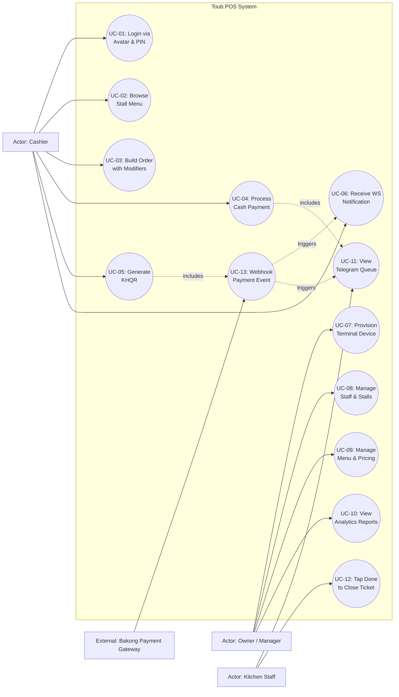
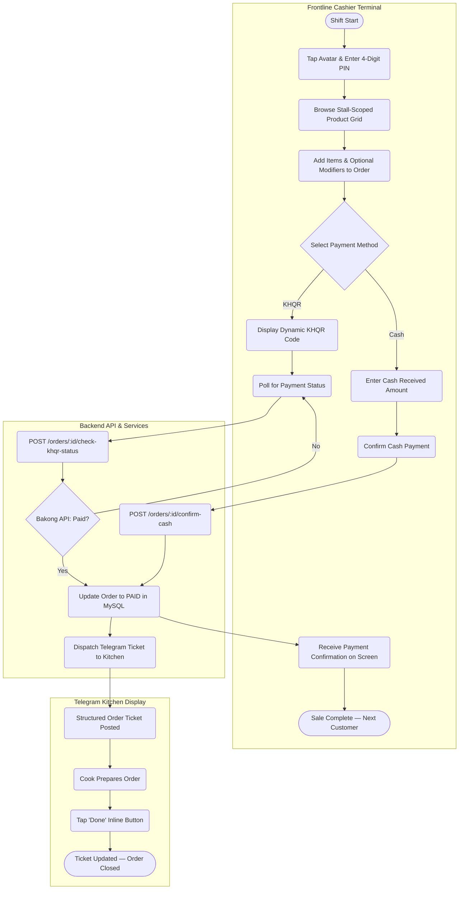
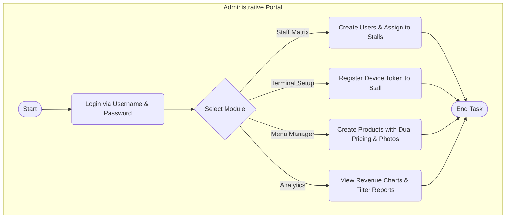
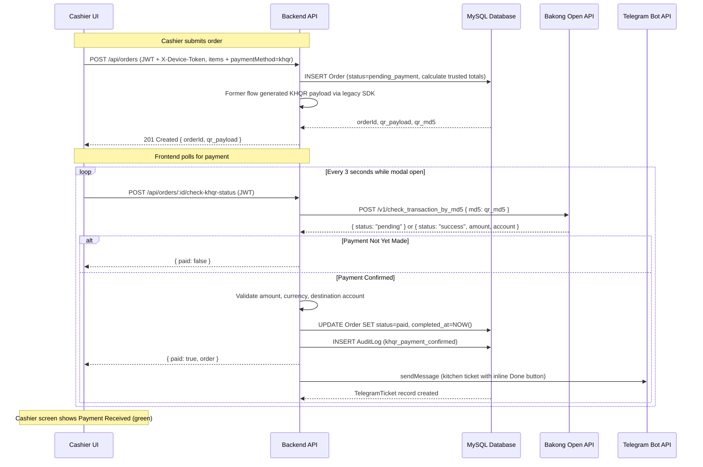
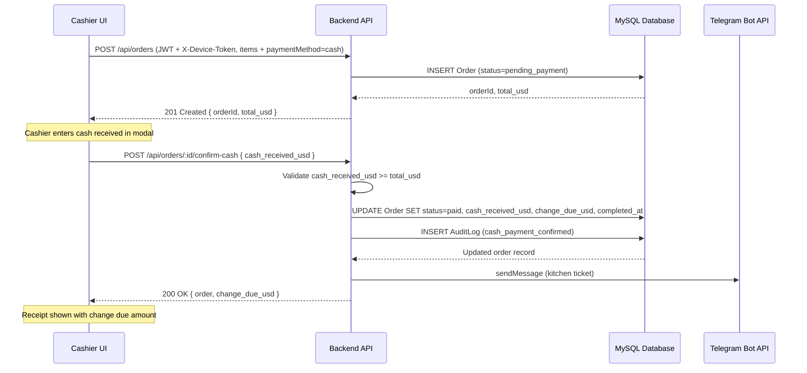
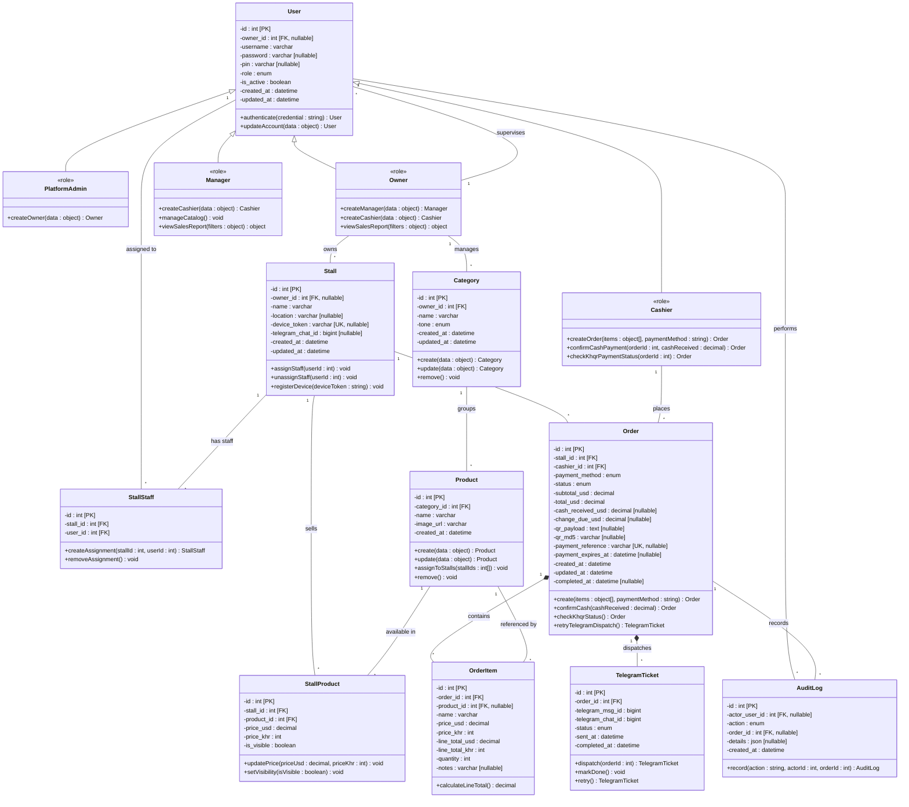

  # Toub POS — Cross-Disciplinary Project Report

**Course:** Cross-Disciplinary Project (Year 2)
**Institution:** Cambodian Academy of Digital Technology (CADT)
**Project Name:** Toub POS — Point of Sale System
**Technology Stack:** ReactJS · Node.js/Express · MySQL · WebSocket · Telegram Bot API

> **Current payment status:** The report records the KHQR integration that the team implemented and tested. Automatic KHQR checkout is now disabled by default because the available Open API polling model is not suitable for normal POS volume. Cash checkout remains active, and the KHQR code/data model is retained for a future approved merchant provider.

---

# Chapter 1: Introduction

## 1.1 Background

The rapid expansion of small-to-medium food-court and marketplace businesses in Cambodia has created a growing demand for affordable, lightweight Point-of-Sale (POS) solutions that support modern digital payment methods. Traditional POS systems are either too expensive for small merchant teams, or they rely on static QR codes that require cashiers to manually verify each payment by checking a separate bank application — a slow, error-prone, and operationally inefficient process.

The Cambodian National Bank's **Bakong** system and the **KHQR** payment standard have dramatically increased the adoption of QR-based payments among Cambodian consumers. However, no low-cost, open-source solution exists that natively integrates this payment infrastructure into an end-to-end merchant workflow that includes kitchen display management, multi-stall coordination, and real-time payment confirmation routing.

**Toub POS** was developed to bridge this gap. It is a lightweight, web-based POS system purpose-built for small merchant teams operating across multiple physical booth (stall) locations. The system combines smart KHQR payment verification, real-time cashier-specific notifications via WebSocket, a Telegram-based kitchen display system (KDS), multi-stall staff coordination, and automated sales reporting — eliminating payment confusion and kitchen miscommunication during high-traffic sales periods.

---

## 1.2 Problem Statement

Small merchant teams operating food stalls and booths in Cambodia face the following recurring operational problems:

| # | Problem | Impact |
|---|---------|--------|
| 1 | **Manual Payment Verification** — Cashiers must manually open a separate bank application to verify each KHQR payment, causing long queues during peak hours. | Customer frustration, slow throughput, revenue loss. |
| 2 | **Payment Notification Ambiguity** — When multiple cashiers share a single payment channel, a payment notification received at one terminal cannot be attributed to a specific cashier's session. | Duplicate order confirmations, missed payments. |
| 3 | **Paper-Based Kitchen Tickets** — Orders are communicated to the kitchen via handwritten paper slips, causing illegibility issues, ticket loss, and delayed fulfilment. | Kitchen errors, food waste, delayed service. |
| 4 | **Fragmented Multi-Stall Operations** — Managing inventory, pricing, and staff across multiple physical booths using spreadsheets or paper registers is cumbersome and error-prone. | Lack of consolidated financial visibility for owners. |
| 5 | **Absence of Sales Analytics** — Without a centralized system, owners cannot easily access real-time or historical sales data per stall or cashier to make informed business decisions. | Inability to identify top-performing products or staff. |

---

## 1.3 Objectives

The following five measurable objectives guide the development and evaluation of the Toub POS system:

**Objective 1 — Develop a Full-Stack POS Management System**
Design and implement a web-based POS application that allows cashiers to process customer orders quickly and accurately within a stall-scoped menu environment, addressing the core bottleneck of manual order entry and disconnected payment workflows.

**Objective 2 — Integrate Real-Time KHQR Payment Verification**
The project initially implemented dynamic KHQR generation and Bakong status
polling as a learning phase. That provider path is now suspended, and the
vulnerable `bakong-khqr` SDK has been removed while TouB POS evaluates an
approved merchant payment provider. Cash is the active checkout method.

**Objective 3 — Replace Paper Kitchen Tickets with a Digital Kitchen Display System**
Implement a Telegram Bot-based Kitchen Display System (KDS) that automatically dispatches a structured digital order ticket to the stall's kitchen channel upon payment confirmation. Kitchen staff can acknowledge completion directly via an inline Telegram button, providing a real-time, paperless order queue.

**Objective 4 — Enable Secure Multi-Stall, Multi-Role Business Management**
Build a Role-Based Access Control (RBAC) system with four distinct roles — `platform_admin`, `owner`, `manager`, and `cashier` — each with clearly defined permissions. Provide an Owner/Manager portal for multi-stall administration, including staff management, stall provisioning, menu management with dual-currency pricing (USD/KHR), and device terminal registration.

**Objective 5 — Provide Data-Driven Sales Reporting and Analytics**
Implement an analytical dashboard that provides owners and managers with revenue trend charts, top-product rankings, staff performance metrics, and time-filtered reports (Daily/Monthly/Yearly), scoped per stall and user role, enabling informed business decisions.

---

## 1.4 Scope

### In Scope

- Core POS terminal UI optimized for tablet and mobile web browsers.
- Multi-stall architecture with strict stall-isolated data access.
- JWT Authentication and RBAC (`owner`, `manager`, `cashier`, `platform_admin`).
- Avatar-based cashier login with 4-digit PIN pad.
- Menu management with dual-currency pricing (USD / KHR).
- Order modifiers and notes per item (e.g., "no ice", "extra spicy").
- Service fee (3%) and estimated tax (8%) calculations.
- KHQR payment integration via Bakong Open API backend webhook/polling.
- Cash payment confirmation with change-due calculation.
- Telegram Kitchen Display System for order relay and cook acknowledgement.
- Analytical dashboard with revenue and product reports.
- ImageKit product photo upload and delivery.
- Swagger/OpenAPI documentation for all backend endpoints.

### Out of Scope (Current Phase)

- Complex inventory tracking (raw material/ingredient depletion).
- Hardware integrations (receipt printers, cash drawers).
- Credit card or non-KHQR digital payment processing.
- Offline-first caching and background sync.
- Full multi-customer SaaS platform administration console.
- Transaction parking (deferred payment).

---

# Chapter 2: Methodology

## 2.1 Software Development Methodology

The Toub POS project follows the **Agile methodology**, specifically using a lightweight **Scrum** framework. Agile was chosen over Waterfall because the project requirements evolved throughout development — for example, the multi-owner data isolation model and the KHQR payment integration design were refined after the initial planning phase. Agile's iterative sprint cycle allowed the team to deliver working software incrementally, gather feedback after each phase, and adapt the architecture before committing to the next feature set.

### SDLC Model: Agile (Scrum)

| Aspect | Detail |
|--------|--------|
| **Sprint Length** | 1 week per sprint |
| **Planning** | 30–45 min sprint planning at the start of each sprint |
| **Daily Standup** | 10-minute daily progress sync |
| **Sprint Review** | 30-minute end-of-sprint demo |
| **Retrospective** | 15-minute lessons-learned review |
| **Definition of Done** | Feature works end-to-end in its defined scope, no architecture invariant is violated, happy-path and error-path handling exists, and the API endpoint is documented in Swagger |

The project was organized into **6 numbered phases**, each equivalent to one or more Agile sprints, progressing from backend foundation to full-stack integration.

---

## 2.2 Development Phases

### Phase 1 — Requirement Analysis

**Goal:** Identify and document all functional and non-functional requirements before any code is written.

In this phase, the team analyzed the operational problems faced by small Cambodian merchant teams (manual QR payment verification, paper kitchen tickets, multi-stall fragmentation), conducted stakeholder interviews, and established the project scope. The output was a formal requirements document covering 10 functional requirements and 7 non-functional requirements, user stories with acceptance criteria, and the RBAC role model (`platform_admin`, `owner`, `manager`, `cashier`). All requirements were recorded in `context/software-engineering.md` and `context/project-overview.md`.

---

### Phase 2 — System Design

**Goal:** Translate requirements into a concrete technical architecture and database schema before implementation begins.

The team designed the system's layered backend architecture (routes → controllers → services → repositories), the MySQL relational schema (Users, Stalls, StallStaff, Categories, Products, StallProducts, Orders, OrderItems, AuditLogs, TelegramTickets), the multi-stall data isolation model using `owner_id` scoping, the JWT authentication flow, and the KHQR payment webhook/polling mechanism. Technology decisions were finalized: ReactJS + Vite for the frontend, Node.js/Express for the backend, MySQL for storage, WebSocket for real-time cashier notification, Telegram Bot API for the kitchen display, and ImageKit for product photo hosting. The architecture was documented in `context/architecture.md`.

---

### Phase 3 — UML Modeling

**Goal:** Produce formal UML diagrams to communicate system behavior, structure, and interactions among all stakeholders.

Four UML diagrams were produced:

- **Use Case Diagram** — Identifies the four actors (Cashier, Owner/Manager, Kitchen Staff, Payment Gateway) and 13 use cases, including their Include, Extend, and Generalization relationships.
- **Activity Diagram** — Maps the end-to-end cashier checkout and kitchen fulfilment workflow with swimlanes separating cashier terminal, backend system, and Telegram kitchen display responsibilities.
- **Sequence Diagram** — Details object-level interactions during the KHQR polling payment flow and the cash confirmation flow, showing API calls, database writes, and external integrations in chronological order.
- **Class Diagram** — Defines the 14 domain classes, their attributes, methods, and all relationship types (Inheritance/Generalization, Association, Composition), mapped 1:1 to the physical database schema. The `User` entity is specialized into four `<<role>>` subclasses (`PlatformAdmin`, `Owner`, `Manager`, `Cashier`).

All diagrams are documented in `context/software-engineering.md` and embedded in this report's Chapter 4.

---

### Phase 4 — Implementation

**Goal:** Build the system incrementally, delivering working backend and frontend features in each sprint.

Implementation was divided into six backend/frontend sprints:

| Sprint | Deliverables |
|--------|-------------|
| **Sprint 1 (Auth)** | Backend JWT auth, bcrypt password/PIN hashing, Express middleware for role guards, device token provisioning |
| **Sprint 2 (Frontend Auth)** | React login flows for Owner/Manager and Cashier PIN, avatar roster UI, device provisioning UI |
| **Sprint 3 (Menu & Staff)** | Products, categories, stalls, stall-products with dual pricing, ImageKit photo upload, stall-staff assignment |
| **Sprint 4 (Orders & Cash)** | Order creation with trusted backend totals, cash confirmation with change calculation, audit logging |
| **Sprint 5 (KHQR)** | Historical learning implementation of KHQR generation and Bakong polling; later suspended and SDK removed pending an approved provider |
| **Sprint 6 (KDS & Real-Time)** | Telegram kitchen display system (dispatch + Done callback), ngrok tunnel auto-registration, stall-scoped device registration, WebSocket KHQR live notification *(in progress)* |

The backend strictly follows a **routes → controllers → services → repositories** layered pattern. The frontend uses custom hooks (`useProducts`, `useOrders`) to abstract API calls from UI rendering.

---

### Phase 5 — Testing

**Goal:** Verify that implemented features work correctly under expected and edge-case conditions, with no regressions.

Testing was performed at multiple levels:

- **Unit Testing:** Individual backend service functions were tested for correct business logic — for example, verifying that the order total calculation matches expected values for given product prices, service fee (3%), and tax (8%).
- **Integration Testing:** API endpoints were tested using **Swagger UI** and **Postman** collections to verify correct HTTP responses, error codes, JWT enforcement, and role-based access control boundaries.
- **Manual End-to-End Testing:** Full checkout flows were tested on tablet form factors — both Cash and KHQR paths — verifying that payment confirmation updates the cashier's screen and dispatches the correct kitchen ticket to Telegram.
- **Security Testing:** Cross-owner data access was tested by attempting to fetch resources (orders, stalls, products) belonging to a different owner's business — confirming that all queries correctly scope to the authenticated user's `owner_id`.
- **Edge Case Testing:** Underpayment rejection (cash received < total), expired QR polling, duplicate webhook events (idempotency guard), and invalid device tokens were all tested.

---

### Phase 6 — Deployment

**Goal:** Package and deliver the application in a runnable state for demonstration and handoff.

- **Backend** is deployed as a Node.js/Express server (`npm run dev` / `npm start`) with environment variables configured in `.env` for database credentials, JWT secret, Bakong API token, Telegram bot token, and ImageKit keys.
- **Frontend** is served by a Vite development server (`npm run dev`) with the API base URL configured via environment variables.
- **Database** is a MySQL instance initialized via `npm run seed`, which populates three demo business owners with themed menus, stalls, staff, and order histories for demonstration.
- **Ngrok tunnel** is automatically provisioned by the backend at startup to expose the local webhook endpoint for Bakong payment callbacks and Telegram bot callbacks — enabling live payment testing without a public server.
- **API Documentation** is available at `/api-docs` (Swagger UI) for all endpoints.

For production, the deployment plan targets a cloud-hosted MySQL database, a Node.js hosting service (e.g., Railway or Render), and a Vite production build (`npm run build`) served via a CDN or static hosting service, with `platform_admin` bootstrap restricted to a secure internal API call.

---

# Chapter 3: Requirement Analysis

## 3.1 Functional Requirements

The following functional requirements define what the Toub POS system must do. Each requirement describes the feature's purpose, expected inputs, and expected outputs.

---

### FR-01 — User Authentication

| Item | Detail |
|------|--------|
| **Purpose** | Ensure only authorized users can access the system. Owner/Manager authenticate via username and password; Cashiers authenticate via a 4-digit PIN from the stall's avatar roster. |
| **Input** | Owner/Manager: `username`, `password`. Cashier: selected user avatar, 4-digit PIN. |
| **Output** | A signed JWT access token containing user ID, role, owner ID, and expiry. Subsequent API requests carry this token in the Authorization header. |

---

### FR-02 — Role-Based Access Control (RBAC)

| Item | Detail |
|------|--------|
| **Purpose** | Enforce that users can only access features and data appropriate to their role, preventing privilege escalation and cross-business data access. |
| **Input** | JWT token on every protected API request. |
| **Output** | Authorized access to permitted routes/data; `403 Forbidden` response on unauthorized attempts. |

---

### FR-03 — Device Provisioning (Terminal Registration)

| Item | Detail |
|------|--------|
| **Purpose** | Allow an Owner/Manager to link a physical tablet/device to a specific stall, restricting that device to only loading that stall's menu and staff roster. |
| **Input** | Owner/Manager credentials, target stall ID. |
| **Output** | A unique `device_token` stored in the stall record and saved in the device's `localStorage`. All subsequent cashier-facing API requests include this token via the `X-Device-Token` header. |

---

### FR-04 — Menu Management

| Item | Detail |
|------|--------|
| **Purpose** | Allow Owners/Managers to create and maintain a stall-specific product catalog with dual-currency pricing and product images. |
| **Input** | Product name, category, USD price, KHR price, product image (uploaded via ImageKit), stall assignments, visibility flag. |
| **Output** | Products visible to cashiers under the assigned stall's menu grid; stall-scoped filtering prevents other stalls' products from appearing. |

---

### FR-05 — Order Creation

| Item | Detail |
|------|--------|
| **Purpose** | Allow cashiers to build a customer order from the stall-scoped product grid, with optional per-item modifier notes, and submit it to the backend for payment processing. |
| **Input** | Selected product IDs, quantities, optional item notes (e.g., "no ice"), payment method (`cash` or `khqr`). |
| **Output** | Order record created in `pending_payment` status; backend calculates and stores trusted totals (subtotal, service fee, tax, grand total) from database prices — the frontend never submits totals. |

---

### FR-06 — Cash Payment Confirmation

| Item | Detail |
|------|--------|
| **Purpose** | Allow a cashier (or Owner/Manager within the same business scope) to confirm a cash payment, recording the amount received and calculating the change due. |
| **Input** | Order ID, `cash_received_usd` amount. |
| **Output** | Order status updated to `paid`; `change_due_usd` calculated and stored; audit log entry created; Telegram kitchen ticket dispatched. |

---

### FR-07 — KHQR Payment Generation and Verification

| Item | Detail |
|------|--------|
| **Purpose** | Generate a dynamic, Bakong-compliant KHQR code for the order total and verify payment completion via the Bakong Open API without requiring the cashier to check a separate bank application. |
| **Input** | Order ID (KHQR payload generated from order total at order creation). |
| **Output** | QR code payload displayed to cashier; backend polls Bakong Open API by `qr_md5`; upon success, order marked `paid`, Telegram ticket dispatched, and cashier notified. |

---

### FR-08 — Telegram Kitchen Display System

| Item | Detail |
|------|--------|
| **Purpose** | Automatically relay confirmed orders to the stall's kitchen channel on Telegram, replacing paper tickets with a real-time digital queue. |
| **Input** | Confirmed order payload (items, quantities, modifiers, stall label, timestamp). |
| **Output** | Structured digital order ticket posted to the stall's Telegram kitchen channel; inline "Done" button allows kitchen staff to mark the order complete, updating the ticket in-place. |

---

### FR-09 — Staff and Stall Management

| Item | Detail |
|------|--------|
| **Purpose** | Allow Owners to create and manage the business's stalls, and assign staff (Managers, Cashiers) to appropriate roles and stalls. |
| **Input** | User details (username, role, PIN/password), stall assignments. |
| **Output** | Users and stalls created/updated/deleted; staff roster updated; stall-staff junction records maintained. |

---

### FR-10 — Sales Reporting and Analytics Dashboard

| Item | Detail |
|------|--------|
| **Purpose** | Provide Owners/Managers with business-intelligence views for daily reconciliation and strategic decision-making. |
| **Input** | Date range filter (Daily/Monthly/Yearly), stall filter, cashier filter. |
| **Output** | Revenue trend charts, top-selling product rankings, per-cashier sales performance metrics, and consolidated order summaries filtered by the authenticated user's business scope. |

---

## 3.2 Non-Functional Requirements

### NFR-01 — Security

**Why it matters:** The system handles financial transactions, user credentials, and payment data. A breach can result in financial loss and reputational damage.

- All API mutation endpoints protected by JWT authentication.
- Role checks enforced at every privilege boundary using Express middleware.
- Passwords hashed with **bcrypt**; PINs stored as bcrypt hashes. Raw credentials are never returned by any API endpoint.
- HTTP security headers enforced by **Helmet.js**.
- KHQR payment verification validates the payment amount, currency, and destination merchant account before marking any order as paid — preventing fraudulent confirmation.
- Stall data isolation enforced server-side; client-supplied stall IDs are never trusted for cashier-facing access.

---

### NFR-02 — Performance

**Why it matters:** The POS system operates in high-traffic merchant environments where slow response times directly translate to longer customer queues and lost sales.

- Common endpoints (product listing, order creation) must respond within 500ms under normal booth traffic.
- The Telegram kitchen ticket must be dispatched within 2 seconds of payment confirmation.
- Paginated API responses for order history and reporting to limit large data transfer.
- Database queries optimized with appropriate indexes on frequently filtered columns (`stall_id`, `cashier_id`, `status`, `created_at`).

---

### NFR-03 — Reliability

**Why it matters:** A cashier mid-transaction cannot afford a system failure that causes an order to be lost or paid twice.

- Payment status transitions are strictly controlled; an order cannot transition to `paid` without a validated payment confirmation event.
- Idempotency guards in the webhook handler prevent duplicate payment processing if Bakong retries a callback.
- Telegram bot failures are isolated — they must never block or roll back a payment confirmation. Dispatch status is tracked separately in `telegram_tickets`.
- An audit log records all sensitive POS actions (order creation, cash confirmation) for traceability.

---

### NFR-04 — Availability

**Why it matters:** Stalls operate during peak business hours and downtime results in lost revenue.

- The backend must remain available during stall operating hours.
- `ngrok` tunnel and webhook auto-registration ensure the payment callback endpoint remains reachable in the development/demo environment.
- Frontend gracefully handles `401` token expiry mid-shift by prompting for PIN re-entry and restoring cart state.

---

### NFR-05 — Scalability

**Why it matters:** The system must support growth — from a single stall to multiple stalls and owners — without architectural changes.

- The multi-stall, multi-owner data model (`owner_id` scoping on all business data) is designed to accommodate additional customers.
- WebSocket service uses a `Map<cashier_id, socket>` structure for O(1) targeted notification — it does not scale with broadcast patterns.
- Stateless JWT authentication allows horizontal API scaling.

---

### NFR-06 — Maintainability

**Why it matters:** The codebase must remain readable and extensible for future phases and team handoffs.

- Backend strictly follows a **routes → controllers → services → repositories** layered architecture. Business logic must not appear in route handlers.
- Frontend uses custom hooks (`useProducts`, `useOrders`) to abstract API calls from UI components.
- All API endpoints documented with **Swagger/OpenAPI**.
- Modular seeder scripts allow safe database reset and test data regeneration.

---

### NFR-07 — Usability

**Why it matters:** Cashiers operate in a high-noise, crowded, and fast-paced environment on tablets or smartphones. The interface must be learnable in minutes and operable under stress.

- Touch-optimized UI with oversized tap targets and high-contrast visual cues.
- Avatar-based cashier login reduces friction — no username typing required.
- Floating order summary panel always visible during item selection.
- KHQR modal provides clear visual states: "Waiting for payment" (yellow) and "Payment Received" (green).
- Dual-currency price display (USD and KHR) for every product.

---

# Chapter 4: System Design

## 4.1 Use Case Diagram

### Actors

| Actor | Description |
|-------|-------------|
| **Cashier** | Front-line staff at the POS terminal. Processes customer orders and payments. Authenticates via avatar tap and 4-digit PIN. |
| **Owner / Manager** | Administrative actors. Manage stalls, staff, menus, and view reports. Authenticate via username and password. Manager is restricted from creating Owners. |
| **Kitchen Staff (Cook)** | Operates in the kitchen; receives order tickets via Telegram and acknowledges completion. |
| **Payment Gateway (Bakong)** | External system that sends KHQR payment confirmation events to the backend webhook endpoint. |

### Main Use Cases

| Use Case | Primary Actor(s) |
|----------|-----------------|
| UC-01: Login via Avatar & PIN | Cashier |
| UC-02: Browse Stall-Scoped Menu | Cashier |
| UC-03: Build Order with Item Modifiers | Cashier |
| UC-04: Process Cash Payment | Cashier |
| UC-05: Generate & Display KHQR | Cashier |
| UC-06: Receive Real-time Payment Notification | Cashier |
| UC-07: Provision Device / Register Terminal | Owner, Manager |
| UC-08: Manage Staff & Stalls | Owner, Manager |
| UC-09: Manage Menu & Dual Pricing | Owner, Manager |
| UC-10: View Analytics & Sales Reports | Owner, Manager |
| UC-11: View Digital Kitchen Queue (Telegram) | Kitchen Staff |
| UC-12: Mark Order as Done (Telegram) | Kitchen Staff |
| UC-13: Send Payment Webhook Event | Payment Gateway (Bakong) |

### Relationships

- **Include:** UC-05 (Generate KHQR) *includes* UC-13 (Bakong Webhook verification) — the QR payment flow requires the webhook event.
- **Include:** UC-04 (Cash Payment) and UC-05 (KHQR Payment) both *include* UC-11/UC-12 (Telegram KDS dispatch) — all confirmed payments trigger kitchen notification.
- **Extend:** UC-06 (Real-time Notification) *extends* UC-05 — the WebSocket ping is an extension of the KHQR flow that fires upon confirmed payment.
- **Generalization:** `Owner` and `Manager` are generalizations of the *Portal User* actor — both share portal access but with different privilege levels. Manager cannot create Owner/Manager accounts.

### How Users Interact with the System

**Cashier flow:** The cashier's tablet is pre-registered to a specific stall by a Manager/Owner. On arriving for a shift, the cashier taps their avatar from the stall's staff roster, enters their 4-digit PIN to unlock the terminal, and is taken directly to the stall-scoped product grid. They select items, add modifiers if needed, review the order in the floating summary panel, and choose Cash or KHQR checkout. For cash, they enter the amount received and the system calculates change. For KHQR, a dynamic QR is displayed and the system polls the Bakong API until payment is confirmed, at which point the cashier's screen updates automatically.

**Owner/Manager flow:** They log in to the `/owner-portal` using their username and password. From the portal, they can register devices, manage stalls, create and assign staff, manage the product catalog with dual-currency pricing, upload product photos, and view analytics dashboards filtered by stall, cashier, and time range.

**Kitchen Staff flow:** Kitchen staff do not log into the POS system directly. They receive order tickets in the stall's Telegram kitchen channel. Each ticket shows the items, quantities, modifiers, stall label, and timestamp. Staff tap the "Done" inline button when the order is ready, and the ticket updates in-place.

---

## 4.2 Activity Diagram

### Cashier Checkout & Kitchen Fulfilment Flow

The following diagram illustrates the end-to-end workflow using swimlanes to separate responsibilities between the cashier terminal, the backend system, and the Telegram kitchen display.

**Workflow Explanation:**

1. The cashier authenticates and builds the order on the POS terminal.
2. Upon submitting the order, the backend creates it with `pending_payment` status and calculates trusted totals.
3. For **cash** payments: the cashier enters cash received; the backend validates it, calculates change, and marks the order `paid`.
4. For **KHQR** payments: the frontend displays the backend-generated QR and polls the backend; the backend queries the Bakong Open API until the payment is detected; the order is then marked `paid`.
5. After any payment confirmation, the backend **simultaneously** notifies the cashier's screen and dispatches the order to the Telegram kitchen channel — these run in parallel.
6. Kitchen staff acknowledge the order via Telegram; the ticket updates in-place.

### Administrative Portal Flow

---

## 4.3 Sequence Diagram

### KHQR Payment Confirmation Flow

The following sequence diagram details the object interactions from order creation through to payment confirmation and kitchen dispatch.

### Cash Payment Confirmation Flow

---

## 4.4 Class Diagram

The following class diagram maps directly to the physical database schema. It illustrates the system's domain model, showing all entities, their attributes, methods, and the relationships between them.

### Class Descriptions

| Class | Description | Key Attributes | Key Methods |
|-------|-------------|----------------|-------------|
| **User** | Base class for all accounts — admins, owners, managers, and cashiers. Stores credentials, role, ownership linkage, and lifecycle timestamps. | `role`, `owner_id`, `password`/`pin`, `is_active` | `authenticate()`, `updateAccount()` |
| **PlatformAdmin** | Top-level `<<role>>` subclass that bootstraps new business owners. Inherits `User`. | — (inherits User) | `createOwner()` |
| **Owner** | Business owner `<<role>>` subclass. Manages stalls, categories, staff, and views reports. Inherits `User`. | — (inherits User) | `createManager()`, `createCashier()`, `viewSalesReport()` |
| **Manager** | Operational `<<role>>` subclass. Can create cashiers, manage the catalog, and view reports. Inherits `User`. | — (inherits User) | `createCashier()`, `manageCatalog()`, `viewSalesReport()` |
| **Cashier** | Front-line `<<role>>` subclass that builds and confirms orders. Inherits `User`. | — (inherits User) | `createOrder()`, `confirmCashPayment()`, `checkKhqrPaymentStatus()` |
| **Stall** | A physical booth location with its own device token, location, and Telegram kitchen channel. | `device_token`, `location`, `telegram_chat_id`, `owner_id` | `assignStaff()`, `unassignStaff()`, `registerDevice()` |
| **StallStaff** | Assignment record linking a `User` to a `Stall`. Promoted to a first-class entity with its own surrogate key. | `stall_id`, `user_id`, `id` [PK] | `createAssignment()`, `removeAssignment()` |
| **Category** | An owner-scoped menu grouping (e.g., "Beverages", "Main Dishes"). | `owner_id`, `name`, `tone` | `create()`, `update()`, `remove()` |
| **Product** | Shared catalog item with name and image. No longer owner-scoped; pricing is fully per-stall. | `category_id`, `name`, `image_url` | `create()`, `update()`, `assignToStalls()`, `remove()` |
| **StallProduct** | Junction that maps a `Product` to a `Stall` and stores the stall-specific USD/KHR price and visibility. | `price_usd`, `price_khr`, `is_visible` | `updatePrice()`, `setVisibility()` |
| **Order** | The core transaction record. Stores payment method, status, trusted totals (subtotal/total), KHQR metadata, and cash fields. | `status`, `total_usd`, `qr_md5`, `cash_received_usd`, `change_due_usd` | `create()`, `confirmCash()`, `checkKhqrStatus()`, `retryTelegramDispatch()` |
| **OrderItem** | An immutable snapshot of a product at time of order, with per-line USD/KHR totals. Stores the product name and price as they were — not a live reference. | `name`, `price_usd`, `price_khr`, `line_total_usd`, `line_total_khr`, `quantity`, `notes` | `calculateLineTotal()` |
| **AuditLog** | Immutable record of sensitive actions for accountability and debugging. | `actor_user_id`, `action`, `details` | `record()` |
| **TelegramTicket** | Tracks the lifecycle of a kitchen order ticket sent to Telegram: `pending` → `sent` → `done`, with retry support. | `telegram_msg_id`, `telegram_chat_id`, `status`, `completed_at` | `dispatch()`, `markDone()`, `retry()` |

### Relationship Explanations

| Relationship | Type | Description |
|-------------|------|-------------|
| User → PlatformAdmin / Owner / Manager / Cashier | Inheritance (Generalization) | `User` is the base entity; the four roles specialize it via a `<<role>>` stereotype, inheriting credentials and lifecycle fields while adding role-specific behavior. |
| Owner → Stall | Association (1-to-Many) | An owner owns many stalls. |
| Owner → Category | Association (1-to-Many) | An owner manages many categories. |
| Owner → User | Association (1-to-Many) | An owner supervises `manager` and `cashier` users (self-referential via `owner_id`). |
| User → StallStaff | Association (1-to-Many) | A user is assigned to many stall-staff assignments. |
| Stall → StallStaff | Association (1-to-Many) | A stall has many staff assignments. |
| Category → Product | Association (1-to-Many) | A category groups many products. |
| Stall → StallProduct | Association (1-to-Many) | A stall sells many stall-products. |
| Product → StallProduct | Association (1-to-Many) | A product is available in many stalls (with different pricing). |
| Stall → Order | Association (1-to-Many) | A stall processes many orders over time. |
| Cashier → Order | Association (1-to-Many) | A cashier places many orders over their shifts. |
| Order → OrderItem | **Composition** (1-to-Many) | OrderItems cannot exist without their parent Order. Deleting the Order deletes all its items. |
| Product → OrderItem | Association (1-to-Many) | OrderItems reference a product snapshot at order time. |
| Order → TelegramTicket | **Composition** (1-to-Many) | An order can dispatch one or more kitchen tickets (including retries) that are bound to the order's lifecycle. |
| User → AuditLog | Association (1-to-Many) | A user performs many audited actions. |
| Order → AuditLog | Association (1-to-Many) | Multiple audit events can be recorded for a single order (creation, confirmation). |

---

# Conclusion

## Outcomes

The Toub POS project has successfully demonstrated a complete, production-ready architecture for a modern, multi-stall Point-of-Sale system tailored to Cambodia's KHQR payment ecosystem. By the end of the implemented phases:

- A **full-stack web application** was built with React.js (frontend) and Node.js/Express (backend), connected to a MySQL relational database.
- A **secure, multi-tenant RBAC system** was implemented with four roles (`platform_admin`, `owner`, `manager`, `cashier`), each strictly scoped to their permitted data and operations.
- **KHQR dynamic payment generation and verification** was implemented as a
  learning phase, then suspended. The vulnerable SDK is no longer in the
  runtime; historical order data remains readable while an approved provider
  is evaluated.
- **Cash payment tracking** was implemented with backend-calculated change, preventing frontend tampering of financial figures.
- **Telegram Kitchen Display System** replaced paper tickets with automated, real-time digital order dispatch and in-place cook acknowledgement.
- An **analytical dashboard** was delivered, allowing owners and managers to view time-filtered revenue reports and product performance, scoped to their business.
- **Strict stall data isolation** was enforced at every database query level, ensuring cross-stall data leakage is architecturally impossible.
- A comprehensive **audit log** records all sensitive financial actions for accountability.

## Lessons Learned

1. **Trust the backend for financial data.** An early design decision to never allow the frontend to submit totals, `cashier_id`, or `stall_id` for payment processing proved essential. Rewriting frontend code to submit only "safe" fields (product IDs, quantities, notes, payment method) and letting the backend calculate everything eliminated an entire class of fraud-prone vulnerabilities.

2. **RBAC complexity grows non-linearly.** The progression from a simple two-role system to a four-role, multi-owner hierarchy (`platform_admin → owner → manager → cashier`) required several refactoring passes. Future teams should model role hierarchies in detail before writing the first line of authorization code.

3. **Data isolation must be a first-class design concern.** Adding `owner_id` scoping to categories, products, stalls, users, and orders mid-project was significantly more disruptive than if it had been designed in from the start. Multi-tenancy concerns should be resolved in Phase 1.

4. **External API contracts change.** The Bakong Open API integration required careful handling of response field names, amount formats, and destination account validation. Defensive parsing and clear error messages for misconfigured environment variables (`BAKONG_ACCOUNT_ID`) saved significant debugging time during integration testing.

5. **Layered architecture pays off.** The strict separation of routes, controllers, services, and repositories made it straightforward to add new features (e.g., audit logging, Telegram dispatch) without touching existing route handlers. Any future developer can follow the same pattern reliably.

6. **Telegram as a low-cost KDS.** Using Telegram as a Kitchen Display System proved to be an innovative, zero-hardware-cost solution that requires no dedicated kitchen monitor. The inline button callback mechanism provides a simple but effective order acknowledgement workflow accessible on any smartphone.

---

*Report prepared for the CADT Cross-Disciplinary Project (Year 2) — Toub POS System*
*Date: July 2026*
